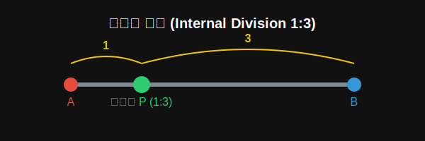

# 09. 아홉 번째 수업: 선분을 쪼개는 내분과 외분 (Dividing Segments)

지금까지 우리는 어떤 '점'을 좌표평면의 숫자로 파악하는 법을 배웠습니다. 그렇다면 고정된 어떤 '선분'을 정확히 반으로 자르거나, $3:1$의 비율로 예쁘게 자르는 지점의 좌표는 짐작으로 찍어야 할까요?

아니요. 수학의 세계에서는 도끼로 장작을 패듯 치밀한 비율 공식으로 이 좌표들을 찾아냅니다. 바로 **내분(Internal Division)**과 **외분(External Division)**입니다.

---

## 학습 목표
* 선분 안에서 자르는 **내분점**과 선분 밖에서 연장선을 자르는 **외분점**의 차이를 배웁니다.
* $m:n$ 으로 나누는 내분점 공식을 도형의 '닮음' 원비로 파악합니다.
* 파포스(Pappus)의 중선 정리를 데카르트의 좌표를 무기로 가볍게 증명해 냅니다.

## 1. 지도를 펼치고 황금 비율로 텐트를 치자! (내분)

요원 A(람보)가 좌표 1에 서 있고, 수직선 저 멀리 요원 B(스파이더맨)가 6에 서 있습니다.
두 사람의 한가운데(비율 $1:1$)에 텐트를 칠 무전수 P를 보내려고 합니다. 무전수 P의 좌표는 어디일까요?

직관적으로 $\frac{1+6}{2} = 3.5$ 지점이라는 것을 알 수 있습니다. 이것이 바로 **중점(Middle Point)** 공식입니다. 즉, "두 좌표를 더해서 반으로 나눈다" (평균 내기).

<div align="center">
  
</div>

만약 한가운데가 아니라 람보 쪽에 더 가까운 $2:3$ 지점에 텐트를 치고 싶다면?
선분 AB를 $m:n$ 으로 쪼개는 내분점 $P(x)$ 의 위치는 이 공식을 따릅니다.
$$ x = \frac{m x_2 + n x_1}{m + n} $$
> **공식 암기 요령 (크로스 기법)**
> 앞쪽 비율 $m$은 뒤쪽 좌표 $x_2$에 곱하고, 뒤쪽 비율 $n$은 앞쪽 좌표 $x_1$에 크로스로 곱해서 더한 후, 비율의 총합($m+n$)으로 나눕니다.
> 예시 (점 1과 6을 2:3으로 내분): $\frac{2 \times 6 + 3 \times 1}{2 + 3} = \frac{15}{5} = \mathbf{3}$ (좌표 3의 지점!)

## 2. 울타리 밖에서 쏘는 위성광선! (외분)

내분이 선분 A와 B 사이에 텐트를 치는 것이라면, **외분(External)** 은 선분을 직선으로 연장한 바깥쪽 어딘가 (A의 왼쪽이거나 B의 오른쪽)에 점 Q를 놓는 것입니다.

선분 AB를 $m:n$ 으로 외분하는 점 $Q(x)$ 는 **'-'(빼기)** 기호 하나만 알면 끝납니다. 내분 기호의 $+$를 모두 $-$로 바꿉니다.
$$ x = \frac{m x_2 - n x_1}{m - n} $$

## 3. 고대인의 난제를 데카르트의 좌표로 깨부수다 (파포스의 정리)

고대 그리스 수학자 파포스(Pappus)는 삼각형 ABC에서 밑변 BC의 정중앙에 선(중선)을 그었을 때, 기막힌 공식이 성립함을 발견했습니다.
$\overline{AB}^2 + \overline{AC}^2 = 2(\overline{AM}^2 + \overline{BM}^2)$

고대 그리스인들은 쩔쩔매며 그림을 그리고 수십 개의 보조선을 그어 이를 증명했습니다. 하지만 좌표를 쓰는 현대의 우리는 코웃음을 칩니다.
**"도형을 냅다 좌표평면 위에 올려놓으면 눈 감고도 증명되는데?"**

1. 밑변의 중점 M을 원점 $(0, 0)$ 으로 박아버립니다. (제일 치사하지만 강력한 방법)
2. 그럼 C는 $(c, 0)$, B는 $(-c, 0)$ 가 됩니다. 위쪽 꼭짓점 A는 제멋대로 $(a, b)$ 로 둡니다.
3. 아까 배운 8장의 **두 점 사이의 거리 공식**을 그대로 대입해서 좌변과 우변의 식을 정리해 봅니다.
4. 양쪽 식이 $2(a^2 + b^2 + c^2)$ 으로 기적처럼 완전히 똑같아집니다! 증명 끝.

데카르트의 "해석기하학"은 천재들만 풀 수 있던 도형 증명을 단순한 '더하기 빼기' 연산 문제로 강등시켜 누구나 풀 수 있게 만든 역사적인 혁명이었습니다.

---

## 4. 파이썬(Python)으로 $1:3$ 내분점 시각화

2D 평면의 내분점 계산은 선 긋기 기반의 모든 그래픽 소프트웨어 일러스트 툴(베지에 곡선 등)에서 내부적으로 1초에 수백 번 통과하는 핵심 컴퓨터 그래픽스 원리입니다.

```python
import matplotlib.pyplot as plt

# 1. 두 요원의 좌표
A =_x, A_y = (1, 2)
B_x, B_y = (9, 6)

# 2. 비율 설정 (m : n = 1 : 3)
m, n = 1, 3

# 3. 2D 좌표평면에서의 내분점 P (x, y 각각 따로 크로스 공식을 적용!)
P_x = (m * B_x + n * A_x) / (m + n)
P_y = (m * B_y + n * A_y) / (m + n)

# 4. 시각화
plt.figure(figsize=(7, 4))

# 선분 그리기
plt.plot([A_x, B_x], [A_y, B_y], 'gray', linewidth=3)
plt.plot(A_x, A_y, 'ro', markersize=10, label="Agent A (1,2)")
plt.plot(B_x, B_y, 'bo', markersize=10, label="Agent B (9,6)")

# 찾은 내분점 찍기
plt.plot(P_x, P_y, 'go', markersize=15, label=f"Internal Point P(1:3)\n-> ({P_x}, {P_y})")

plt.title("Internal Division (1:3) of Segment AB")
plt.xlim(0, 10)
plt.ylim(0, 8)
plt.grid(True)
plt.legend()
plt.show()
```

단순히 `(1*9 + 3*1)/4` 를 기계적으로 돌렸을 뿐인데, 평면의 허공을 가로지르는 대각선 기울기 위에 정확히 25% 지점(1:3 위치)에 초록점이 쾅 하고 찍히는 쾌감을 맛볼 수 있습니다. 

## 학습 정리
1. **중점**: $\frac{x_1 + x_2}{2}$. 두 점의 정확히 한가운데 위치한 (1:1 내분) 점.
2. **내분점 (Internal)**: 선분 안쪽을 $m:n$으로 쪼갠다. 공식은 크로스 곱의 **덧셈** $\frac{m x_2 + n x_1}{m+n}$. 
3. **외분점 (External)**: 선분 바깥쪽 연장선을 $m:n$으로 세운다. 공식은 크로스 변환의 **뺄셈**.
4. **혁명적 도구**: 어려운 고대 기하학 도형의 보조선 증명을 단순히 "원점 박기 + 대수학 식별" 계산기로 전략시킬 수 있다. (해석 기하학의 진정한 힘)
