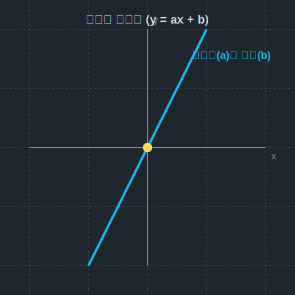

# 10. 열 번째 수업: 직선들의 방정식 (Equations of Lines)

좌표평면 위에서 가장 단순하면서도 가장 많이 쓰이는 도형은 무엇일까요? 바로 '직선'입니다.
세 번째 수업에서 우리는 $y = 3x$ 라는 비례식을 통해 점들이 모여 직선이 되는 것을 확인했습니다. 이제 이 끝없이 뻗어 나가는 오만가지 종류의 직선들을 마음대로 조종하는 **컨트롤러(방정식)**를 다룰 차례입니다.

---

## 학습 목표
* 직선을 결정하는 핵심 두 가지 요소: **기울기(Slope)** 와 **절편(Intercept)** 의 의미를 배웁니다.
* 일차함수 식인 **$y = ax + b$** 가 좌표평면에서 어떻게 그려지는지 파악합니다.
* 파이썬 스크립트를 사용하여 '선형 회귀선(최적의 직선)'의 기본 원리를 맛봅니다.

## 1. 직선의 조종간: 기울기와 절편

게임 캐릭터를 조종할 때 방향키와 점프 버튼이 있듯, 우리는 **$y = ax + b$** 라는 공식에서 $a$와 $b$ 값만 조절하면 세상 모든 직선을 만들어 낼 수 있습니다.

<div align="center">
  
</div>

### 기울기 $a$ (어느 방향으로 얼마나 가파른가?)
오르막길이 얼마나 가파른지를 숫자로 표현한 것입니다.
* $a$ 가 양수(+) 이면 우상향 하는 오르막길 (산을 등반)
* $a$ 가 음수(-) 이면 우하향 하는 내리막길 (스키장 슬로프)
* 계산법: $x$가 증가한 양 분에 $y$가 증가한 양 ($\frac{\text{높이 변화량}}{\text{가로 변화량}}$)

### $y$절편 $b$ (어디서부터 출발할 것인가?)
직선이 $y$축과 쾅 부딪혀 만나는(절단하는) 지점의 좌표값입니다.
* $b$ 가 $+5$ 이면, 원점에서 5칸 위로 올라간 상태로 직선이 출발합니다.
* $b$ 가 $-2$ 이면, 원점에서 2칸 지하로 내려간 상태로 직선이 출발합니다.

<div align="center">
  
</div>

## 2. 세 가지 정보로 직선의 식 단숨에 뽑아내기

직선을 완벽하게 특정하려면 다음 세 가지 상황 중 하나의 힌트만 있으면 됩니다.

1. **기울기 $a$ 와 $y$절편 $b$ 를 알 때**: 가장 쉽습니다. 그대로 조립!
   - (예) 기울기가 3이고, y절편이 5인 직선 $\rightarrow y = 3x + 5$
2. **기울기 $a$ 와 지나가는 한 점 $(x_1, y_1)$ 을 알 때**: 
   - (예) 기울기가 2이고, 점 (1, 3)을 지난다. $\rightarrow y - 3 = 2(x - 1)$
3. **지나가는 두 점 $(x_1, y_1)$, $(x_2, y_2)$ 만 알 때**:
   - 먼저 두 점으로 기울기 $a$ 를 구합니다: $a = \frac{y_2 - y_1}{x_2 - x_1}$
   - 그리고 아까 구한 2번 공식에 그대로 꽂아 넣습니다!

## 3. 선과 점 사이의 거리: 수선의 발

좌표평면에서는 점과 직선 사이의 '최단 거리'도 구할 수 있습니다. 어떤 사람(점)이 횡단보도(직선)를 가장 빨리 건너는 방법은 대각선이 아니라 직각(수직)으로 뛰는 것입니다. 
이 90도가 되는 최단 거리를 구하는 공식 역시 증명이 필요하지만, 여러분은 결과를 기억하고 대입하기만 하면 됩니다.
> 점 $(x_1, y_1)$ 과 직선 $Ax + By + C = 0$ 사이의 거리 $d$ :
> $$ d = \frac{|Ax_1 + By_1 + C|}{\sqrt{A^2 + B^2}} $$

---

## 4. 파이썬(Python)과 인공지능 속의 직선

데이터 사이언스와 인공지능 분야의 가장 핵심 기초 기술인 **머신러닝(Machine Learning)** 에서 제일 먼저 배우는 것이 바로 '선형 회귀(Linear Regression)'입니다. 선형 회귀란, 흩뿌려진 복잡한 데이터들을 가로지르는 **가장 완벽한 직선 $y = ax + b$ 하나를 인공지능이 찾아내는 과정**입니다!

```python
import matplotlib.pyplot as plt

# 1. AI가 찾은 '최적의 직선' y = 2x + 1
def predict(x): # x값을 받으면 AI가 결과(y)를 예측합니다.
    a = 2 # 기울기
    b = 1 # y절편
    return a * x + b

# 2. X 좌표 데이터 
x_values = [-2, -1, 0, 1, 2, 3, 4]

# 3. Y 좌표 데이터 예측
y_values = [predict(x) for x in x_values]

# 4. 시각화 (직선 방정식 그리기)
plt.figure(figsize=(6, 6))

# 데이터 점과 결과 직선 축 출력
plt.plot(x_values, y_values, 'b-', linewidth=3, label="Equation: y = 2x + 1")

# y절편 (0,1) 시각물 강조
plt.plot(0, 1, 'ro', markersize=10, label="y-intercept (0, 1)")

# 원점 뼈대 그리기
plt.axhline(0, color='black', linewidth=1.5)
plt.axvline(0, color='black', linewidth=1.5)
plt.grid(color='gray', linestyle='dotted')

plt.xlim(-3, 5)
plt.ylim(-5, 10)
plt.title("Straight Lines in Coordinate Plane")
plt.legend()
plt.show()
```

우리가 종이 위에서 연필로 슥슥 긋던 $y=ax+b$ 직선 하나가, 미래 산업을 이끄는 인공지능 알고리즘의 심장 속에 고스란히 박혀 뛰어놀고 있습니다.

## 단원 모듈 20 (좌표) 핵심 총정리

1. **좌표계의 창조자 데카르트**: 침대에 누워서 관찰한 천장의 파리가 17세기의 해석기하학을 낳았다.
2. **사분면의 마법**: 무작위 기하학에 X축, Y축을 그음으로써 도형이 대수학 숫자로 변역되었다.
3. **그래프**: $y = 3x$ (직선), $y = a/x$ (쌍곡선), $y = x^2$ (포물선) 등 모든 만물의 움직임은 그래프로 환원된다.
4. **점과 거리의 연산**: 단순한 피타고라스 원리와 비례식 하나만으로 방대한 사이버 공간상의 거리를 측정(거리 공식)하고 배분(내/외분점)한다.

지금까지 좌표의 여정을 훌륭하게 완주하셨습니다! 다음 모듈에서 뵙겠습니다.
