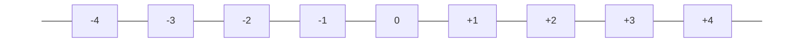

개 부족한 것이 양이 많습니까? 그렇습니다. 한 개 부족한 것이 전체를 비교해 보면 양이 더 많죠. 그러므로 $-1$이 $-2$보다 큰 것은 당연합니다. 따라서 수직선은 왼쪽에서 오른쪽으로 갈수록 수의 크기가 커집니다.

이렇게 수가 커져갑니다.

헉헉거리며 람보가 돌아왔습니다. 이번에도 람보는 '총알은 2만 4천 킬로미터 지점의 땅에 떨어져 있었는데 그곳도 수직선의 끝이 아니었다'고 합니다. 그곳에서 끝을 바라 보아도 보이지 않았다고 합니다. 그래서 왼쪽의 수직선 끝도 무한대라는 결론을 짓습니다. 그렇습니다. 수직선의 양쪽 끝은 끝이 없는 무한대로 뻗어 있습니다.

이제 좌표라는 말을 잠시 알아봅시다. 어떤 점의 위치를 나타내는 것을 좌표라고 합니다. 내가 파리의 위치로 좌표를 만든 것처럼 말입니다. 좌표는 방금 우리가 배운 1차원인 수직선과 2차원인 평면, 그리고 3차원인 공간에서 다룰 수 있습니다.
