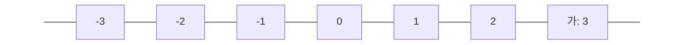

우선, 수직선상의 좌표를 공부하도록 합시다.
수직선상의 좌표를 다른 말로는 직선 위의 점의 위치라고 생각할 수 있습니다.
수직선 위에 대응하는 점의 위치를 수로 나타낸 것을 점의 좌표라 하고, 좌표가 0인 점을 원점이라고 합니다. 대응이란 말이 나왔습니다. 수학적 용어 풀이보다는 눈으로 보이는 설명을 하겠습니다. 점이 찍혀 있는 것을 일단 대응됐다고 보면 됩니다. 3에 대응되었다는 소리는 3에 점이 찍혀 있는 상태를 말합니다.
아래 그림을 좀 볼까요?

그림은 좌표가 3인 점을 수직선에 나타낸 것입니다. 점 가는 0에서 오른쪽으로 3칸 간 위치에 있으며, 수 3에 대응되었습니다. 이때 수 3을 점 가의 좌표라고 하고, $가(3)$이라고 씁니다.
그런데 약간 이상한 점을 발견할 수 있습니다. 조금 전 그림에서는 수직선의 오른쪽 숫자들을 $+1, +2, +3, \dots$으로 나타냈는데 두 번째 그림에서는 그냥 $1, 2, 3, \dots$으로 나타냈습니다. 누
