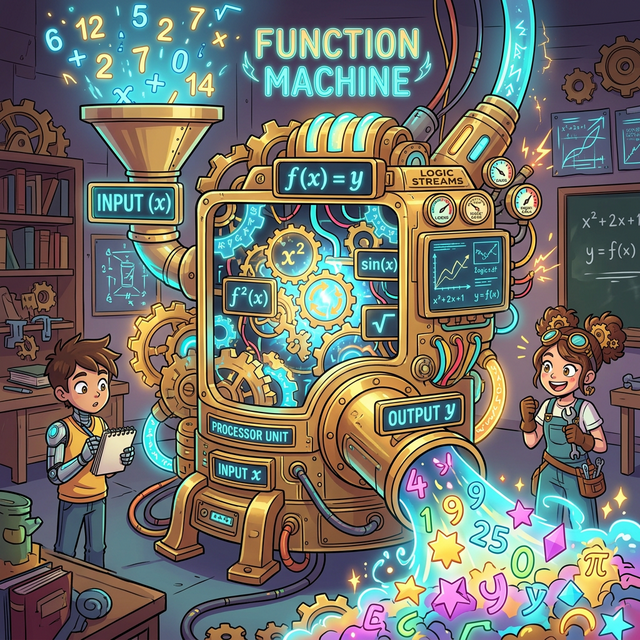

# 00. 인트로: 예측 가능한 마법 상자 (Intro)

지금까지 우리는 멈춰있는 도형($\triangle$) 의 길이 비율을 구하거나, 고정된 방정식 ($x+5 = 10$) 을 풀어 미지의 숫자 $x$ 를 캐내는 퀴즈 박스를 다루었습니다. 
하지만 현실 세상은 멈춰있지 않습니다. 내가 시급(원인)을 얼마나 일하냐에 따라 월급(결과)이 달라지고, 날씨의 온도(원인)에 따라 에어컨의 전기세(결과)가 폭발합니다.

세상의 모든 **"원인(Input) 과 결과(Output) 의 상호 작용 규칙"** 을 톱니바퀴 치차로 맞물려놓은 가장 투명하고 예측 가능한 마법 상자. 우리는 이것을 **'함수(Function)'** 라고 부릅니다.

---

## 1. 함수의 진짜 기원과 의미

함수를 의미하는 영어 단어 **Function** 은 본래 '기능', '작동하다', '역할' 이라는 뼛속까지 공학적인 뜻을 품고 있습니다. 수학계에 이 단어를 처음 도입한 라이프니츠(Leibniz)는 어떤 물리적 운동이 일어날 때, 곡선의 점들이 움직이는 '기능적 역할'을 설명하기 위해 이 단어를 빌려 썼습니다.

<div align="center">
  
</div>

동양권 한자에서 가져온 **'함수(函數)'** 라는 단어는 무려 상자, 보관함을 뜻하는 **'함(函)'** 자를 씁니다!
이 한자 번역이 오히려 함수 기계의 직관을 가장 잘 보여줍니다.
**"상자($\text{Box}$, 함) 속에 어떤 재료 숫자($X$)를 집어넣어, 수 조작을 거쳐 새로운 숫자($Y$)를 뱉어내는 수의 관계식"** 이라는 뜻이니까요. 

## 2. 프로그래밍 함수 모듈과 완벽한 일치

만약 파이썬이나 자바스크립트를 한 줄이라도 쳐보셨다면, 당신은 이미 함수의 신입니다.
```python
def make_double(x):
    y = x * 2
    return y
```
입력 재료 `x` 가 파이프를 타고 함수(def) 머신 안으로 들어갑니다. 기계 내부에선 `* 2` 라는 거대한 망치질 톱니바퀴 조작이 가해집니다. 그리고 마침내 변형된 재료 `y` 가 배출구(return) 를 통해 컨베이어 벨트 밖으로 튀어나오죠!

수학 시간에 배우는 가장 기본적인 기호 표현인 **$f(x) = 2x$** 가 방금 친 저 $3$줄짜리 파이썬 코드와 단 1바이트의 논리적 오차도 없이 $100\%$ 완벽하게 똑같은 의미입니다.

원인($x$)과 결과($y$)를 묶고, 이 규칙들을 뗐다 붙였다 레고 블록 조립(합성) 하면서 거대한 우주의 시뮬레이터(물리 엔진)를 창조해 내는 첫걸음. 함수, 그 무한한 상자의 뚜껑을 지금 열어보겠습니다.
