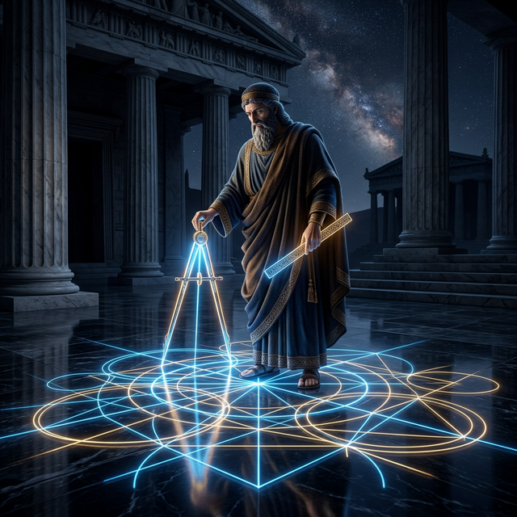

# 00. 유클리드의 원론, 완벽을 스케치하다

## 1. 학습 목표 (Learning Objectives)
* 평범한 인간의 시각적 측정을 거부하고, 오직 절대 불변의 추상적 룰만으로 완벽한 도형의 세계를 구축해 낸 고대 그리스 기하학의 제왕 **유클리드(Euclid)** 의 철학을 파악합니다.
* 2000년 가까이 인류의 뇌를 지배한 절대 수학 바이블, 《기하학 원론(Elements)》 의 역사적 가치를 조명합니다.

## 2. "왕을 위한 기하학의 지름길은 없습니다!"
기원전 300년경 이집트 알렉산드리아, 프톨레마이오스 1세 왕이 당대 최고의 수학자 유클리드에게 푸념합니다.
> "선생, 이 기하학이라는 학문은 머리 아프고 너무 어려워서 배우기가 벅차구려. 왕인 나를 위해 기하학을 좀 더 쉽게 마스터할 수 있는 지름길 왕도(王道)가 없소?"

유클리드는 왕불경죄로 목이 날아갈 수도 있는 상황에서, 인류 역사상 가장 오만한 천재의 대답을 남깁니다.
> **"전하, 기하학에는 왕도(Royal Road)가 없사옵니다."**

이 무자비한 철학 아래 쓰인 13권짜리 책이 바로 성경 다음으로 인류 역사상 가장 많이 출판된 베스트셀러, 모든 기하학의 알파이자 오메가 **《유클리드 원론(Elements)》** 입니다.

## 3. 왜 하필 '눈금이 없는' 자인가?
유클리드의 기하학 설계 도면에서는 절대 현대인들처럼 "자로 3cm를 재서 그려볼까?" 하는 천박한 행위가 허락되지 않았습니다.

고대 그리스인들에게 눈금(Scale)은 인간의 눈과 금속 파편이 만든 '매우 불완전하고 오차가 가득한 현실의 먼지'에 불과했습니다.
그들은 이데아(Idea)의 세계에 존재하는 $100\%$ 완벽한 진리의 도형을 현실로 강림시키기 위해서는 오직 두 가지 **신성한 도구** 만 허락해야 한다고 믿었습니다.

1. **눈금 없는 곧은 자(Straightedge)**: 오직 두 점을 잇는 끝없이 올곧은 '선(Line)'이라는 관념 자체를 창조하는 도구.
2. **컴퍼스(Compass)**: 어떤 중심점에서 출발하든 완벽히 동일한 거리(비례)를 유지하며 무한의 대칭 '원(Circle)'을 창조하는 도구.

이 두 가지 신성한 도구만을 이용하여 완벽한 무결점의 도형을 이 세상에 복사해 그리는 율법 의식을 바로 **작도(Construction)** 라고 부릅니다.

## 4. 학습 정리 (Summary)
1. **유클리드의 《원론》**: 고대 이집트인들이 밧줄로 땅을 재던 실용주의 측량술 수준이었던 기하학을, 오직 공리(Axiom)와 눈금 없는 스케치만으로 연역 증명해 내는 '완벽한 논리 예술'로 승격시킨 책입니다.
2. **작도(Construction)의 진짜 의미**: 자를 사용해 몇 킬로미터, 몇 센티미터인지 인간의 얄팍한 단위로 재는 것이 아닙니다. 콤파스로 완벽한 '비율(길이 복사)'을 떠오고, 눈금 없는 자로 '직선성'을 유지하여 논리에 한 치의 오차도 없는 신의 도형을 렌더링 하는 행위입니다.
