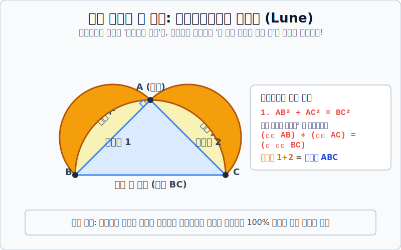

# 03. 원을 사각형으로: 히포크라테스의 초승달 (Lune)

## 1. 학습 목표 (Learning Objectives)
* 고대 그리스 기하학자들의 궁극적인 야망 중 하나였던 **'원적 문제(Squaring the circle)'** 의 철학적 동기를 이해합니다.
* 피타고라스 정리를 활용하여 둘레가 둥근 곡선 모양인 **'히포크라테스의 초승달'** 두 개의 넓이 합이 반듯한 직각삼각형의 넓이와 $100\%$ 똑같이 일치함을 시각적으로 증명합니다.

## 2. 원을 으깨서 정사각형을 만들어라! (원적 문제)
고대 이집트 시절부터 인류는 면적을 구하기 쉬운 '다각형(특히 정사각형)'을 몹시 사랑했습니다. 가로세로만 자로 재서 곱하면 토지 면적이 딱 떨어지니까요.
하지만 '원(Circle)'은 둥그스름해서 면적을 정확하게 측량하기가 여간 까다로운 게 아니었습니다. 그래서 기하학자들은 이런 기괴한 퀘스트를 스스로에게 던집니다.

> **퀘스트: "눈금 없는 자와 콤파스만 딱 써서, 저기 있는 원 모양이랑 크기(넓이)가 소수점 끝자리까지 100% 완전히 똑같은 정사각형을 작도해 봐라!"**

곡선을 찢어서 완벽한 등가의 직선 다각형으로 렌더링 하는 이 극한의 퍼즐을 기하학 3대 난제 중 하나인 **원적 문제(원의 정사각형화)** 라고 부릅니다. 수천 년간 아무도 못 풀던 이 문제에 가장 기념비적인 한 방을 날린 사람이 있었으니, 바로 고대 그리스의 수학자 **히포크라테스(Hippocrates)** 입니다. (우리가 아는 '의학의 아버지'와는 동명이인입니다!)

## 3. 곡선과 직선 넓이 등가의 기적, '초승달(Lune)'
히포크라테스는 직각삼각형 각 변의 길이에서 피타고라스 정리가 성립한다는 점을 이용하여, 둥그스름하게 생긴 '초승달' 모양의 면적을 반듯한 다각형 면적으로 변환하는 해킹을 보여줍니다. 

위 다이어그램의 논리적 메커니즘을 컴파일 번역해 볼까요?
1. 각 $A$가 $90^\circ$ 도인 직각삼각형 $ABC$ 가 있습니다.
2. 빗변 $BC$ 를 지름으로 하는 거대한 **가장 큰 반원(회색 점선)** 을 아래가 아니라 삼각형의 머리 위 방향으로 접어 그립니다.
3. 그리고 짧은 두 변 $AB$ 와 $AC$ 를 각각 지름으로 하는 **중간 사이즈 반원 두 개(노란색)** 도 머리 위로 그려 올립니다.
4. 노란색 반원들이 거대한 회색 반원 경계선을 삐져나오며, 양옆으로 뾰족하고 둥근 **오렌지색 초승달(Lune) 2개** 가 탄생합니다!

이 두 개의 초승달 넓이를 합친 값은 놀랍게도 가운데 파란색으로 칠해진 **직각삼각형 $ABC$ 의 넓이** 와 한 치의 오차도 없이 $100\%$ 똑같습니다!

## 4. 증명: 피타고라스 정리를 이용한 마술
어떻게 곡선의 넓이가 직선 다각형 넓이랑 같아졌을까요?
원의 넓이는 공식이 $\pi r^2$ 입니다. 즉 넓이는 "반지름(변) 길이의 제곱"에 무조건 정비례하게 커집니다.
그런데 직각삼각형에서 피타고라스 철칙에 의해 $\overline{AB}^2 + \overline{AC}^2 = \overline{BC}^2$ 입니다.
이 말은 길이를 넘어서 면적으로 해석할 수 있습니다.
> **(노란색 반원 AB 넓이) + (노란색 반원 AC 넓이) = (가장 큰 반원 BC 넓이)**

자, 이제 양쪽 넓이를 동일하게 빼는 대수학 방정식 스킬을 써볼까요?
* [왼쪽 블록] $A$: **노란 반원 두 개** + 그 안에 낀 **삼각형 넓이**를 몽땅 다 더해봅시다.
* [오른쪽 블록] $B$: **가장 큰 반원 하나** + 그 위에 떠 있는 **초승달 넓이 합**을 더하면 왼쪽 블록과 모양(면적)이 완벽히 똑같아집니다.
* $A = B$ 상태에서, 팩트 기둥이었던 `(노란 반원 2개의 테두리 넓이 합) = (가장 큰 반원 넓이)` 만큼을 $A$ 와 $B$ 양쪽에서 동시에 $\Delta$(Delete) 삭제해 버립니다!

그럼 놀랍게도 $A$쪽에는 **[삼각형 넓이]** 만 달랑 남고, $B$쪽에는 **[초승달 두 개의 넓이 합]** 만 남아서 무조건 두 숫자가 같아지는 기적의 작도 증명이 완성됩니다.

## 5. 학습 정리 (Summary)
1. **원적 문제(Squaring the circle)**: 컴퍼스로 그려진 원주 곡선의 넓이를, 유한한 숫자로 통제 가능한 반듯한 직선 다각형(정사각형) 면적으로 치환하고자 했던 수학자들의 끝없는 열망입니다.
2. **초승달 증명의 의의**: 비록 완전한 형태의 원(Circle) 자체를 정사각형으로 바꾼 건 아니었지만, 인류 역사상 최초로 "둥그스름한 곡선 도형의 면적을 논리적인 직선 다각형 값으로 100% 매핑 치환해 냈다"는 점에서 엄청난 진보를 가져왔습니다. 이는 훗날 아르키메데스의 미적분 적분학(면적 구하기) 개념의 밑바탕이 됩니다.
