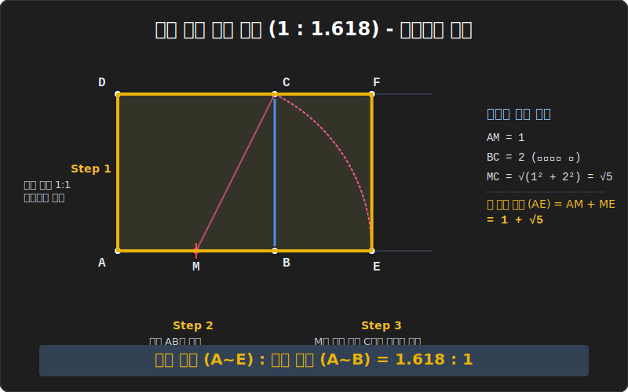

# 04. 신이 내린 비율: 황금 사각형 작도 (Golden Rectangle)

## 1. 학습 목표 (Learning Objectives)
* 예술, 생물학, 우주의 보편적 미학으로 여겨지는 대자연의 프랙탈 비율 $1 : 1.618$ **'황금비(Golden Ratio)'** 의 수학적 정의($\frac{1+\sqrt{5}}{2}$)를 짚어봅니다.
* 피타고라스 정리에 의해 발생하는 대각선 무리수($\sqrt{5}$) 길이를 콤파스의 회전 반경으로 가로채어(Capture), 눈금 없는 자만으로 허공의 도와지에 완벽한 '황금 사각형'을 추출해 내는 작도법을 마스터합니다.

## 2. 세상에서 가장 아름다운 사각형
고대 파르테논 신전의 정면 구도, 밀로의 비너스 상, 애플(Apple)사의 로고, 심지어 신용카드의 규격 비율까지 공통적으로 적용된 비밀번호가 있습니다.
짧은 변과 긴 변의 비율이 **약 $1 : 1.618$** 로 딱 맞아떨어질 때 인간의 뇌가 가장 극강의 안정감과 미적 쾌감을 느낀다고 하여 붙여진 이름, 바로 **황금비(Golden Ratio)** 입니다.

이 신비한 비율을 만들기 위해, 과거 건축가 기하학자들은 절대 자에 눈금을 파서 `1.618cm` 위치에 점을 찍는 천박한 짓을 하지 않았습니다. 오직 컴퍼스 회전력과 수직선 교차 궤적만으로 도화지 위에 신의 비율을 100% 오차 없이 자동 렌더링 시켰습니다.

## 3. 황금 사각형 작도 시퀀스 (루트 5 해킹)
정사각형 하나에서 무리수 값을 콤파스로 강제 추출하여, 옆으로 황금 비율만큼 늘어난 황금 사각형 복제 도면을 그리는 4단계 작도 튜토리얼입니다.

1. **[Step 1. 베이스 박스]**: 바닥에 가로세로 길이가 각각 2인 커다란 정상 정사각형 $ABCD$ 를 하나 작도합니다. (선분 반갈죽과 수직선 올리기 스킬 적용)
2. **[Step 2. 컴퍼스 베이스캠프]**: 바닥 밑변인 선분 $AB$ 를 수직이등분 스킬로 반 박살 내서, 그 정중앙 위치에 중점 $M$ 을 찍어 좌표를 고정합니다. 이제 바닥 $AM$ 과 옆면 $AD$ 의 비율은 $1:2$ 입니다! 
3. **[Step 3. 무리수 $\sqrt{5}$ 추출 궤도]**: 중점 $M$ 에 컴퍼스 철침을 단단히 박습니다. 그리고 연필심을 오른쪽 대각선 위쪽 끝 별인 $C$ 에 맞춥니다.
   - 이때 직각삼각형 $MBC$ 에서 피타고라스 공식을 돌려볼까요?
   - 밑변 $MB$ 는 수치 1, 높이 $BC$ 는 수치 2 입니다. $\rightarrow 1^2 + 2^2 = 5$.
   - 즉, 빗변인 **대각선 $MC$ 의 길이는 무조건 $\sqrt{5} (루트5)$** 의 무리수값이 됩니다!
4. **[Step 4. 다운 체인저 (바닥으로 쳐 박기)]**: 이제 그 루트 5 길이만큼 벌어진 컴퍼스 폭을 그대로 고정한 채, 바닥으로 휙~ 원호 궤적을 그리며 그어 내립니다! 바닥 연장선이랑 컴퍼스 원호가 찌직! 하고 부딪히는 점 $E$ 가 생깁니다.
   - 반지름은 변하지 않으므로, 바닥에 찍힌 선분 $ME$ 의 길이 역시 방금 추출한 $\sqrt{5}$ 입니다!

## 4. 증명: $\frac{1+\sqrt{5}}{2}$ 의 출현
이 작도 궤적으로 새로 만들어진 거대한 바닥 전체 길이(선분 $AE$)의 사이즈를 검수해 봅시다.
* 기존의 왼쪽 바닥 조각 $AM$ 의 길이 = **$1$**
* 방금 콤파스로 허공 대각선에서 바닥으로 훔쳐 온 조각 $ME$ 의 길이 = **$\sqrt{5}$**
* $\rightarrow$ **새로운 전체 가로 길이 ($AE$) = $\mathbf{1 + \sqrt{5}}$** 가 됩니다!

이 거대한 가로 길이를, 예전에 잡았던 높이 세로 $AD$ 의 길이(수치 2)로 스케일 대비 나누어 보면? 
기적처럼 기하학의 최종 암호 **$\mathbf{\frac{1+\sqrt{5}}{2}}$ (약 1.618)** 팩터가 도출됩니다! 황금 사각형이 완성되었습니다. 눈금 한 치 재지 않고 오직 피타고라스의 삼각비율과 콤파스 복붙 원리만으로 뽑아낸 무리수의 결정체입니다.

## 5. 학습 정리 (Summary)
1. **황금 사각형(Golden Rectangle)**: 가로와 세로의 길이 비가 $\frac{1+\sqrt{5}}{2}$ 로 매칭되는 사각형. 끝없이 내부의 자기 자신을 털어내면 영원토록 작아지는 프랙탈 황금 나선(Fibonacci snail)을 낳는 어미 형태.
2. **컴퍼스의 길이 해킹(루트값 탈취)**: 컴퍼스는 각도만 그리는 도구가 아닙니다. 대각선이라는 허공에 둥둥 떠 있는 무리수값($\sqrt{2}, \sqrt{5}$ 등 비율상 만들어지는 값) 길이를 꽉 붙잡아서 바닥 1차원 직선 축으로 끌어내려 길이를 이식해 주는 '무리수 이동 복제 툴'의 역할을 합니다.
