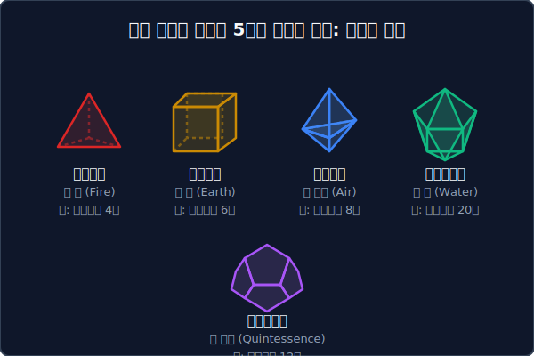

# 03. 우주의 5원소 코어, 플라톤 입체 (정다면체)

## 1. 학습 목표 (Learning Objectives)
* 수만 가지의 다면체 중에서 '완벽한 대칭'의 조건을 만족하는 극희귀종, **'정다면체(Platonic Solids)'** 5형제를 만납니다.
* 고대 철학자 플라톤이 이 5개의 입체를 만물의 5원소(불, 흙, 공기, 물, 우주)에 대입했던 원초적 미학을 SVG 렌더링으로 감상합니다.

## 2. 완벽한 대칭의 절대 반지: 정다면체의 까다로운 조건
다면체를 만들다 보면 찌그러지거나 모양이 일정하지 않은 잡석들이 대다수입니다. 
하지만 다이아몬드처럼 기하학적으로 완벽한 균형과 대칭을 이루는 최고의 엘리트 계급이 있는데, 이를 **'정다면체'**라고 칭합니다. 

정다면체 클럽에 가입하려면 아주 무시무시하고 결벽증적인 두 가지 수학적 엄격한 심사를 100% 만족해야 합니다.
1. **[조건 1] 면들의 얼굴이 똑같을 것:** 다면체를 감싸는 '모든 면'이 크기와 모양이 완전히 똑같은 **합동인 '정'다각형**(정삼각형, 정사각형 등)이어야 합니다.
2. **[조건 2] 뾰족함의 정도가 똑같을 것:** 각 뾰족한 뿔(꼭짓점)마다 **모이는 면의 개수가 모두 똑같아야** 합니다. (어떤 꼭짓점은 3개가 모이고, 다른 데는 4개가 모이면 실격)

놀랍게도 우주 전체를 통틀어 이 무서운 두 조건을 만족하는 3D 덩어리(입체)는 **단 5개** 존재합니다!

  

  

## 3. 플라톤 입체 (Platonic Solids) 5형제
고대 그리스의 대철학자 플라톤(Plato)은 이 5개의 완벽한 입체에 광적인 숭배를 바쳤고, 세상(우주)을 이루는 근본 원소 5가지가 이 입체의 모양을 띄고 있다고 믿었습니다.

1. **🔥 정사면체 (Tetrahedron | 면: 정삼각형 4개)**: 찌르면 피가 날 만큼 예리하고 뾰족하여 하늘로 솟아오르는 가벼운 불의 성질을 닮았습니다.
2. **🪨 정육면체 (Cube | 면: 정사각형 6개)**: 우리가 아는 주사위. 바닥과 접하는 넓이가 가장 빵빵하고 무거워 안정적인 흙을 상징했습니다.
3. **💨 정팔면체 (Octahedron | 면: 정삼각형 8개)**: 바람개비나 연처럼 양옆을 잡고 뱅글뱅글 굴리기 편해, 하늘을 떠도는 공기로 매칭했습니다.
4. **💧 정이십면체 (Icosahedron | 면: 정삼각형 20개)**: 동그란 공에 가장 가까워서 손에 잡히지 않고 물방울처럼 매끄럽게 흐르는 물을 묘사했습니다.
5. **✨ 정십이면체 (Dodecahedron | 면: 정오각형 12개)**: 나중에 발견된 가장 기하학적으로 신비로운 펜타그램(오각형) 덩어리로, 플라톤은 이를 밤하늘 12궁도와 영적인 신의 영역, 즉 우주(Quintessence) 자체라고 선언했습니다.

## 4. 학습 정리 (Summary)
1. **정다면체(플라톤 입체)**: 모든 면이 합동인 정다각형이고, 모든 꼭짓점에 모이는 면의 갯수가 같은 완벽한 3D 대칭 도형입니다.
2. 우주의 무한한 도형 중 **오직 정사면체, 정육면체, 정팔면체, 정십이면체, 정이십면체 단 5종류**만이 이 신성한 타이틀을 획득할 수 있습니다.
