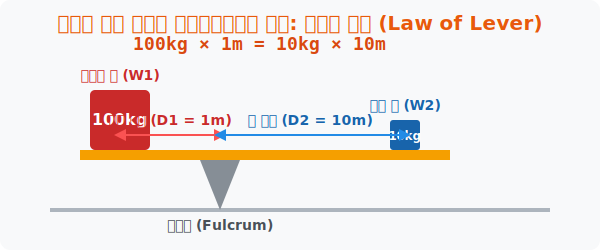

# 1. 아르키메데스의 마법: 지레의 법칙 (Law of Lever)

## [도입부] 학습 목표 (Learning Objectives)
- 고대 그리스의 천재 아르키메데스가 발견한 물리학의 근간, **'지레의 법칙'**을 이해하고 거대한 에너지를 통제하는 반비례 구조를 학습합니다.
- 토크(Torque, 회전력)의 개념인 `무게 × 거리` 공식이 양쪽에서 완벽한 평행을 이루는 역학적 논리를 수식으로 해부합니다.
- 파이썬(Python) 방정식 역산 코드를 활용해 지구를 혼자서 들어 올리기 위해 필요한 긴 막대기의 실제 길이를 체감해 봅니다.

---

## 1. "나에게 긴 지렛대와 받침점만 주시오. 지구라도 들어 보이겠소."

기원전 3세기, 엄청난 몸무게의 무장 군함(배)을 해변으로 끌어올리는 일은 수백 명의 노예가 동원되는 고된 노동이었습니다. 하지만 아르키메데스는 도르래와 **지레(Lever)** 장치를 만들어 왕 앞에서 한 손으로 거대한 군함을 모래사장 위로 쑥 들어 올려버렸습니다. 

아르키메데스가 발견한 우주의 법칙은 너무나도 심플하면서도 충격적이었습니다.
**오른쪽과 왼쪽의 불균형한 무게를 어떻게 똑같이 밸런스(균형)를 맞출 수 있을까요?** 해답은 '길이(거리)'에 있었습니다.

> **$\text{무게}_1 \times \text{거리}_1 = \text{무게}_2 \times \text{거리}_2$**



가벼운 꼬마($10$kg, 무게2)가 엄청나게 뚱뚱한 스모 선수($100$kg, 무게1)를 시소 반대편으로 태워서 들어 올리고 싶다면? 시소의 받침점(Fulcrum)을 스모 선수 쪽으로 아주 바짝 붙이고(짧은 거리 $1$m, 거리1), 꼬마가 타는 쪽의 시소 널빤지를 **$10$배 길게($10$m, 거리2) 세팅**해주면 됩니다.
- 스모 선수: $100$kg $\times 1$m = $100$ 의 파워
- 꼬마 아이: $10$kg $\times 10$m = $100$ 의 파워 (완벽한 균형!)

이처럼 힘의 부족함을 '거리(공간)'로 등가 교환해 내는 물리학 시스템이 지레의 핵심입니다.

<br>

## 2. 모멘트(Moment)와 밸런스

수학에서는 이 `무게 × 거리` 의 값을 회전하는 폭발성 에너지 즉 **모멘트(Moment)** 혹은 **토크(Torque)**라고 부릅니다.
좌측의 시곗바늘 반대 방향 모멘트 수치와, 우측의 시계방향 모멘트 수치가 정확히 똑같아져서 합이 **0**이 되는 순간, 움직임이 멈추고 고정됩니다 (이 점이 바로 뒤에서 배울 **무게중심**입니다). 자동차 엔진 마력보다 중요한 토크(Torque) 수치, 자전거 기어의 원리가 전부 여기에서 파생됩니다.

---

## 3. 💻 파이썬(Python)으로 지구 들어 올리기

정말로 아르키메데스가 긴 막대기를 가졌다면 지구를 들 수 있었을까요? 파이썬을 이용해 아르키메데스의 몸무게와 지구의 무게 데이터를 대입하여, 도대체 몇 미터짜리 막대기가 우주에 필요한지 계산해 봅시다.

### 🐍 파이썬 예제: 아르키메데스의 우주 지렛대 시뮬레이터

```python
# 지레의 평형 공식: W1 * D1 = W2 * D2
# 지구의 무게(W1)와 지구 중심부터 받침점의 거리(D1), 
# 아르키메데스 몸무게(W2)가 주어지면, 막대기의 길이(D2)를 구할 수 있습니다!

earth_mass_kg = 5.972e24   # 지구의 질량 (약 6 x 10^24 kg) 어마어마한 무게
fulcrum_distance_m = 1.0   # (가정) 받침점은 지구 중앙에서 고작 1m 떨어져 있음
archi_mass_kg = 70.0       # 아르키메데스 체중 (70kg)

print("--- 🌍 아르키메데스 지구 들어올리기 프로젝트 ---")

# 역산 로직: D2 (필요한 막대기 길이) = (W1 * D1) / W2
lever_length_required = (earth_mass_kg * fulcrum_distance_m) / archi_mass_kg

# 천문학적 거리를 직관적으로 이해하기 위해 빛의 해(광년, Light Year)로 변환
# 1 광년 = 약 9.46e15 미터
light_year_converter = 9.46e15
lever_length_ly = lever_length_required / light_year_converter

print(f"지구 무게: {earth_mass_kg} kg")
print(f"아르키메데스 체중: {archi_mass_kg} kg")
print(f"💡 아르키메데스가 지구를 들기 위해 뻗어야 하는 막대기의 길이:")
print(f"☞ 약 {lever_length_ly: .0f} 광년 (Light-years)")

if lever_length_ly > 100000: # 우리 은하계 지름 약 10만 광년
    print("🚨 시스템 경고: 이 막대기는 우리 은하계(Milky Way)를 뚫고 나갈 만큼 깁니다!")

# 결과창:
# --- 🌍 아르키메데스 지구 들어올리기 프로젝트 ---
# 지구 무게: 5.972e+24 kg
# 아르키메데스 체중: 70.0 kg
# 💡 아르키메데스가 지구를 들기 위해 뻗어야 하는 막대기의 길이:
# ☞ 약  9022649 광년 (Light-years)
# 🚨 시스템 경고: 이 막대기는 우리 은하계(Milky Way)를 뚫고 나갈 만큼 깁니다!
```

코딩 결과, 안타깝게도 지구를 들려면 우주 전체를 가로지르고도 남을 $900$만 광년짜리 엄청난 쇳덩이 막대기가 필드에 렌더링 되어야 한다는 사실을 알게 됩니다. 하지만 이 "거리와 힘의 교환 엔진"은 현재 포크레인, 크레인, 손톱깎이, 병따개를 작동시키는 거대한 물리 엔진으로 쓰이고 있습니다.

---

## [결론] 학습 정리 (Summary)

1. **지레의 법칙 (Law of Lever)**: 널빤지의 양 끝에 서로 다른 몸무게가 있어도, 중심(받침점)으로부터의 **'거리'를 역으로 길게 늘려주면 평형(Balance)을 맞출 수 있다**는 우주의 진리입니다.
2. **모멘트(Moment)의 밸런스**: `무게 × 받침점까지의 거리` 를 곱한 결과값이 물체를 뱅글뱅글 돌아가게 만드는 힘(토크)이 되며, 양쪽 밸런스가 $0$으로 떨어지는 교차점이 가장 안정적인 상태입니다.
3. **물리엔진 시뮬레이션**: 3D 애니메이션이나 게임을 코딩할 때 무거운 철제문이 부드럽게 돌아가 거나 크레인이 무너지지 않도록 지탱하려면 무조건 지레의 모멘트 밸런스 배열값을 시스템에 주입해야 합니다.
