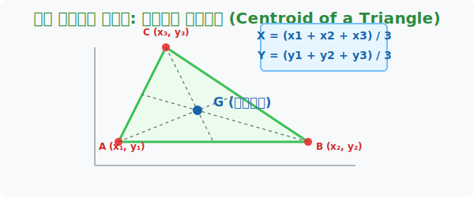

# 2. 접시 돌리기의 황금점: 삼각형의 무게중심 (Centroid)

## [도입부] 학습 목표 (Learning Objectives)
- 1장에서 배운 지레의 평형 원리를 바탕으로 2차원 '삼각형 판'이 쓰러지지 않고 완벽히 평형을 이루는 모멘트 제로($0$) 지점을 찾습니다.
- 꼭짓점 세 개의 $X, Y$ 좌표를 단순히 $3$으로 나누는 것(평균)만으로 우주의 밀도 중심이 계산되는 경이로운 수식을 확인합니다.
- 파이썬(Python)의 데이터 리스트를 활용해 2D 게임 내 캐릭터의 비행체 무게중심을 자동으로 트래킹하는 코드를 짜봅니다.

---

## 1. 지레의 법칙을 2차원 도화지로 옮기다

앞에서 우리는 막대기(1차원 선) 양 끝에 있는 짐들이 평형을 이루는 '받침점'의 위치를 계산했습니다. 
이번에는 나뭇가지가 아니라 거대하고 평평한 '삼각형 합판(2차원)' 을 볼펜 끝 하나만으로 쓰러지지 않게 올려놓으려 합니다. 접시 돌리기 기예를 할 때 막대기를 받치는 바로 그 지점, 중력이 나를 잡아당기는 힘이 상하좌우 모든 방향으로 완벽한 $0$(균형 지대) 수치를 기록하는 곳을 우리는 **무게중심(Centroid)**이라고 부릅니다.

물리학자들이 수많은 삼각형 합판을 톱으로 썰어서 저울에 달아본 결과, 놀라운 기하학적 룰을 발견해 냈습니다.
삼각형의 꼭짓점에서 출발하여 반대편 변을 반으로 싹둑 가르는 대나무 선(중선, Median)을 세 번 쫙쫙 그었더니, 기적처럼 한 점 **G** 에서 만나는 것입니다. 이 점 G가 바로 우주의 중력이 밸런스를 맞추는 황금점이며, 앞선 38장 오심 파트에서 배웠듯 항상 $2:1$ 의 분할 비율을 자랑합니다.



<br>

## 2. 3명의 친구가 손을 잡은 평균값

기하학에서 선을 긋는 건 피곤합니다. 르네 데카르트(Descartes)가 만들어둔 $X,Y$ 좌표 격자 시스템 위에 삼각 합판을 툭 던져 놓고 대수학으로 풀어버리면 아주 신비로운 공식이 탄생합니다.

삼각형 꼭짓점에 살고 있는 세 명의 친구 좌표를 각각 $A(x_1, y_1), B(x_2, y_2), C(x_3, y_3)$ 이라고 합시다. 
이 셋의 힘이 가장 공평하게 평형을 이루는 $X$와 $Y$ 의 좌표는 어디에 있을까요? 
답은 너무 허무합니다. 세 명의 수학 성적 평균을 내듯, **세 점의 X값을 싹 다 더해서 3으로 나누고, Y값도 다 더해서 3으로 나누면 끝($\frac{x_1+x_2+x_3}{3}$)** 입니다! 
물리학의 엄청난 모멘트 평형 상태가, 데이터 과학의 단순한 `평균(Average)` 연산과 완벽하게 똑같다는 이 사실은 3D 컴퓨터 그래픽스(CG) 시스템의 가장 아름다운 주춧돌입니다.

---

## 3. 💻 파이썬(Python)으로 게임 오브젝트 균형 잡기

개발자들이 배틀그라운드나 마인크래프트 같은 게임 속에서 드론이나 전투기가 날아다니는 물리 엔진(Physics Engine)을 구현할 때, 피격당한 비행기 날개(Polygons)의 중심축이 어디에 박혀있는지 계속 1초에 60번씩 계산해야 합니다. 이때 이 3 분할 평균 스크립트가 돌아갑니다.

### 🐍 파이썬 예제: 우주선 삼각 날개 무게중심 탐지 시스템

```python
# 2D 좌표 게임입니다. 우주선의 삼각 날개 꼭짓점 3개의 현재 위치 센서 데이터
# A (10, 20), B (50, 20), C (30, 80)
point_A = (10, 20)
point_B = (50, 20)
point_C = (30, 80)

print("--- 🛸 삼각 비행체 물리 코어 계산 시스템 ---")

# 무게중심 G (Gx, Gy) 도출 로직 (3점의 평균을 낸다!)
def get_centroid(p1, p2, p3):
    # X 좌표들만 뽑아서 3으로 나눔
    cen_x = (p1[0] + p2[0] + p3[0]) / 3
    # Y 좌표들만 뽑아서 3으로 나눔
    cen_y = (p1[1] + p2[1] + p3[1]) / 3
    
    return (cen_x, cen_y)

# 엔진 함수 호출
center_of_gravity = get_centroid(point_A, point_B, point_C)

print(f"좌측 엔진 좌표: {point_A}")
print(f"우측 엔진 좌표: {point_B}")
print(f"전방 코어 좌표: {point_C}")
print(f"✅ 연산 완료! 비행체의 흔들림 없는 무게중심(G)은 [ {center_of_gravity[0]:.1f}, {center_of_gravity[1]:.1f} ] 위치입니다!")

# 만약 총알을 맞아 오른쪽 날개(B)가 박살이나서 좌표가 (20, 20)으로 쪼그라들었다면?
damaged_B = (20, 20)
damaged_center = get_centroid(point_A, damaged_B, point_C)
print(f"🚨 우측 날개 파손! 비행체 무게중심 쏠림 감지 -> 새 무게중심: [ {damaged_center[0]:.1f}, {damaged_center[1]:.1f} ]")

# 결과창:
# --- 🛸 삼각 비행체 물리 코어 계산 시스템 ---
# 좌측 엔진 좌표: (10, 20)
# 우측 엔진 좌표: (50, 20)
# 전방 코어 좌표: (30, 80)
# ✅ 연산 완료! 비행체의 흔들림 없는 무게중심(G)은 [ 30.0, 40.0 ] 위치입니다!
# 🚨 우측 날개 파손! 비행체 무게중심 쏠림 감지 -> 새 무게중심: [ 20.0, 40.0 ]
```

이 알고리즘처럼 폴리곤(다각형 그래픽)의 평균을 내어 기준점을 찾는 기법은 게임을 넘어 자율주행 자동차를 위한 `라이다(LiDAR)` 점 구름(Point Cloud) 맵핑에서도 장애물의 정중앙 거리를 산출하는 데 초당 수천만 번씩 백엔드에서 격렬하게 연산되고 있습니다.

---

## [결론] 학습 정리 (Summary)

1. **무게중심 (Centroid)**: 2차원 넓이와 중력을 가진 도형을 바늘 끝 하나로 톡 올려두었을 때 사면팔방으로 한쪽으로도 기울어지지 않는 완벽한 힘의 평형 지대(모멘트 제로)입니다.
2. **삼각형의 3분할 규칙**: 기하학적으로는 꼭짓점과 마주 보는 변의 가운데를 이은 중선 3개가 교차하는 지점이며, 대수학적으로 아찔하게도 꼭짓점 좌표값들의 `평균(Average)`과 일치합니다.
3. **폴리곤 코딩 시스템**: 복잡한 물체(비행기, 사람 등)를 모니터에 구현할 때, 표면을 전부 단순한 삼각형의 조합(폴리곤)으로 쪼개고 각각의 무게중심 평균을 추적하면 복잡한 3D 환경의 충돌과 파괴 물리를 에러 없이 렌더링 할 수 있습니다.
