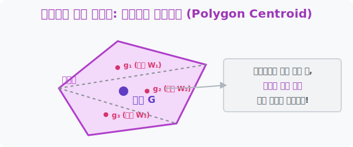

# 3. 쪼개고 합치면 마법이 풀린다: 다각형의 무게중심

## [도입부] 학습 목표 (Learning Objectives)
- 3개의 꼭짓점 평균값만으로 해결되지 않는 복잡한 사각형이나 오각형의 평균 균형점(무게중심)을 찾는 원리를 배웁니다.
- 거대한 도형을 우리가 잘 아는 '삼각형' 여러 개로 칼질(가상의 쪼개기)하여 각각의 모멘트를 지레의 법칙으로 다시 합치는 **'가중 평균(Weighted Average)'** 기법을 이해합니다.
- 파이썬(Python) 반복문을 통해 복잡한 폴리곤(Polygon)의 면적과 결합된 최종 무게중심 좌표를 도출해 내는 수학 공학적 코딩을 훈련합니다.

---

## 1. 사각형의 무게중심은 4개의 평균일까?

이전 챕터에서 삼각형의 무게중심은 신기하게도 세 꼭짓점 좌표값들의 단순 3분할 평균($\frac{x_1+x_2+x_3}{3}$) 이었습니다. 
그럼 사각형의 꼭짓점 4개를 싹 다 더해서 4로 나누면(평균을 내면) 사각형의 무게중심 즉 중력 밸런스 포인트가 될까요? 기하학 역사상 가장 많은 사람들이 착각하는 부분이지만, **정답은 "절대 아니다!"** 입니다. 

정사각형이나 예쁜 직사각형일 땐 우연히 정중앙이 걸리지만, 한쪽으로 찌그러진 오징어 모양 사각형이나 오각형에서는 모서리가 쏠린 쪽으로 단순 평균값이 엄청난 에러를 내뿜습니다. 점(꼭짓점)은 넓이 즉 '무게(밀도)'를 대변하지 못하기 때문입니다.



<br>

## 2. 모든 것은 '기본 단위(삼각형)'로 쪼개야 한다

우리가 아는 유일한 정답은 "삼각형의 무게중심" 뿐입니다. 그렇다면 철칙은 하나입니다. 
**"모르는 거대한 돌덩이를, 우리가 아는 작은 삼각형 여러 개로 쪼개라!"**

1. 오각형이 있다면 내부를 쭉쭉 그어서 3개의 삼각형 조각으로 쪼갭니다 (Triangulation).
2. 3개 삼각형마다 각각의 무게중심($g_1, g_2, g_3$) 좌표를 $X, Y$ $3$분할 공식으로 구합니다.
3. **[핵심]** 각 삼각형의 무게중심 자리에, **해당 삼각형의 '넓이(면적)'만큼 진짜 무거운 쇳덩이 추(W1, W2, W...)*가 올려져 있다고 가정**합니다!
4. 이제 허공에 둥둥 뜬 3개의 쇳덩이 추들이 모멘트가 $0$ 이 되며 평형을 이루는 '진짜 거대 지레의 받침점(General Centroid)'을 찾아냅니다.

넓이가 큰 놈일수록 발언권(가중치)이 센 이 민주주의적 계산법의 이름이 바로 통계학에서 쓰이는 **'가중 평균(Weighted Average)'** 입니다.

---

## 3. 💻 파이썬(Python)으로 다각형 무게중심 통합기 만들기

게임 엔진에서 자동차가 부서지며 철판 쪼가리들이 떨어져 나갈 때 파이썬 코드는 순식간에 떨어져 나간 다각형들의 넓이를 가중치 삼아 수백만 번의 **가중 평균(Weighted Average)**을 때려버립니다.

### 🐍 파이썬 예제: 2개의 삼각형이 결합된 사각형 기계 부품의 중앙 코어 찾기

```python
# (가정) 사각형을 T1, T2 라는 두 개의 삼각형으로 쪼갰습니다.

print("--- ⚙️ 다각형 부품의 마스터 중력 코어 탐지 시스템 ---")

# T1: 넓이 100, 지체 무게중심 좌표 (x=10, y=20)
area_T1 = 100
gx_T1, gy_T1 = 10, 20

# T2: 엄청나게 큼! 넓이 300, 지체 무게중심 좌표 (x=40, y=80) 
area_T2 = 300
gx_T2, gy_T2 = 40, 80

# 1. 엉터리 방식 (단순 평균)
# 단순히 좌표들을 2 로 나눈다 (면적 무시)
wrong_x = (gx_T1 + gx_T2) / 2
wrong_y = (gy_T1 + gy_T2) / 2

# 2. 진짜 천재의 방식 (가중 평균)
# 각 좌표에 '넓이'라는 권력을 곱해준 뒤, 나중에 '총 넓이'로 나눈다!
total_area = area_T1 + area_T2
real_gx = (gx_T1 * area_T1 + gx_T2 * area_T2) / total_area
real_gy = (gy_T1 * area_T1 + gy_T2 * area_T2) / total_area

print(f"엉터리 무결성 검증 실패 코어: ({wrong_x:.1f}, {wrong_y:.1f})")
print(f"✅ 가중 평균으로 찾아낸 진짜 무결성 코어: ({real_gx:.1f}, {real_gy:.1f})")

# 결과창:
# --- ⚙️ 다각형 부품의 마스터 중력 코어 탐지 시스템 ---
# 엉터리 무결성 검증 실패 코어: (25.0, 50.0)
# ✅ 가중 평균으로 찾아낸 진짜 무결성 코어: (32.5, 65.0)
```

가중 평균 코어 `(32.5, 65.0)` 를 보면, 몸집이 무려 3배 라스 큰 $T_2$ 삼각형의 좌표값 `(40, 80)` 쪽으로 밸런스 포인트가 엄청나게 쏠려(당겨져) 있다는 것을 완벽하게 확인할 수 있습니다. 인공지능이 기계 파츠의 불량 흔들림 밸런스를 측정할 때 사용하는 가장 강력한 방어 로직입니다.

---

## [결론] 학습 정리 (Summary)

1. **단순 평균의 함정**: 삼각형 이상의 다각형(사각형, 오각형...)부터는 꼭짓점의 자리를 전부 더하고 개수대로 나누는 평범한 공식이 절대 먹히지 않습니다 (물리학적 법칙 위반).
2. **분할 정복 (Divide and Conquer)**: 도저히 풀 수 없는 기기괴괴한 도형은 모두 기본 단위인 '삼각형 조각'으로 찢어버린 후, 삼각형별 코어($g$)를 1차로 각각 도출해 냅니다.
3. **가중 평균 (Weighted Average)**: 각 삼각형 조각의 '넓이(면적)'를 지레에 올려질 쇳덩이의 무게(가중치)로 설정하여, 크기가 클수록 더욱 자기 쪽으로 중심을 멱살 잡고 당겨오도록 수학 방정식을 짭니다.
