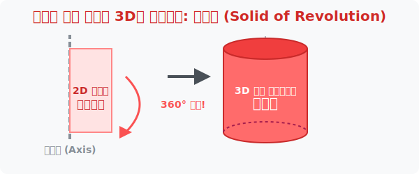

# 4. 평면 도화지에서 3D 마법 소환: 회전체 (Solid of Revolution)

## [도입부] 학습 목표 (Learning Objectives)
- 2차원 평면에 그려진 납작한 점과 선이, 어떤 중심 '축(Axis)'을 기준으로 뱅글뱅글 돌아갔을 때 생겨나는 3차원의 아름다운 입체 조형물, **'회전체'**의 개념을 배웁니다.
- 직사각형, 직각삼각형, 반원의 2D 이미지가 회전하면서 어떻게 원기둥, 원뿔, 구(Sphere)라는 입체 마법으로 변환되는지 공간지각 능력을 일깨웁니다.
- 파이썬(Python)의 `math.pi` 상수를 이용해 회전체의 단면적인 '원'의 넓이를 추적하는 가장 기초적인 그래픽 엔진을 작성해 봅니다.

---

## 1. 막대사탕 돌리기: 평면이 3D를 잉태하다

여러분은 놀이공원에서 빙빙 돌아가는 회전목마나 손으로 팽팽하게 꼬아서 돌리면 빙글빙글 돌아가는 장난감을 본 적이 있을 것입니다.
어떤 커다란 꼬챙이(축)에 납작한 2D 수수깡(직사각형) 종이를 딱 붙이고 손바닥으로 미친 듯이 비벼서 돌려봅시다. 우리 눈에 엄청나게 빠르게 회전하는 잔상이 남으면서, 눈앞에는 투명한 통조림 캔 모양의 3D 입체 투영물이 만들어집니다! 

수학에서 이렇게 어떤 기준선(회전축)을 중심으로 1바퀴($360^\circ$) 빙그르르 돌려서, **오직 잔상만으로 공간을 채워 빚어 생겨나는 입체도형을 '회전체(Solid of Revolution)'**라고 부릅니다. 



도자기 장인이 물레를 빙글빙글 돌리며 손으로 평면 스케치를 얹으면 그것이 예쁜 항아리통(Curve Volume)이 되는 것과 똑같은 우주의 이치입니다. 

<br>

## 2. 세상을 지배하는 3대 회전체 군단

우리가 흔히 보는 가장 유명한 3D 입체도형 3형제는 사실 태생적으로 단순한 2D 평면 종이 조각이었습니다. 
- **원기둥(Cylinder):** 회전축에 **'직사각형'** 기둥을 붙이고 빙빙 돌리면 캔 콜라 같은 거대한 통나무 기둥이 생성됩니다.
- **원뿔(Cone):** 회전축에 뾰족한 **'직각 삼각형'**을 붙이고 빙빙 돌리면 파티 모자 같은 원뿔이 촤라락 나타납니다.
- **구(Sphere):** 회전축에 **'반원($\frac{1}{2}$ 원)'** 조각을 붙이고 돌리면? 당구공이나 지구 같은 완벽한 둥근 공이 생성됩니다.

이 회전체 도령들의 가장 큰 공통점은 무엇일까요? 바로 어떤 각도로 가로로 썰어봐도, 그 싹둑 잘려나간 **단면(조각)의 생김새는 무조건 완벽한 동그라미(원, Circle)** 가 나온다는 사실입니다. 회전하면서 지나간 족적이니 당연한 결과지요.

---

## 3. 💻 파이썬(Python)으로 회전체의 기본 슬라이스 단면 찾기

3D 그래픽 프로그래머들이 블렌더(Blender)나 언리얼(Unreal) 엔진에서 회전체 입체물을 만들 때, 컴퓨터 하드웨어는 내부적으로 이 물체를 수만 장의 얇은 원형 슬라이시(Slice) 햄 장수처럼 썰어버려서 파이(PI)로 넓이를 곱셈 연산해 냅니다.

### 🐍 파이썬 예제: 회전체(원기둥) 슬라이스의 넓이 계산 엔진

```python
import math

print("--- 🌀 3D 회전체 자동 렌더링 물리 엔진 ---")

# (가정) 가로 5cm, 세로 10cm 짜리 직사각형 종이를 
# 세로 선을 중심축(회전축)으로 잡고 미친듯이 돌려서 3D 통조림을 만들었습니다.

rect_width = 5   # 이게 회전하면 바로 원통의 반지름(radius)이 됩니다!
rect_height = 10 # 이게 회전체의 높이(height)입니다.

# 회전체의 가장 근본 성질: 단면은 무조건 원(Circle)이다.
# 단면(원)의 넓이 구하는 공식: 반지름 x 반지름 x 원주율(pi)
cylinder_radius = rect_width
slice_area = (cylinder_radius ** 2) * math.pi

# 원기둥 부피 구하기: 얇은 슬라이스 단면을 높이만큼 곱해서 층층이 쌓는다!
cylinder_volume = slice_area * rect_height

print(f"1. 2D 직사각형의 스펙: 가로 {rect_width}cm, 세로 {rect_height}cm")
print(f"2. 빙빙 돌아 생겨난 원기둥의 밑면(슬라이스) 1장 넓이: {slice_area:.2f} cm²")
print(f"🚀 최종 계산된 통조림(원기둥)의 입체 3D 부피: {cylinder_volume:.2f} cm³")

# 결과창:
# --- 🌀 3D 회전체 자동 렌더링 물리 엔진 ---
# 1. 2D 직사각형의 스펙: 가로 5cm, 세로 10cm
# 2. 빙빙 돌아 생겨난 원기둥의 밑면(슬라이스) 1장 넓이: 78.54 cm²
# 🚀 최종 계산된 통조림(원기둥)의 입체 3D 부피: 785.40 cm³
```

방금 파이썬이 수행한 작업이, 여러분이 영화관에서 보는 토이스토리 애니메이션 캐릭터 컵이 3D 그래픽스의 `리볼브(Revolve)` 단추를 누르면 허상의 공간 모니터에서 내부 밀도를 가지게 되는 부피 셰이딩(Volumetric Shading) 수식입니다.

---

## [결론] 학습 정리 (Summary)

1. **회전체 (Solid of Revolution)**: 아무 차원이 없는 2차원의 가느다란 폴리곤 표면을 강철 꼬챙이(축)에 매달아 회전시켜 그 "잔상 무리" 로 하여금 물리적 공간(3D 부피)을 형성하는 우아한 수학 기법입니다.
2. **도형의 DNA 변신**: 평범했던 직사각형은 빙빙 돌아 캔 콜라 원기둥이 되고, 직각삼각형은 파티 원뿔이 되며, 반원 조각은 완벽한 구체 로 모습을 진화시킵니다.
3. **단면의 절대 원칙**: 회전축에 수직인 칼날로 물체를 싹둑 반 토막 냈을 때 보이는 모든 면은 크기 차이만 있을 뿐 무조건 완벽한 원형($\circ$)의 모습을 지니고 있습니다.
