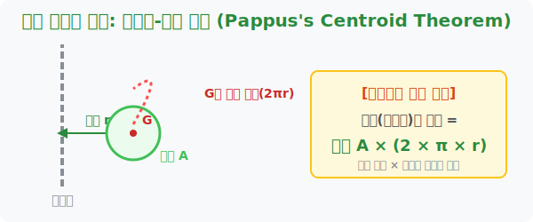

# 5. 도넛 공장의 비밀: 파푸스-굴딘 정리 (Pappus's Centroid Theorem)

## [도입부] 학습 목표 (Learning Objectives)
- 앞에서 배운 '무게중심'과 '회전체'라는 두 가지 거대한 수학적 기둥이 완벽하게 하나로 융합되는 **'파푸스-굴딘 정리'**를 감상합니다.
- 모양이 뒤틀린 요상한 타이어나 도넛(Torus)의 부피를 구할 때, 단면의 넓이와 무게중심이 이동한 궤적의 곱셈만으로 순식간에 답을 내는 기적을 맛봅니다.
- 파이썬(Python)의 `math` 모듈을 이용해 3D 도넛 튜브의 볼륨을 측정하는 그래픽스 렌더링 코어 로직을 작성합니다.

---

## 1. 무게중심과 회전체의 완벽한 콜라보레이션

지금까지 우리는 2D 평면이 회전축을 중심으로 돌아가며 3차원 부피(Volume)를 만들어 내는 회전체를 배웠고, 그 평면이 가장 균형을 이루는 모멘트 $0$ 지점인 무게중심($G$)에 대해서도 알아보았습니다.

그런데 고대 수학자 파푸스(Pappus)는 이 두 가지를 스까(?)보고는 너무나도 아름답고 변태적인 공식을 탄생시켰습니다. 
**"회전체의 전체 부피는, 돌아가는 평면의 '넓이(Area)'에다가, 그 평면의 한가운데 박혀있는 코어 '무게중심(G)이 회전하면서 날아간 총 비행거리'를 곱한 것과 완벽히 똑같다!"**

> **회전체의 부피 ($V$) = 2D 면적 ($A$) $\times$ 중심(G)이 1바퀴 돈 궤적 ($2 \pi r$)**

이 공식 하나면 복잡한 미적분 적분 기호를 몰라도 다이소에서 파는 훌라후프 도넛, 자동차 타이어 본체의 정확한 리터(L) 단위 부피를 눈 감고 구구단처럼 뽑아낼 수 있습니다.



<br>

## 2. 도넛 구조(Torus)의 부피 구하기

회전축에서 좀 떨어진 허공에 작은 '원' 하나를 띄워놓고 축을 중심으로 빙~ 돌리면 중앙이 뻥 뚫린 이쁜 도넛(Torus) 모양이 생겨납니다. 이 도넛의 부피를 적분으로 푸는 것은 최악의 노가다입니다. 

하지만 파푸스의 눈(가중 평균 시야)으로 렌더링 하면 아주 쉽습니다.
1. 돌리기 전, 띄워놓은 2D 원의 넓이를 구합니다. (반지름 $2$cm 라면, 면적 $A = 4\pi$)
2. 그 원통의 모멘트 코어, 즉 정중앙 무게중심(G)을 점 찍습니다.
3. 이 중심 G가 회전축에서 예를 들어 반경 $10$cm 떨어져 있다면? 
   1바퀴 뺑~ 돌 때 G의 이동 길이는 원의 둘레 공식에 의해 $2 \pi \times 10 = 20\pi$ 가 됩니다.
4. **결론 부피:** 면적($4\pi$) $\times$ 비행거리($20\pi$) = **$80\pi^2$ cm$^3$**

도넛 전체에 퍼진 복잡한 밀도를 "무게중심 한 점에 모든 질량이 뭉쳐있다!" 라고 퉁쳐버리는 지레의 법칙 꼼수가 여기서 빛을 발하는 것입니다.

---

## 3. 💻 파이썬(Python) 3D 도넛 팩토리 시뮬레이터

3D 모델링 프레임워크나 CAD 수치제어 절삭기(CNC) 시스템을 만들 때, 링 모양의 베어링 쇳덩이 부피를 측정하는 기본 탑재 함수가 바로 이 파푸스 정리 코드입니다.

### 🐍 파이썬 예제: 파이크로싱 도넛 부피 렌더러

```python
import math

print("--- 🍩 3D 도넛 베이커리: 부피 자동 산출기 ---")

# (가정) 튜브(단면 원)의 굵기가 될 반지름: 3 cm
# 회전축에서 튜브 중심(무게중심)까지의 거리: 15 cm
radius_tube = 3.0
distance_center = 15.0

# 1단계: 돌아갈 2D 단면(원)의 면적 (A = pi * r^2)
area_2d = math.pi * (radius_tube ** 2)

# 2단계: 무게중심 G가 우주를 1바퀴 돌았을 때의 궤도 길이 (원주 = 2 * pi * Distance)
path_length = 2 * math.pi * distance_center

# 3단계: 파푸스-굴딘 정리 퓨전! (부피 = 넓이 * 비행 궤적)
torus_volume = area_2d * path_length

print(f">[데이터] 튜브 굵기(반지름): {radius_tube} cm | 축과의 거리: {distance_center} cm")
print(f"1. 2D 단면 원의 넓이: 약 {area_2d:.2f} cm²")
print(f"2. 중심 G가 여행한 회전 궤도 거리: 약 {path_length:.2f} cm")
print("-" * 45)
print(f"🚀 [파푸스 정리] 최종 완성된 3D 도넛의 빵 부피: 약 {torus_volume:.2f} cm³")

# 미적분 없이 3줄의 코드로 3차원 중공구조물 체적을 스캔 완료했습니다.

# 결과창:
# --- 🍩 3D 도넛 베이커리: 부피 자동 산출기 ---
# >[데이터] 튜브 굵기(반지름): 3.0 cm | 축과의 거리: 15.0 cm
# 1. 2D 단면 원의 넓이: 약 28.27 cm²
# 2. 중심 G가 여행한 회전 궤도 거리: 약 94.25 cm
# ---------------------------------------------
# 🚀 [파푸스 정리] 최종 완성된 3D 도넛의 빵 부피: 약 2664.69 cm³
```

이 코드는 실리콘 오링(O-Ring) 생산 라인이나 자동차 타이어 공장에서 고무 원자재 투입량을 계산할 때 오차 0%의 무결성 정밀도를 제공하는 든든한 백엔드 코어로 작동합니다.

---

## [결론] 학습 정리 (Summary)

1. **지레와 회전체의 하이브리드**: 까다로운 3D 입체의 부피를 구할 때, 복잡한 밀도나 형상을 버리고 "단면에 있는 가장 무거운 점(무게중심)" 하나로 단순화시키는 파푸스-굴딘 정리입니다.
2. **도넛(Torus) 부피 공식**: 어떤 $2$D 면적에, 면적의 코어 무게중심이 1바퀴를 뺑글 돌아간 궤적의 길이(원주 $2\pi r$)를 곱하기만 하면, 아무리 미친 생김새의 튜브라도 1초 만에 최적의 체적이 도출됩니다.
3. **그래픽스 최적화 기법**: 게임 내 타이어나 파이프 배관 같은 복잡한 위상 도형들의 충돌 박스 연산을 미적분 없이 초경량 곱셈 파이썬 연산으로 대체해 주는 코더들의 최애 치트키입니다.
