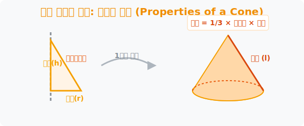

# 6. 파티 모자의 비밀: 원뿔의 겉넓이와 부피 (Cone)

## [도입부] 학습 목표 (Learning Objectives)
- 직각삼각형을 중심축으로 $360$도 회전시킬 때 생겨나는 날렵한 회전체인 **'원뿔(Cone)'**의 탄생 원리를 정립합니다.
- 원뿔의 겉껍질을 가위로 쫙 펼쳤을 때 생겨나는 '부채꼴' 패키징 도면의 구조(모선과 둘레의 관계)를 이해합니다.
- 파이썬(Python) 피타고라스 정리 뼈대를 통해 원뿔의 깎여나간 3분의 1 부피 렌더링 코드를 설계합니다.

---

## 1. 직각삼각형, 빙글 돌아 파티 모자가 되다

원기둥(콜라 캔)이 직사각형의 회전 잔상이었다면, 생일잔치 때 쓰는 뾰족한 꼬깔 파티 모자인 **원뿔(Cone)** 은 완벽한 '직각 삼각형' 이 축을 중심으로 미친 듯이 빙빙 돌아서 생긴 3D 입체형태입니다.

- 중심에서 바닥 끝까지 뻗어나간 선을 **밑면의 반지름($r$)** 이라고 합니다.
- 위에서 아래로 수직으로 내리꽂힌 코어 기둥을 **높이($h$)** 라고 합니다.
- 자, 그리고 뾰족한 산꼭대기에서 바닥을 향해 비스듬히 경사져 흘러내리는 매끈한 빗변 선이 하나 있습니다. 이를 **모선(Generatrix, $l$)** 이라고 부릅니다. 이 세 가지 뼈대($r, h, l$)는 직각삼각형을 이루고 있어 언제든 피타고라스 정리($r^2 + h^2 = l^2$)로 서로의 길이를 알아낼 수 있습니다.



<br>

## 2. 1/3 로 깎여나간 마법의 부피와 겉껍질 전개도

원기를 머금은 꽉 찬 원기둥 통나무를 조각칼로 깎아서 날렵한 원뿔로 깎아내면 톱밥이 엄청나게 많이 떨어질 것입니다. 정확히 얼마나 버려지는 걸까요?

아르키메데스와 유클리드가 수학적으로 오목조목 썰어서 증명해 낸 진리는, **"밑면과 높이가 똑같은 원기둥 대비, 원뿔의 부피는 정확하게 분수 $\frac{1}{3}$토막 난다"** 입니다. 
즉, **원뿔 부피 = $\frac{1}{3} \times (\pi \cdot r^2) \times h$**. 이 놀라운 삼등분 마법은 컴퓨터 그래픽스에서 뿔 모양의 충돌 박스(Hitbox) 최적화를 할 때 용량을 $1/3$로 다이어트시키는 백엔드 수식에 그대로 들어갑니다.

겉넓이는 어떨까요? 이 뾰족한 꼬깔콘 파티 모자를 가위로 세로로 찌익 그어 평면에 펼치면 커다란 '부채꼴(피자 조각)' 모양이 나타납니다. 
부채꼴의 호(둥근 바닥 선)의 길이는 결국 펼치기 전의 밑면 원의 훌라후프 둘레($2\pi r$)와 완벽히 맞물리고, 부채의 반지름은 모선($l$)이 됩니다.

---

## 3. 💻 파이썬(Python) 원뿔 제원 자동 산출기

파티용품 공장에서 고깔모자를 찍어낼 때 원단(종이)이 얼마나 들어갈지, 물은 얼마나 담을 수 있을지 캐드(CAD) 프로그램이 알아서 연산해 내는 모듈 스크립트를 구현해 봅시다.

### 🐍 파이썬 예제: 고깔모자 겉넓이와 부피 공장

```python
import math

print("--- 🥳 꼬깔콘 파티모자 3D CAD 스캐너 ---")

# (가정 데이터)
# 밑면의 반지름 3cm, 높이 4cm 인 삼각형을 돌려서 원뿔을 만듦
radius_r = 3.0
height_h = 4.0

# 1. 모선(경사면) 길이 계산 (피타고라스 빗변 정리: l = √(r^2 + h^2))
generatrix_l = math.sqrt((radius_r ** 2) + (height_h ** 2))
print(f"1. 빗변 연산 완료 -> 뿔을 타고내리는 모선의 길이: {generatrix_l} cm")

# 2. 부피 계산 로직 (원기둥의 딱 1/3)
# Volume = (1/3) * (pi * r^2) * h
cone_volume = (1/3) * math.pi * (radius_r ** 2) * height_h

# 3. 겉넓이 계산 로직 (바닥 원의 넓이 + 펼쳐진 부채꼴의 넓이)
# 펼쳐진 부채꼴(옆면)의 넓이 마법 공식 = pi * r * l
base_area = math.pi * (radius_r ** 2)
side_area = math.pi * radius_r * generatrix_l
total_surface_area = base_area + side_area

print(f"2. 피자조각 전개도 -> 원뿔을 만들기 위해 필요한 종이 면적: {total_surface_area:.2f} cm²")
print(f"3. 입체 공간 엔진 -> 꼬깔 속에 물이나 과자를 채울 수 있는 양: {cone_volume:.2f} cm³")

# 결과창:
# --- 🥳 꼬깔콘 파티모자 3D CAD 스캐너 ---
# 1. 빗변 연산 완료 -> 뿔을 타고내리는 모선의 길이: 5.0 cm
# 2. 피자조각 전개도 -> 원뿔을 만들기 위해 필요한 종이 면적: 75.40 cm²
# 3. 입체 공간 엔진 -> 꼬깔 속에 물이나 과자를 채울 수 있는 양: 37.70 cm³
```

방금 파이썬을 이용해 평범한 2D 수치($r=3, h=4$) 따위로, 3차원 공간 속의 짐승 같은 원뿔의 곡면 포장지(Surface) 면적과 3D 물(Volume) 스케일링 데이터를 전부 도출해 냈습니다. 우주선 캡슐, 제트기 탄두를 모델링하는 설계 코어 함수입니다.

---

## [결론] 학습 정리 (Summary)

1. **원뿔 (Cone)**: 파티 꼬깔 모자의 형태를 가진 회전체이며, 그 영혼에는 반듯한 직각삼각형이 회전축을 물고 돌고 있는 공간 복사 로직이 탑재되어 있습니다.
2. **$\frac{1}{3}$ 의 압축률**: 같은 제원을 가진 꽉 찬 캔 콜라(원기둥)에 비례해서, 거추장스러운 옆구리 빈 공간을 팍팍 깎아내면 우주의 섭리로 정확히 $3$분의 $1$ 로 압축된 부피를 제공합니다.
3. **피타고라스 엔진 체인**: 중심축($h$), 바닥 선($r$), 흐르는 경사면($l$)이 하나로 엮인 삼각형이므로, 피타고라스 삼각 방정식을 통해 한쪽 부품이 깨지더라도 파이썬으로 가볍게 복구해 시뮬레이팅 할 수 있습니다.
