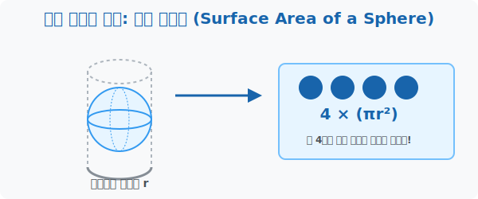

# 7. 우주가 선택한 완벽한 둥근 껍질: 구의 겉넓이 (Sphere Surface)

## [도입부] 학습 목표 (Learning Objectives)
- 지구, 태양, 비눗방울까지 자연계가 왜 액체를 머금었을 때 완벽한 '구(Sphere)' 형태를 유지하려 안간힘을 쓰는지 물리학적 가성비(겉넓이)의 미학을 이해합니다.
- 아르키메데스가 발견한 둥근 공의 포장지(겉넓이)가 평면 원($\pi r^2$) 4장과 완벽하게 일치한다는 충격적인 $4\pi r^2$ 공식의 비밀을 파헤칩니다.
- 파이썬(Python)의 수학 연산을 이용해 실제 지구본에 가죽을 씌울 때 필요한 겉넓이를 스퀘어미터(m²)로 환산하는 엔지니어링 코드를 만듭니다.

---

## 1. 자연은 가성비의 끝판왕이다

빗방울이나 우주 공간에 버려진 물방울이 왜 육면체나 별 모양이 아니라 예쁜 구슬(동그라미) 형태로 둥둥 떠다닐까요? 
바로 우주의 **"표면 장력"**과 **"가성비 법칙"** 때문입니다. 자연은 안에 머금은 부피(물의 양)는 최대한 방어하면서, 바깥 공기와 닿는 껍데기(겉넓이)는 가장 적게 만드려는 극한의 다이어트 로직을 가지고 있습니다. **같은 부피 대비 표면적(겉넓이)이 가장 작은 완벽한 최적화 포장 박스가 지구상에서 오직 '구(Sphere)' 뿐**이기 때문입니다.

<br>

## 2. 평면 원 4장이 모여 둥근 우주를 감싼다

아르키메데스는 이 완벽한 둥근 공의 껍질(가죽)을 벗겨서 넓이를 재기 위해 인생을 바쳤습니다. 그리고 소름 돋는 사실을 직관해 냈습니다.
공의 중앙을 싹둑 갈랐을 때 생기는 커다란 평면 원($\pi r^2$)의 가죽을 4장 오려내어 공 위에 덧붙이면, 조금의 틈도 남지 않고 모자라지도 않게 완벽히 포장된다는 사실을 말입니다.

> **구의 겉넓이 = $4 \times (\pi \cdot r^2)$**



즉, 둥근 공 하나를 천으로 덮어 씌우기 위해서는 그 공의 정중앙을 가른 평면 궤도(위성 궤적) 4개 분량의 천 조각만 있으면 충분하다는 아주 단순명료한 대수학적 결론입니다. 이 기하학적 룰은 행성의 지표면 열복사 패널 면적을 구하는 나사(NASA)의 천체 공식으로 고스란히 사용됩니다.

---

## 3. 💻 파이썬(Python)으로 지구본 가죽 씌우기

가죽 공예사가 지름 $30$cm 짜리 대형 지구본(공)을 가죽으로 예쁘게 덮어씌울 때 필요한 진짜 가죽의 평수(면적)는 얼마나 될까요? 파이썬 상수 `math.pi` 를 이용한 직관적인 스크립트로 오차 없이 뽑아냅니다.

### 🐍 파이썬 예제: 딥러닝 구체(Sphere) 포장 알고리즘

```python
import math

print("--- 🌍 3D 맵핑: 지구본 원단 렌더링 시스템 ---")

# (데이터) 지구본의 지름이 30cm 이면, 반지름(r)은 15cm
globe_radius = 15.0

# 1. 지구본을 정중앙으로 갈랐을 때 생기는 '적도 도화지' 1장 넓이
# 평면 원 넓이 = pi * r^2
equator_area = math.pi * (globe_radius ** 2)

# 2. 구의 전체 껍질 = 그 적도 평면 넓이의 무조건 "4배"
total_surface_area = 4 * equator_area

# 스퀘어센티(cm²)를 우리에게 익숙한 제곱미터(m²: 10000 분의 1)로 가시화
surface_m2 = total_surface_area / 10000

print(f"✅ 지구본 반지름: {globe_radius} cm")
print(f"✅ 적도 절단면(평면 원 1장) 면적: {equator_area:.1f} cm²\n")
print(f"🚀 지구본 포장용 가죽 발주량: 총 {total_surface_area:.1f} cm² 필요!")
print(f"☞ (건축용 넓이로 환산 시 약 {surface_m2:.3f} m² 가죽 소요)")

# 결과창:
# --- 🌍 3D 맵핑: 지구본 원단 렌더링 시스템 ---
# ✅ 지구본 반지름: 15.0 cm
# ✅ 적도 절단면(평면 원 1장) 면적: 706.9 cm²
# 
# 🚀 지구본 포장용 가죽 발주량: 총 2827.4 cm² 필요!
# ☞ (건축용 넓이로 환산 시 약 0.283 m² 가죽 소요)
```

어떤 3D 게임 환경에서 눈덩이나 폭탄(Sphere Hitbox)에 화끈한 텍스쳐(스킨)를 입히기 위해 그래픽 카드가 실시간으로 요구하는 폴리곤 전개 이미지의 최소 픽셀 수가 이 $4\pi r^2$ 코어로 순식간에 떨어집니다.

---

## [결론] 학습 정리 (Summary)

1. **최적화 덩어리**: 같은 내용물을 가장 적은 양의 포장지로 둘러쌀 수 있게 조각된, 자연계의 극강 가성비 입체 구조가 바로 둥근 '구(Sphere)'입니다.
2. **평면 원 4장의 마법**: 구를 감싸는 입체 껍데기(겉넓이)는 구 중심을 가로지르는 평평한 반경 원($\pi r^2$) 4장이 지닌 2차원 넓이 합과 거짓말처럼 완전히 똑같아 지게 떨어집니다 ($4\pi r^2$).
3. **지구의 스킨 맵핑**: 우주 탐사에 위성을 띄우거나, 가죽공방에서 공을 만들 거나, 그래픽 엔지니어가 3D 렌더링의 질감을 도포할 때 낭비되는 메모리와 재질을 막는 코어 수식으로 각광받고 있습니다.
