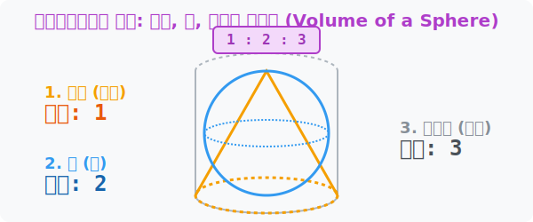

# 8. 아르키메데스의 묘비: 조각되는 원기둥과 구의 부피 (Sphere Volume)

## [도입부] 학습 목표 (Learning Objectives)
- 인류 역사상 가장 아름다운 역학 밸런스, 꽉 들어맞는 원뿔 : 구 : 원기둥의 **$1 : 2 : 3$** 부피 황금 비율을 감상합니다.
- 왜 둥근 구의 부피 공식이 뜬금없이 $\frac{4}{3} \pi r^3$ 이라는 이상한 분수를 달고 나오게 되었는지 직관적으로 도출해 냅니다.
- 파이썬(Python)의 데이터 스케일링 함수를 이용해 세 가지 입체도형 안의 생수(물) 저장 공간 렌더링 효율을 계산해 봅니다.

---

## 1. 전설의 묘비명: "1 : 2 : 3"

고대 수학의 최강자 아르키메데스는 죽기 전 제자들에게 "내 묘비에는 아무리 쳐다봐도 아름다운 3대 입체 도형을 그려다오..." 라는 유언을 남겼습니다. 

어떤 커다란 원기둥 깡통 박스($3$)가 있습니다. 여기에 빈틈없이 정확하게 꽉! 끼어 들어가는 둥근 축구공($2$) 하나와, 뾰족한 파티 원뿔 꼬깔모자($1$)를 같이 구겨 넣습니다. 
그러자 기적과도 같이 3차원 부피(물이나 모래가 채워지는 양)가 정확히 **원뿔(1) 대 구(2) 대 원기둥(3)** 의 비율로 떨어진다는 사실을 증명해 냈기 때문입니다!



<br>

## 2. 원기둥에서 구(Sphere)를 파내다

어릴 적 우리는 "구의 부피는 $\frac{4}{3} \pi r^3$ 이다" 라고 아무 생각 없이 암기했습니다. 하지만 이 $1:2:3$ 비율의 지도를 가지면 그냥 장난감처럼 조립할 수 있습니다!

1. **원기둥의 부피 (가장 큽니다 / 비율 $3$)** 
   - 밑넓이($\pi r^2$) $\times$ 높이. 
   - 근데 구가 꽉 끼어있으려면 원기둥의 높이는 구의 지름($2r$)과 같아야 합니다! 
   - 고로 원기둥 부피 = $(\pi r^2) \times 2r$ = **$2\pi r^3$**
2. **구의 부피 (중간 녀석 / 비율 $2$)**
   - 구는 아까 원기둥 부피($3$)의 $\frac{2}{3}$를 차지한다고 했죠?
   - $2\pi r^3 \times \frac{2}{3}$ = 짜잔! 바로 그 유명한 **$\frac{4}{3}\pi r^3$** 가 도출됩니다!
3. **원뿔의 부피 (꼬마 녀석 / 비율 $1$)**
   - 원기둥 부피의 $\frac{1}{3}$ 입니다. $\rightarrow 2\pi r^3 \times \frac{1}{3} = \frac{2}{3}\pi r^3$

미적분이라는 악마의 괴물을 소환하지 않아도, 단순한 분수 비례식($\frac{2}{3}$)만으로 우주의 모든 행성 부피를 즉시 랜더링해 내는 미친 최적화 로직입니다.

---

## 3. 💻 파이썬(Python) 3D 탱크 팩토리 설계

화학 공장에서 물탱크를 만들 때, 같은 철판을 가지고 '원기둥' 탱크를 만드느냐, '둥근 공역' 탱크를 만드느냐에 따라 들어가는 용액의 가성비가 엄청나게 날뜁니다. 파이썬으로 수확물을 검증합니다.

### 🐍 파이썬 예제: 아르키메데스의 황금비율 용량 검증기

```python
import math

print("--- 💧 3차원 유체 저장소 용적(부피) 설계 시뮬레이터 ---")

# (조건) 반지름이 5미터인 부품들
r = 5.0
# 꽉 끼어 들어가는 원기둥, 고로 높이는 2r (10미터)
h = 2 * r

# 1. 든든한 원기둥 물탱크 용량 (비율 3)
vol_cylinder = math.pi * (r ** 2) * h

# 2. 둥근 돔형 구(Sphere) 물탱크 용량 (비율 2)
# 공식: 4/3 * pi * r^3
vol_sphere = (4/3) * math.pi * (r ** 3)

# 3. 뾰족한 원뿔 꼬깔 용량 (비율 1)
# 공식: 1/3 * pi * r^2 * h
vol_cone = (1/3) * math.pi * (r ** 2) * h

print(f"✅ 구의 렌더링 부피: {vol_sphere:.1f} m³")
print(f"✅ 원기둥의 렌더링 부피: {vol_cylinder:.1f} m³")

# 진짜로 원기둥의 2/3 (66.6%)를 구가 차지하고 있는지 팩트 체크!
sphere_ratio = (vol_sphere / vol_cylinder) * 100

print("-" * 50)
print(f"🚀 아르키메데스 황금비율 검증: 둥근 공 탱크는 원기둥 박스의 정확히 [{sphere_ratio:.1f}%] 를 채웠습니다!")
print("☞ (비율 1 : 2 : 3 완벽하게 일치)")

# 결과창:
# --- 💧 3차원 유체 저장소 용적(부피) 설계 시뮬레이터 ---
# ✅ 구의 렌더링 부피: 523.6 m³
# ✅ 원기둥의 렌더링 부피: 785.4 m³
# --------------------------------------------------
# 🚀 아르키메데스 황금비율 검증: 둥근 공 탱크는 원기둥 박스의 정확히 [66.7%] 를 채웠습니다!
# ☞ (비율 1 : 2 : 3 완벽하게 일치)
```

이 $1:2:3$ 의 아름다운 물리 엔진 비율은 현대 캐드(CAD)나 게임 엔진에서 원형 히트박스(Hit box)를 정사각형 큐브 매트릭스로 변환하여 고속 프레임 렌더링을 칠 때 메모리 누수를 막아주는 가장 강력한 안전장치로 코딩됩니다.

---

## [결론] 학습 정리 (Summary)

1. **궁극의 기하학 비율**: 꽉 들어맞는 상자 속에 위치한 '원뿔'대 '구'대 '원기둥'이 담아낼 수 있는 모래(또는 물)의 부피 비율은 거짓말처럼 딱 떨어지는 $1 : 2 : 3$ 입니다.
2. **복잡한 공식의 정체**: 무작정 외웠던 구의 부피 공식 $\frac{4}{3} \pi r^3$ 은 사실 거대한 원기둥 부피($2\pi r^3$)의 $3$분의 $2$ 토막($\frac{2}{3}$)이라는 직관적인 비례식에서 유도된 아기자기한 등호식입니다.
3. **가상 세계의 중력 설계**: 게임 엔진에서 사물의 충돌 파괴 이펙트(부피 산산조각)를 구현할 때, 메모리를 왕창 잡아먹는 둥근 구나 뿔 대신 단순 큐브 상자(기둥)로 빠르게 연산한 후 단지 $\times \frac{1}{3}, \times \frac{2}{3}$만 쳐주는 꼼수 코딩의 근원지입니다.
