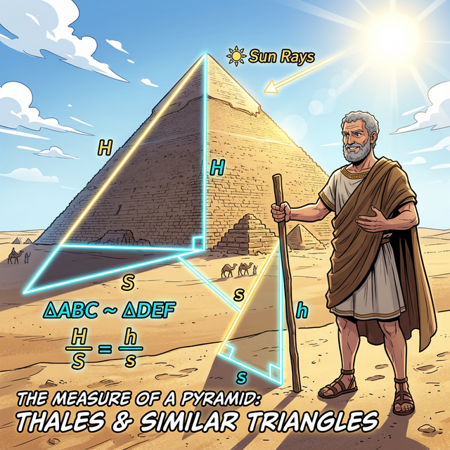

# 00. 도입 - 피라미드의 그림자를 잰 철학자 탈레스

기하학(Geometry)이라는 단어는 **'땅(Geo)'**과 **'측정하다(Metry)'**가 합쳐져 만들어졌습니다. 고대 이집트인들은 매년 나일강이 범람할 때마다 농토의 경계가 지워지자, 땅의 넓이를 다시 재고 나누기 위해 밧줄과 막대기만으로 사각형과 삼각형을 그려야만 했습니다. 생존을 위해 탄생한 학문, 그것이 기하학입니다.

---

## 1. 그리스 최초의 수학자, 탈레스 (Thales)

기원전 600년경, 이집트를 방문한 그리스의 철학자 **탈레스(Thales)**는 사막 한가운데 우뚝 솟은 거대한 쿠푸왕의 대피라미드(Great Pyramid)를 보고 압도당했습니다. 당시 이집트의 파라오는 탈레스의 지혜를 시험해 보기 위해 물었습니다.
*"가장 지혜로운 자여, 저 피라미드 꼭대기까지 올라가지 않고도 피라미드의 높이를 정확히 잴 수 있겠는가?"*

탈레스는 피라미드에 오를 필요가 전혀 없었습니다. 그는 모래밭에 수직으로 자신의 지팡이 하나를 푹 꽂아 넣었을 뿐입니다.

  

## 2. 태양빛이 만드는 우주의 삼각형 (닮음비)

  

태양빛은 너무나 멀리서 오기 때문에 지구의 모든 물체에 항상 **'평행(Parallel)'**하게 빛을 쏘아냅니다.
탈레스는 이 빛이 만들어내는 그림자를 유심히 관찰했습니다.

1. **내 지팡이의 길이**와 바닥에 깔린 **내 지팡이의 그림자 길이**가 똑같아지는 순간을 기다렸습니다. (직각이등변삼각형이 되는 각도)
2. 태양빛이 평행하다면, **작은 지팡이가 만드는 삼각형의 비율**과 **거대한 피라미드가 만드는 삼각형의 비율**은 우주 어디서나 완벽하게 똑같다(닮음)는 것을 알았습니다.
3. 지팡이의 그림자 길이가 지팡이의 실제 높이와 같아진 바로 그 순간! 탈레스는 소리쳤습니다. 
   *"이집트의 서기관들이여, 지금 당장 바닥에 깔린 저 거대한 피라미드의 그림자 길이를 재시오! 그 그림자의 길이가 지금 이 순간 피라미드의 진짜 높이와 완벽하게 똑같을 것이오!"*

파라오와 이집트 제관들은 직접 측량한 결과가 탈레스의 수학적 예언과 딱 맞아떨어지는 것을 보고 경악을 금치 못했습니다. 이것이 바로 인류 역사상 최초로 발견된 **'삼각형의 닮음(Similarity)'**을 이용한 길이 측량이자, 수학이 단순한 셈법을 넘어 보이지 않는 자연의 진리를 꿰뚫어 보는 순간이었습니다.

## 3. 현대 컴퓨터 공학과 폴리곤(Polygon)

오늘날 우리가 보는 3D 영화, 최신 플레이스테이션 게임, 메타버스의 가상 인간들은 어떻게 모니터에서 입체로 보일까요? 그래픽 카드(GPU)는 우리 눈에 보이지 않지만 화면에 수백만 개의 **작은 삼각형(Polygon)**들을 촘촘히 이어 붙여서 괴물, 도시, 인간의 얼굴을 그려내고 있습니다. 

왜 하필 원이나 사각형이 아니라 '삼각형'일까요?
* 세 개의 점으로는 **오직 평평한 하나의 평면(Surface)**만을 완벽하게 정의할 수 있기 때문입니다. (네 점부터는 종이가 구겨지듯 입체로 찌그러질 가능성이 생깁니다.)
* 가장 변형이 없는 절대적인 기본 뼈대, 즉 기하학 분야의 '소수(Prime Number)' 역할을 하는 것이 바로 삼각형입니다.

## V3.1 학습 가이드
이 단원에서는 탈레스가 발견한 삼각형의 성질부터 시작하여, 삼각형을 컴퓨터 코드로 그려내는 원리까지 추적합니다. 파이썬을 이용해 삼각형의 '합동' 조건을 코드로 이식해 보고, 무게중심(Centroid)을 구하는 수치 평균 연산(Averaging Operator)을 프로그래밍하여 고대의 지혜와 현대의 컴퓨터 알고리즘이 사실 완벽히 똑같은 원리로 작동함을 증명할 것입니다.
