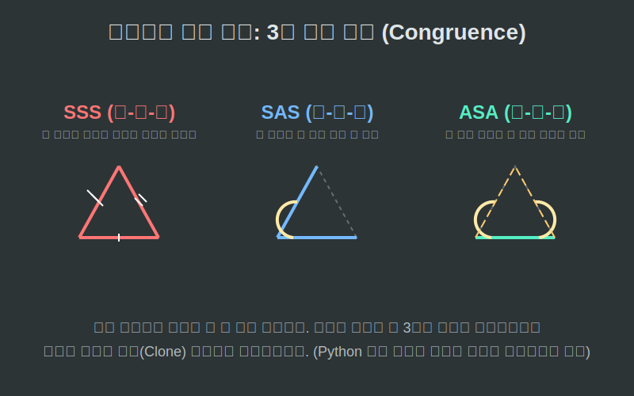

# 03. 세 번째 수업: 삼각형의 절대 복사 (합동, Congruence)

스마트폰 공장에서 똑같은 메탈 프레임을 백만 개씩 찍어낼 때, 그 프레임들이 완벽히 똑같은지 어떻게 검증할까요? 두 개의 도형의 크기, 각도, 변의 길이가 소수점 끝자리까지 완벽하게 스티커처럼 포개어지는(Overlapped) 상태를 수학에서는 **'합동(Congruence)'**이라고 부릅니다. 기호로는 **$\equiv$**(작대기 3개)를 씁니다.

---

## 학습 목표
* 6개의 정보(변 3개, 각 3개)를 다 알 필요 없이 단 3개의 핵심 유전자만으로 완벽한 클론(Clone)을 판별해내는 **유클리드의 3대 합동 조건**을 배웁니다.
* SSS, SAS, ASA 의 약자를 해독하고 시각적으로 조립되는 과정을 이해합니다.
* 파이썬의 핵심 개념인 **객체 지향 프로그래밍(OOP, Object-Oriented Programming)**의 **클래스(Class)** 생성자를 통해 이 세 가지 합동 조건이 어떻게 3D 데이터로 생성되는지 연결합니다.

## 1. 유클리드의 3대 유전자 일치 조건

결론부터 말하면 두 삼각형이 합동(완전히 같은 복제본)인지 확인하기 위해 세 변과 세 각을 다 자에 대고 잴 필요가 없습니다. 단 **3가지 조건** 중 하나라도 맞아떨어지는 순간, 남은 부위들은 기하학의 물리 법칙에 의해 강제로 위치가 고정되어 버립니다!

1. **SSS (Side-Side-Side) 합동**:
   "세 뼈대(변)의 길이가 각각 똑같다면?"
   못을 박아 뼈대 3개를 연결해 놓으면 두 삼각형은 절대 다른 모양으로 비틀어지지 않습니다. 아예 굳어버린 완벽한 쌍둥이 골조입니다.
2. **SAS (Side-Angle-Side) 합동**:
   "두 뼈대의 길이와, 그 사이의 **끼인 각**이 똑같다면?"
   두 개의 뼈대가 나침반처럼 벌려져 각도가 ล็อก(Lock)되어 있다면! 나머지 떨어진 두 끝을 잇는 변의 길이는 우주가 두 쪽이 나도 한 가지 길이로 고정됩니다! 따라서 완벽한 쌍둥이입니다.
3. **ASA (Angle-Side-Angle) 합동**:
   "하나의 바닥 뼈대와 그 양 끝에서 쏘아 올린 **두 개의 각도(레이저)**가 똑같다면?"
   양 끝에서 정해진 각도로 레이저 선을 쏘았을 때 반대편 허공에서 두 선이 부딪히는 '교점(Vertex)'은 무조건 한 곳뿐입니다. 즉 복제본 완성입니다!

<div align="center">
  
</div>

## 2. Python 객체 공장: 클래스(Class)와 생성자 설계

<div align="center">
  
</div>

파이썬의 세계에서는 물건의 설계도를 **`class`**라고 부르며, 이 설계도를 기반으로 메모리에 똑같은 물건(객체)을 백만 개씩 찍어냅니다. 이때 물건을 찍어내는 초기화 기능인 `__init__` (생성자)에 넘기는 필수 부품(파라미터)들이 바로 위의 SAS, ASA 와 똑같습니다!

```python
# 파이썬 객체 지향(OOP)으로 설계하는 유클리드 삼각형 공장

class Triangle:
    """삼각형을 찍어내는 기하학 캐드(CAD) 설계도 (클래스)"""
    
    # 3대 조립 방식 중 하나로 초기 주문을 받습니다. (생성자)
    def __init__(self, build_type, p1, p2, p3):
        
        # 1. 만약 고객이 [SSS] 로 주문을 넣었다면? (변 3개 제공)
        if build_type == "SSS":
            print(f"-> 뼈대 3개({p1}, {p2}, {p3}) 수신 완료. 물리 엔진이 삼각형을 고정 렌더링합니다.")
            self.side1, self.side2, self.side3 = p1, p2, p3

        # 2. 만약 고객이 [SAS] 로 주문을 넣었다면? (변, 끼인각, 변)
        elif build_type == "SAS":
            print(f"-> 변({p1}), 낀각({p2}도), 변({p3}) 수신 완료. 남은 한 변은 삼각함수로 강제 고정 렌더링합니다.")
            self.side1, self.angle, self.side2 = p1, p2, p3

        # 3. 만약 고객이 [ASA] 로 주문을 넣었다면? (각, 바닥변, 각)
        elif build_type == "ASA":
            print(f"-> 각({p1}도), 바닥({p2}), 각({p3}도) 수신 완료. 두 레이저 교점에 꼭짓점을 자동 생성합니다.")
            self.angle1, self.base, self.angle2 = p1, p2, p3


# 이제 이 설계도(Triangle 클래스)를 불러와 파이썬 메모리에 허상 객체 2개를 소환(복제/합동)시켜 봅시다.
print("엔진: 클론(Clone) A를 SAS 조건으로 찍어냅니다.")
clone_A = Triangle("SAS", 10, 45, 12)

print("\n엔진: 클론(Clone) B를 SAS 조건으로 완벽히 똑같이 찍어냅니다.")
clone_B = Triangle("SAS", 10, 45, 12)

# clone_A와 clone_B는 메모리 주소는 다르지만 가지고 있는 데이터(변, 각)는 완벽히 똑같은 쌍둥이. 즉 합동입니다.
```

컴퓨터 메모리에 떠 있는 수천 개의 몬스터 3D 폴리곤들은 사실 내부 코드를 들여다보면 저 유클리드의 "점 3개 또는 변 3개(SSS, SAS)" 파라미터를 입력받아 파이썬이나 C++ 클래스 엔진이 끊임없이 모니터에 똑같이 찍어내고(합동 렌더링) 있는 것에 불과합니다!

## 학습 정리
1. **합동(Congruence)**: 두 도형이 포개어 완벽하게 크기와 형태가 일치하는 쌍둥이 클론 상태. (`==` 동치 연산)
2. **합동 3대 불변 조건**: 뻔한 정보 6개를 다 찾지 말고 SSS, SAS, ASA 중 딱 3개의 필수 입력 파라미터(Argument)만 찾으면 구조가 고정(Lock) 되어 버림을 증명한 치트키.
3. 파이썬의 **클래스 오버로딩(Class Overloading)**이나 **초기화(`__init__`) 생성자 설계**를 할 때, 기하학의 입력 조건(SAS 등)을 파라미터 구조로 채택하면 3D 객체를 찍어내는 완벽한 오브젝트 메이커(Object Maker) 엔진을 만들 수 있다.
