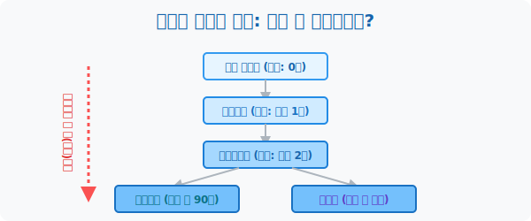
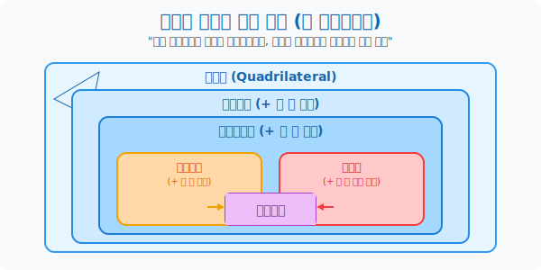
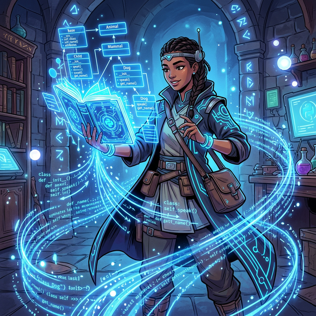

# 1. 뼈대와 규칙의 서바이벌: 사각형 세계의 족보 (Definition & Types of Quadrilaterals)

## [도입부] 학습 목표 (Learning Objectives)
- 단순히 "네 개의 선분으로 둘러싸인 도형"을 넘어, 어떤 규칙(평행, 각도, 길이)을 추가로 장착하느냐에 따라 이름과 신분 계급이 달라지는 사각형 세계의 '진화 족보'를 파악합니다.
- 조건이 1개도 없는 짐승 상태의 일반 사각형부터, 모든 완벽한 규칙을 갈아 넣은 최종 궁극체 정사각형까지 수직적으로 하달되는 수학적 분류법(Hierarchy)을 이해합니다.
- 파이썬(Python) 객체 지향 프로그래밍(OOP)의 상속(Inheritance) 개념을 활용하여, 상위 사각형의 성질이 하위 사각형으로 어떻게 그대로 유전되어 내려오는지 코드로 시뮬레이트합니다.

---

## 1. 짐승(일반 사각형)에서 진화하는 족보

우주의 빈 도화지 위에 아무렇게나 점 4개를 찍고 선분을 그으면 그저 **'사각형(Quadrilateral)'** 이 탄생합니다. 막 튜토리얼을 끝낸 레벨 1짜리 기초 도형으로 아무런 수학적 성질(마법)이 없습니다.
하지만 이 짐승 같은 사각형에 학자들이 **'강제적인 규칙(조건)'** 을 하나씩 페널티로 부여하기 시작하면, 돌연변이 진화가 일어납니다.

- **조건 1**: "야, 너네 마주 보는 두 선분. 최소한 한 쌍은 기찻길처럼 [평행]하게 뻗어봐라." $\rightarrow$ **사다리꼴(Trapezoid)** 로 레벨업!
- **조건 2**: "한 쌍으론 부족해. 나머지 마주 보는 한 쌍마저도 완벽히 [평행]해라!" $\rightarrow$ **평행사변형(Parallelogram)** 으로 레벨업!
- **조건 3-A**: 평행사변형인 상태에서 "너네 삐뚤빼뚤한 각도를 전부 칼같이 [$90도$] 로 맞춰!" $\rightarrow$ **직사각형(Rectangle)** 으로 파생 진화!
- **조건 3-B**: 각도는 냅두고 "너네 네 변의 [길이]를 모두 똑같이 잘라 맞춰!" $\rightarrow$ **마름모(Rhombus)** 로 파생 진화!
- **최종 보스**: "직사각형의 $90도$ 규율과 마름모의 변길이 규율을 전부 퓨전시켜라!!" $\rightarrow$ **정사각형(Square)** 궁극체 탄생!

수학에서 사각형을 배운다는 것은, 저 **"누가 어떤 조건을 더 빡세게 달고 태어났는가?"** 라는 진화 트리를 암기하는 것과 완전히 동일합니다.



<br>

## 2. 포함 관계: 위에서 아래로 상속되는 마법



이 족보의 가장 소름 돋는 점은 **'상위 개념의 특성은 하위 개념이 $100\%$ 공짜로 훔쳐다 쓸 수 있다'** 는 사실입니다.
예를 들어 평행사변형은 사다리꼴의 후손입니다. 따라서 누군가 "평행사변형아, 너 사다리꼴의 성질(한쌍 평행)을 가지고 있니?" 라고 물으면 평행사변형은 콧방귀를 뀌며 "난 이미 두 쌍이나 평행(조건2) 한데, 한 쌍 평행(조건1)정도야 껌이지!" 라고 대답합니다. 

결과적으로 **정사각형(최종 보스)** 은 평행사변형의 대각선 마법, 직사각형의 각도 마법, 마름모의 길이 마법을 이력서에 모조리 써먹을 수 있는 다이아몬드 수저가 됩니다. 반면 마름모보고 "너 직사각형이지?" 라고 물으면 $90도$ 규칙이 없으므로 탈락하는 논리 게임의 연속입니다.

---

## 3. 💻 파이썬(Python) 객체지향형(OOP) 사각형 진화 코딩



객체지향 프로그래밍(OOP)에서의 "클래스 상속(Inheritance)" 은 사각형의 진화 족보를 구현하는 데 구글 엔지니어들이 가장 사랑하는 완벽한 아키텍처입니다. 컴퓨터에게 부모 클래스 사각형의 DNA가 자식에게 전이되는 현상을 증명시켜봅시다.

### 🐍 파이썬 예제: 사각형 진화와 유전자 상속(Inheritance) 시뮬레이터

```python
print("--- 🧬 사각형 돌연변이: 유전자 상속(OOP) 시스템 가동 ---")

# 1. 짐승(조상) 클래스: 아무 조건 없음
class Quadrilateral:
    def __init__(self):
        self.sides = 4
        self.rule = "그냥 각 4개, 변 4개임"
    
    def status(self):
        return f"[사각형] {self.rule}"

# 2. 사다리꼴 클래스 (일반 사각형의 특성을 '상속' 받음)
class Trapezoid(Quadrilateral):
    def __init__(self):
        super().__init__() # 조상의 피를 물려받음
        self.rule += " -> [추가마법] 마주보는 한 쌍이 평행함!"
        
    def status(self):
        return f"[사다리꼴] {self.rule}"

# 3. 평행사변형 클래스 (사다리꼴의 특성을 '상속' 받음)
class Parallelogram(Trapezoid):
    def __init__(self):
        super().__init__() # 사다리꼴의 피마저 물려받음
        self.rule += " -> [추가마법] 나머지 한 쌍마저 평행함!"
        
    def status(self):
        return f"[평행사변형] {self.rule}"

# 객체(도형) 생성 및 족보 검열
basic_shape = Quadrilateral()
para_shape = Parallelogram()

print(basic_shape.status())
print(para_shape.status())

print("-" * 50)
print(f" ❓ 평행사변형은 일반 사각형의 자식인가? : {isinstance(para_shape, Quadrilateral)}")
print(f" ❓ 일반 사각형은 평행사변형 자격을 갖고 있는가? : {isinstance(basic_shape, Parallelogram)} (당연히 능력 부족 탈락)")

# 결과창:
# --- 🧬 사각형 돌연변이: 유전자 상속(OOP) 시스템 가동 ---
# [사각형] 그냥 각 4개, 변 4개임
# [평행사변형] 그냥 각 4개, 변 4개임 -> [추가마법] 마주보는 한 쌍이 평행함! -> [추가마법] 나머지 한 쌍마저 평행함!
# --------------------------------------------------
#  ❓ 평행사변형은 일반 사각형의 자식인가? : True
#  ❓ 일반 사각형은 평행사변형 자격을 갖고 있는가? : False (당연히 능력 부족 탈락)
```

이 코드처럼 평행사변형(`para_shape`)은 코드 몇 줄만으로 선조 사다리꼴의 `[마주보는 한쌍 평행]` 유전자를 공짜로 뜯어옵니다! 수학 교과서 속 도형의 진화 과정은 컴퓨터 사이언스 최첨단 패러다임인 객체지향 계층구조(Class Hierarchy)와 토씨 하나 다르지 않은 거대한 설계서입니다.

---

## [결론] 학습 정리 (Summary)

1. **도형의 진화(계층적 분류)**: 사각형 파트는 결코 암기 과목이 아닙니다. 백지상태의 짐승 도형에 '평행 한 다발', '수직 한 꼬집', '길이 한 국자' 의 제한적 조미료 규칙을 강제로 먹임으로써 새로운 괴물이 탄생하는 창조의 역사입니다.
2. **"~은 ~이다" 논리의 정복**: "정사각형은 직사각형이다. (O)" 왜? 직사각형의 필수 코어인 '$90도$' 룰을 정사각형은 이미 마스터랩으로 뚫어놨기 때문입니다. 하지만 반대로 "직사각형은 정사각형이다. (X)" 는 성립하지 않습니다. (길이 마법이 없기 때문입니다).
3. **마법은 유전된다**: 하위 테크트리에 있는 도형일수록 위쪽 선조들이 쓰던 대각선 마법, 내각 덧셈 마법 등의 족보를 다이렉트로 가져다 쓸 수 있는 무식한 파워 장착자임을 명심해야 합니다.
