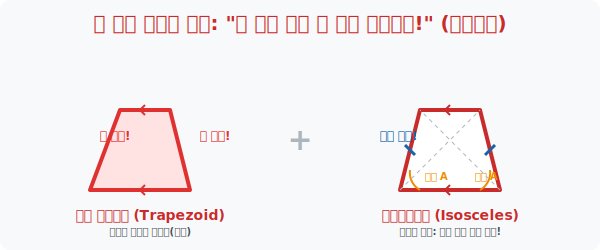
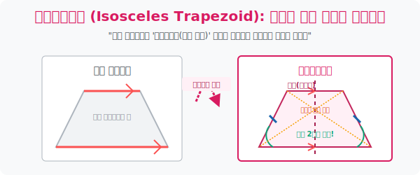

# 2. 첫 번째 진화 구간: 높은 곳까지 올라가게 도와주는 '사다리꼴(Trapezoid)'

## [도입부] 학습 목표 (Learning Objectives)
- 짐승 사각형이 문명 세계로 진입하기 위해 획득해야 하는 첫 번째 절대 반지, **"마주 보는 한 쌍의 대변이 평행하다"** 라는 규칙과 사다리꼴의 탄생 비화를 인지합니다.
- 좌우 대칭의 미학결정체인 **'등변사다리꼴(Isosceles Trapezoid)'** 로 변이 되었을 때 파생되는 두 밑각의 크기 일치, 그리고 두 대각선의 길이가 마법처럼 똑같아지는 히든 버프를 증명합니다.
- 파이썬(Python)의 기하학 매트릭스 백터 검증을 통해 4개의 점으로 둘러싸인 좌표 데이터가 정말로 위아래만 평행선을 이루는 사다리꼴인지 기울기 방정식을 뚫고 판독하는 판독기를 코딩합니다.

---

## 1. 짐승 사각형 최초의 문명화, "기찻길을 깔아라!"

지하실에 갇혀있던 성질 고약한 사각형에게 첫 번째 명령이 떨어집니다.
"적어도 위, 아래 뚜껑 2개 선분만큼은 절대로 서로 교차하지 않게 기찻길처럼 [평행]하게 수평을 맞춰라! 양옆 기둥은 아무렇게나 찌그러져도 무방하다!!"

이 조건 하나를 만족시킨 순간, 이 사각형은 더 이상 짐승이 아닌 **'사다리꼴(Trapezoid)'** 이라는 버젓한 신분증을 발급받습니다. 한 쌍의 대변이 평행하다는 이 사다리꼴의 구조물은, 벽에 사다리를 비스듬히 세워두었을 때 바닥 선분과 발을 밟는 계단 선분들이 전부 나란하게 평행한 모양과 같다고 하여 붙여진 직관적인 이름입니다.

이 평행 뚜껑 2개가 존재한다는 이유만으로, 우린 1학년 때 배운 위대한 마법 **"엇각과 동위각"** 스킬을 이 사다리꼴 내부에서 마음껏 지지고 볶고 칼질하여 각도 문제를 풀 수 있는 권한을 얻게 됩니다.



<br>

## 2. 돌연변이 귀족의 탄생: 등변사다리꼴(Isosceles Trapezoid)



사다리꼴 집안에서 아주 특이한 녀석이 하나 튀어나왔으니, 바로 **'등변(같을 等, 변 邊) 사다리꼴'** 입니다. 
"위아래 뚜껑이 평행한 건 알겠는데... 내친김에 양옆에 비스듬히 떨어지는 두 다리 선분의 길이까지 자로 잰 듯 똑같이 맞춰버리면 어떨까?" 라는 광기의 산물입니다.

양옆 다리의 길이가 똑같아지는 순간, 이 녀석은 완벽한 **'좌우 대칭'** 의 아이콘이 되어버리며 어마어마한 보너스 버프 3가지를 획득합니다.
1. **밑각의 복사(Copy)**: 양쪽 발목 인근의 두 밑각 크기가 토씨 하나 안 틀리고 똑같아집니다. (좌우가 완벽히 데칼코마니가 되었으니까요!)
2. **어깨각의 복사(Copy)**: 당연히 윗쪽 뚜껑 모서리에 깔린 두 어깨 각도의 크기도 똑같아집니다.
3. **대각선 레이저의 동일화**: 왼쪽 위에서 오른쪽 끝으로 쏘는 대각선의 길이 빔과, 오른쪽 위에서 왼쪽 끝으로 쏘는 대각선의 길이가 자를 대보면 소름 돋게 똑같습니다. (일반 사다리꼴은 대각선 길이가 완전히 다릅니다).

등변사다리꼴은 이후 등장할 귀족 평행사변형조차 가지지 못한 "대각선 무기 길이가 같다" 는 필살기를 가진 숨겨진 저격수 도형입니다.

---

## 3. 💻 파이썬(Python) 좌표 기울기로 스캔하는 사다리꼴 판독기


게임 엔진에서 유저가 4개의 좌표점을 찍어 도형을 맵핑했을 때, 컴퓨터는 어떻게 이 4개의 점 덩어리가 "사다리꼴" 인지 인식할까요? 바로 마주 보는 두 점을 이은 밧줄의 **기울기(Slope)** 데이터가 일치하는지 파이썬 로직으로 폭파 스캔하는 것입니다.

### 🐍 파이썬 예제: 좌표 기하학(Coordinate Geometry) 1쌍 평행 레이더망

```python
print("--- 📐 기하 판독기: 좌표로 스캔하는 '사다리꼴' 팩트 체크 ---")

# (좌표 맵핑) 4개의 점을 던짐: A(0, 0), B(5, 0), C(4, 3), D(1, 3)
point_A = (0, 0)
point_B = (5, 0)
point_C = (4, 3) # 윗변 오른쪽 꼭짓점
point_D = (1, 3) # 윗변 왼쪽 꼭짓점

# 기울기(Slope) 구하는 무식한 뼈대 공식: (y2 - y1) / (x2 - x1)
def calculate_slope(p1, p2):
    # 만약 수직으로 서있어서 x가 안변하면(분모가 0이면) 에러 방어용으로 무한대 던짐
    if p2[0] - p1[0] == 0:
        return 999999 
    return (p2[1] - p1[1]) / (p2[0] - p1[0])

# 1. 아랫변(AB)과 윗변(DC) 기울기 스캔
slope_AB = calculate_slope(point_A, point_B)
slope_DC = calculate_slope(point_D, point_C)

# 2. 왼쪽다리(AD)와 오른쪽다리(BC) 기울기 스캔
slope_AD = calculate_slope(point_A, point_D)
slope_BC = calculate_slope(point_B, point_C)

print(f"▶ 밑변 AB 기울기: {slope_AB:.1f} / 윗변 DC 기울기: {slope_DC:.1f}")
print(f"▶ 왼쪽 다리 AD 기울기: {slope_AD:.1f} / 오른쪽 다리 BC 기울기: {slope_BC:.1f}")
print("-" * 50)

# 판독 룰: 두 쌍의 마주보는 기울기 중, [단 한 쌍만!] 이라도 기울기 값이 똑같다면 기찻길 (평행) 통과!
if slope_AB == slope_DC or slope_AD == slope_BC:
    print(" ✅ [판독 결과] 합격! 한 쌍의 선분이라도 극강의 평행을 유지하고 있습니다.")
    print("    -> 이 도형 시스템은 짐승이 아닌 [사다리꼴] 로 분류 완료되었습니다.")
else:
    print(" 🚫 [판독 결과] 실패. 아무도 평행 룰을 지키기 않았습니다. 찌그러진 일반 다각형입니다.")

# 결과창:
# --- 📐 기하 판독기: 좌표로 스캔하는 '사다리꼴' 팩트 체크 ---
# ▶ 밑변 AB 기울기: 0.0 / 윗변 DC 기울기: 0.0
# ▶ 왼쪽 다리 AD 기울기: 3.0 / 오른쪽 다리 BC 기울기: -3.0
# --------------------------------------------------
#  ✅ [판독 결과] 합격! 한 쌍의 선분이라도 극강의 평행을 유지하고 있습니다.
#     -> 이 도형 시스템은 짐승이 아닌 [사다리꼴] 로 분류 완료되었습니다.
```

코드가 증명하듯 밑변과 윗변의 기울기가 `0.0` 으로 수평을 이루며 완벽히 일치했습니다! 한 쌍이 평행 조건을 해킹해 뚫는 순간 이 폴리곤 데이터는 사다리꼴 신전을 입장할 자격을 획득하게 됩니다.

---

## [결론] 학습 정리 (Summary)

1. **최소한의 자격 증명 (1쌍 평행)**: 중학교 내신 문제에서 "다음 중 아무 사각형이나 막 가져와도 무조건 성립하는 것은?" 따위의 질문이 나오면 덜컥 속지 마십시오. 사다리꼴 뱃지를 달려면 무조건 마주 보는 선분 2개 중 1쌍의 선로가 평행 레이저를 쏴야만 성립합니다.
2. **아름다운 외인구단 '등변사다리꼴'**: 평행은 위아래로 한 번 해주고, 뜬금없이 양옆 벽의 길이를 획일화 통일시킨 등변 사다리꼴은 거울 대칭을 무기로 두 밑각을 찍어 누르고 대각선 길이마저 통일해 버리는 기괴한 파괴력을 가집니다.
3. **엇각과 동위각의 파티**: 평행선이 1쌍 출현했다는 것은 통쾌하게도 Z 자 모양을 긋고(엇각), F 자 모양을 그어(동위각) 맞은편 뿔의 폭탄 각도 수치를 거저먹을 수 있는 강력한 무기를 하나 획득했다는 선언문입니다.
