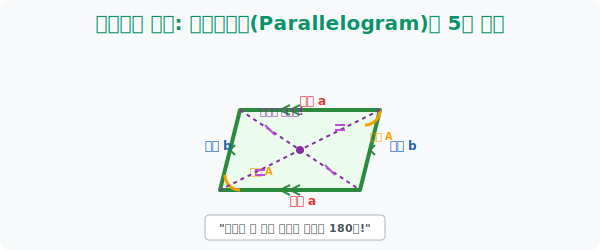
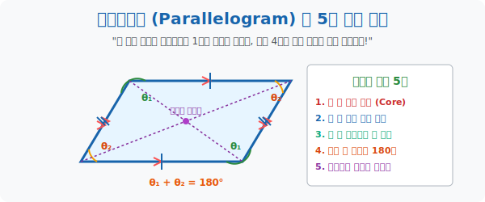

# 3. 도형계의 귀족: 평행사변형(Parallelogram)의 5대 마법

## [도입부] 학습 목표 (Learning Objectives)
- 사다리꼴의 1쌍 평행을 넘어, 나머지 마주 보는 한 쌍마저 완벽한 기찻길(평행)을 이루어 낸 도형 계의 엘리트 귀족 **'평행사변형'** 의 존재를 각인합니다.
- 평행사변형으로 진화하는 순간 터져 나오는 5가지의 거대한 마법(변의 복사, 각의 복사, 각의 합 180도, 대각선 반갈죽) 의 기하학적 스펙을 해부합니다.
- 파이썬(Python)의 좌표 벡터 덧셈 법칙을 통해 3개의 점 좌표만 알고 있어도, 평행사변형의 평행 이동 벡터(Vector) 마법을 이용해 숨겨진 4번째 점의 좌표를 해킹해 내는 네비게이션 스크립트를 구현합니다.

---

## 1. 완벽한 두 개의 기찻길: 귀족의 탄생

사다리꼴이 위아래 한 쌍만 기찻길(평행) 모양을 한 반쪽짜리였다면, 학자들은 나머지 왼쪽/오른쪽 벽마저 완벽하게 평행하게 세워버리면 어떨까 호기심을 가졌습니다.
"마주 보는 **두 쌍의 대변이 모두 평행**한 사각형!" 
이것이 바로 사각형 족보의 허리를 든든하게 받치고 있는 위대한 귀족, **평행사변형(Parallelogram)** 의 탄생입니다.

이 두 쌍이 쌍방으로 평행하다는 절대 조건 하나가 만족 되는 순간, 이 도형의 내부 구조는 견고하게 잠금(Lock)이 풀리면서 엄청난 5대 마법 스펙들이 와르르 다 떨어지게 됩니다. 우리는 평행사변형 문제를 풀 때 이 5가지 스킬 중 아무거나 냅다 갖다 써버리면 그만입니다.



<br>

## 2. 평행사변형 특전: 5대 마법 스킬 트리



어느 각도기로 재든, 자로 재든 평행사변형이라면 무조건 모조리 다 들어맞는 소름 돋는 5가지의 우주 법칙입니다.

1. **정의 마법 (평행 2쌍)**: 윗변 // 아랫변, 왼쪽변 // 오른쪽 변 (기본 패시브)
2. **복사 마법 1 (변의 길이)**: 마주 보는 변의 길이가 모조리 똑같습니다. 윗변 5면 아랫변 5, 왼쪽 변 3이면 오른쪽 변 무조건 3!
3. **복사 마법 2 (마주 보는 각)**: 마주 보는 대각선 축 각도의 크기가 똑같습니다. 왼쪽 윗 각이 120도면 오른쪽 아래 각도 무조건 120도!
4. **연합 마법 (각의 덧셈 180도)**: 아무 방향이나 이웃한 두 각을 붙잡고 더하면 무슨 짓을 해도 **$180도$**가 나옵니다. "동측내각" 의 위대한 원리입니다.
5. **학살 마법 (대각선의 이등분)**: 대각선을 X자로 그으면 두 대각선은 서로의 배꼽을 정확히 **반갈죽(이등분)** 해버립니다.

"선생님, 저 사각형이 평행사변형인지 어떻게 알아요?" 라고 묻는다면 반대로 생각하면 됩니다. 저 5원칙 중에서 찌그러진 일반 다각형 범죄자가 **"단 하나라도 만족시키는 행동을 보여준다면, 그놈 신분증은 평행사변형"** 으로 강제 판결이 납니다.

---

## 3. 💻 파이썬(Python) 벡터 기하학 4번째 꼭짓점 해킹기


아주 유명한 IT 기업 코딩 테스트 문제입니다. "A, B, C 점 3개만 주어졌을 때, 이 도형이 평행사변형이 되기 위한 D점의 GPS 좌표를 해킹해 내라!" 평행선의 "이동 거리(Vector)" 속성을 이용하면 중학생도 1초 만에 풀어버립니다.

### 🐍 파이썬 예제: 벡터 평행 이동 4번 째 점 추적기

```python
import numpy as np

print("--- 🛰️ 셜록 홈즈 파업: 벡터 맵핑 4번째 점 해킹 ---")

# (좌표 맵핑) 3개의 점만 덩그러니 주어짐
# 순서대로 A(왼쪽아래), B(오른쪽아래), C(오른쪽위) 라고 가정
point_A = np.array([1, 1])
point_B = np.array([5, 2])
point_C = np.array([6, 6])

print(f"▶ 타겟 확보 | A: {point_A}, B: {point_B}, C: {point_C}")

# 1. 벡터(Vector) 마법 시전: B점에서 A점 쪽으로 걸어간 거리와 방향 파악!
# 백터 BA = A - B
vector_BA = point_A - point_B

print(f" 🧭 [벡터 스캔] B에서 A로 이동하려면 X축으로 {vector_BA[0]}칸, Y축으로 {vector_BA[1]}칸 이동해야 함")

# 2. 복사 마법 발동 (평행사변형은 마주보는 변이 평행하고 길이가 같다)
# 그럼 C점에서도 똑같이 저 벡터 BA 방향/길이 만큼 걸어가면 무조건 숨겨진 D점이 나와야지!
# D = C + vector_BA
point_D = point_C + vector_BA

print("-" * 50)
print(f" 💣 [해킹 완료] 숨겨진 4번째 점 D의 GPS 좌표는: {point_D} 입니다!")
print(f"    (검증: AD의 기울기와 BC의 기울기가 완벽하게 일치하는 평행사변형 완성!)")

# 결과창:
# --- 🛰️ 셜록 홈즈 파업: 벡터 맵핑 4번째 점 해킹 ---
# ▶ 타겟 확보 | A: [1 1], B: [5 2], C: [6 6]
#  🧭 [벡터 스캔] B에서 A로 이동하려면 X축으로 -4칸, Y축으로 -1칸 이동해야 함
# --------------------------------------------------
#  💣 [해킹 완료] 숨겨진 4번째 점 D의 GPS 좌표는: [2 5] 입니다!
#     (검증: AD의 기울기와 BC의 기울기가 완벽하게 일치하는 평행사변형 완성!)
```

놀랍지 않나요? 코딩에서 점 D 의 $x, y$ 연립 방정식을 무식하게 풀 이유가 없습니다. "아랫변이 왼쪽으로 걸어간 거리만큼, 윗변도 왼쪽으로 똑같이 걸어갔겠지!" 라는 평행사변형의 본질만 건드린 파이썬 벡터(Vector) 수학 연산 한 줄로 시야의 암흑을 벗겨냅니다.

---

## [결론] 학습 정리 (Summary)

1. **사다리꼴을 압도하는 5대 패시브**: 사다리꼴이 평행 1쌍에 빌어먹던 서민이었다면, 나머지 1쌍마저 마저 평행을 잠제 해금 한 평행사변형은 길이, 각도, 대각선까지 마음대로 자르고 붙이는 절대 귀족의 반열에 오릅니다.
2. **마법의 연계(180도의 발견)**: 이웃한 두 각의 합이 $180도$ 라는 스펙은 시험 문제에서 기적의 치트키입니다. 각도기 120도가 주어지면, 눈 감고 옆의 각도에 60도를 적고 맞은편에 120도를 복사해 붙이면 모든 각도 퍼즐이 박살 납니다.
3. **대각선 반갈죽의 공포**: 두 뼈대 대각선이 서로의 허리를 정확히 절반으로 베고 간다는 성질은 다다음 챕터에 나올 마름모와 직사각형 파생 도형들의 근본적인 조상 유전자로 뿌리내립니다.
