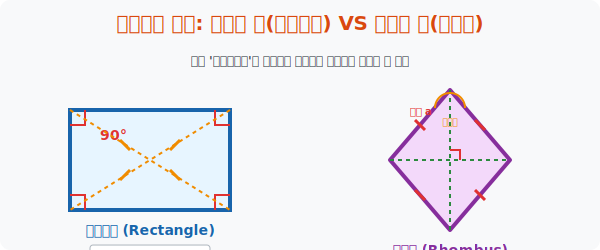
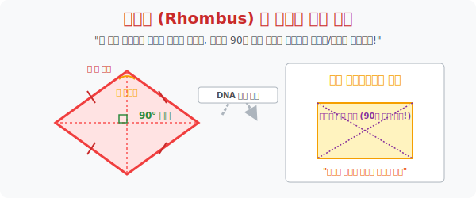

# 4. 형제들의 분열: 각도의 신(직사각형) VS 길이의 신(마름모)

## [도입부] 학습 목표 (Learning Objectives)
- 평행사변형이라는 고오급 귀족 가문에서 파생되어, "각도 파" 로 갈라선 '직사각형' 과 "길이 파" 로 갈라선 '마름모' 라는 두 돌연변이 형제의 특화 진화 스킬을 감상합니다.
- 선조(평행사변형)의 패시브 스킬 5개는 모조리 공유하면서도, 각각 **대각선의 길이(직사각형)** 와 **대각선의 직교 정면충돌(마름모)** 이라는 독자적인 필살기를 보유하게 된 유전자 분열을 분석합니다.
- 파이썬(Python)의 `math.hypot` 공식을 통한 점과 점 사이의 거리 계산 스크립트로 맵상의 점 4개가 진짜 네 변의 길이가 칼같이 맞아떨어지는 마름모 영토인지 자동 스캔하는 방어 시스템을 코딩합니다.

---

## 1. 각도 집착의 끝판왕: 직사각형 (Rectangle)

사방이 기찻길이라 평화롭던 평행사변형이 갑자기 결벽증에 걸렸습니다. "아우, 모서리가 찌그러진 건 절대 못 참아! 모든 코너 모서리 각도를 **전부 칼같이 90도($90^\circ$)** 로 펴버렷!!"
이 결벽증의 탄생물이 바로 네 각이 모두 직각인 **직사각형(Rectangle)** 입니다.

당연히 선조 평행사변형의 평행이동 마법 피가 흐르고 있으므로 이 녀석 역시 두 쌍 대변 평행, 맞마주보는 변 길이 동일 등의 마법은 숟가락만 얹어 다 빼먹습니다. 하지만 무리해서 모서리를 $90도$ 로 확 펴버린 덕분에 엄청난 물리적 변형(돌연변이 스킬) 이 하나 발생했습니다.

- **[직사각형의 독점 필살기]**: **"두 대각선의 길이가 우주 끝까지 자로 잰 듯 완벽히 똑같다!"**
  - 일반 평행사변형을 대각선 그으면 한쪽은 길고 한쪽은 짧습니다. 그러나 직사각형은 네 귀퉁이 각도가 똑바로 서버림에 따라 허리를 관통하는 두 대각선 뼈대의 길이 밸런스가 $1:1$ 대칭 패치를 받아버린 것입니다.



<br>

## 2. 길이 집착의 끝판왕: 마름모 (Rhombus)



이번엔 평행사변형 가문의 둘째 형제입니다. 이 녀석은 각도 따위는 찌그러지든 말든 관심이 없고 오로지 변의 "길이 밸런스" 에만 미친 놈입니다.
"직사각형 형님은 마주 보는 길이 2개씩만 똑같지? 난 아예 상하좌우 **네 변의 테두리 길이를 통틀어 모조리!** 다 똑같이 짧게 잘라 맞춰버리겠어!!"
이 광기의 산물이 네 변의 길이가 모두 똑같은 다이아몬드, **마름모(Rhombus)** 입니다.

이 녀석 역시 평행사변형 할아버지의 유산(서로 다 평행 등) 을 모조리 공짜로 훔쳐다 씁니다. 하지만 네 뼈대의 길이를 강제로 쥐어짜 똑같이 맞춰버리는 바람에, 내부에 있던 대각선 뼈대 축 2개가 충돌하며 전무후무한 대사건 마법이 발현됩니다.

- **[마름모의 독점 필살기 1]**: **"두 대각선이 서로를 수직($90^\circ$)으로 찍어 내리며 십자가 크로스한다!"**
  - (일반 평행사변형은 대각선이 삐딱하게 교차하지만, 마름모는 피타고라스의 숨결을 받아 정확히 직각 십자가 칼질을 냅니다)
- **[마름모의 독점 필살기 2]**: **"대각선이 코너 각도를 정확히 반으로 쪼개며 날아간다 (각의 이등분)!"**

---

## 3. 💻 파이썬(Python) 내 땅이 마름모인지 검열하는 지적도(거리) 스캐너


부동산 땅 점 4개의 꼭짓점 좌표만 주어졌을 때, 굳이 각도를 재거나 평행을 확인하지 않아도 "네 선분의 거리가 모두 똑같다!" 라는 팩트 하나만 파이썬 피타고라스 빗변 거리 공식(`hypot`) 으로 때려 넣으면 마름모 지적도 증명은 0.1초 만에 끝이 납니다.

### 🐍 파이썬 예제: 좌표 거리 측정을 통한 마름모 판독 시스템

```python
import math

print("--- 💎 부동산 매트릭스: 좌표 기반 마름모 영토 판독기 ---")

# (좌표 맵핑) 마름모 모양 다이아몬드를 그리는 점 4개
# A(0, 3) 윗꼭짓점, B(-4, 0) 왼쪽, C(0, -3) 아래, D(4, 0) 오른쪽
pts = {
    'A': (0, 3),
    'B': (-4, 0),
    'C': (0, -3),
    'D': (4, 0)
}

# 두 점프 좌표 사이의 거리(모서리 길이) 를 피타고라스 마법구(math.hypot) 로 뚫어버리는 함수
def get_distance(p1, p2):
    return math.hypot(p2[0] - p1[0], p2[1] - p1[1])

# 4개 외곽선 울타리(변) 의 길이 몽둥이 무식하게 전부 측정!
side_AB = get_distance(pts['A'], pts['B'])
side_BC = get_distance(pts['B'], pts['C'])
side_CD = get_distance(pts['C'], pts['D'])
side_DA = get_distance(pts['D'], pts['A'])

print(f"▶ 울타리 4개 길이 스캔 완료:")
print(f"   [AB]: {side_AB:.1f} / [BC]: {side_BC:.1f} / [CD]: {side_CD:.1f} / [DA]: {side_DA:.1f}")
print("-" * 50)

# 마름모 검열 장치: "4개의 몽둥이 길이가 모조리 일치하는가?"
if side_AB == side_BC == side_CD == side_DA:
    print(" ✅ [마름모 진화 승인] 평행사변형의 유전자를 넘어, 네 변을 모두 획일화시킨 [마름모] 영토입니다!")
    print("    (이 땅 대각선으로 길 2개 파면 무조건 십자가 위아래 90도 수직교차 나옴 ㅋㅋ)")
else:
    print(" 🚫 [판독 실패] 네 변 길이가 다릅니다. 이 땅은 찌그러진 잡도형입니다.")

# 결과창:
# --- 💎 부동산 매트릭스: 좌표 기반 마름모 영토 판독기 ---
# ▶ 울타리 4개 길이 스캔 완료:
#    [AB]: 5.0 / [BC]: 5.0 / [CD]: 5.0 / [DA]: 5.0
# --------------------------------------------------
#  ✅ [마름모 진화 승인] 평행사변형의 유전자를 넘어, 네 변을 모두 획일화시킨 [마름모] 영토입니다!
#     (이 땅 대각선으로 길 2개 파면 무조건 십자가 위아래 90도 수직교차 나옴 ㅋㅋ)
```

이 코드는 아무런 평행 조건식을 넣지 않았습니다. 오직 '네 변의 길이가 싸그리 똑같다' 라는 극악의 마름모 정의 코드만 넣었는데, 피타고라스 원리에 의해 자동으로 마주 보는 변은 평행해져 평행사변형 서브 버프까지 덩달아 챙기는 위대한 기하학의 연산 논리를 보여줍니다.

---

## [결론] 학습 정리 (Summary)

1. **상속자들의 특화 스킬**: 귀족 평행사변형에서 직사각형은 **"각도를 90도로 펴라"** 는 퀘스트를, 마름모는 **"네 변의 길이를 같게 잘라라"** 는 퀘스트를 깨고 진화한 변종들입니다.
2. **대각선 마법의 분화**: 직사각형의 몸부림은 대각선 2개의 **"길이 통일"** 이라는 보상을 낳았고, 마름모의 몸부림은 허리를 관통하는 두 대각선의 **"수직 직교($90도$ 충돌)"** 와 **"각의 반갈죽 이등분"** 이라는 서로 다른 특권층 보상을 획득하게 했습니다. 
3. **진화의 방향성 결여의 함정**: 어떤 머리 나쁜 사각형이 "마주 보는 두 변 길이만 같고, 한 각만 90도로 할래!" 라고 애매한 진화를 꾀하면 도형 시스템에 충돌을 일으켜 모순에 빠집니다. 모든 규칙은 서로 거미줄처럼 엮여 하나의 완성체 스펙트럼(족보)을 유지합니다.
