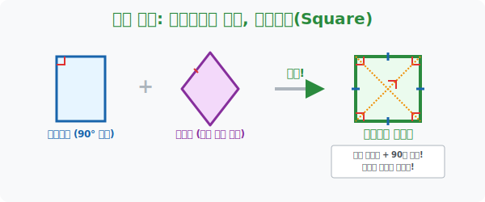
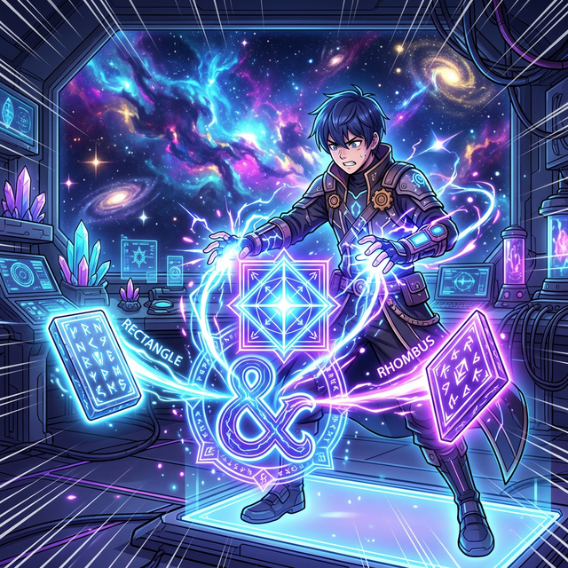

# 5. 완전체 궁극의 진화: 다이아몬드 수저, 정사각형(Square)

## [도입부] 학습 목표 (Learning Objectives)
- 사각형 족보의 가장 밑바닥부터 시작하여 모든 고된 퀘스트를 다 깨고 올라온 최종 보스 몬스터, **'정사각형(Square)'** 의 탄생 배경과 절대 스펙을 구경합니다.
- 서로 사이가 안 좋았던 "각도 파(직사각형)" 와 "길이 파(마름모)" 의 DNA가 한 피투성이로 융합되어(Fusion) 탄생한 정사각형이 과거 선조들의 모든 마법을 공짜로 난사하는 모습을 확인합니다.
- 파이썬(Python)의 `Set(집합)` 교집합 연산을 통해, 수학책의 "정사각형 조건 = 직사각형 조건 AND 마름모 조건" 이라는 텍스트가 프로그래밍 집합 논리와 완벽히 일치하는 집합론의 정수를 경험합니다.

---

## 1. 두 혈통의 퓨전: 직사각형($90도$) + 마름모(길이통일)

4수업에서 평행사변형의 두 알에서 깨어난 직사각형과 마름모는 각자의 특수한 진화 트리를 탔습니다. 그런데 어떤 미친 도형이 외쳤습니다.
"난 직사각형처럼 **네 개의 모서리가 다 $90^\circ$ 도** 이면서, 동시에 마름모처럼 **네 변의 테두리 길이가 모조리 다 똑같은** 궁극의 콤비네이션이 될 테야!!"

마치 게임에서 최고의 얼음 속성(직사각형)과 불 속성(마름모) 템을 모두 눌러 장착한 이 사기성 짙은 캐릭터의 이름이 바로 **정사각형(Square)** 입니다.

- **[궁극의 대각선 팩트]**: 선조들의 기술을 난사합니다. 
  1. (직사각형 스킬 발동) "내 두 대각선의 **길이는 완전히 똑같다!**"
  2. (마름모 스킬 발동) "내 두 대각선은 서로 한가운데서 **$90^\circ$ 로 수직충돌(직교) 한다!**"
  3. (평행사변형 스킬 발동) "당연히 대각선은 서로를 정확히 **반갈죽(이등분)** 쪼갠다!"

정사각형 앞에서는 더 이상 증명할 게 없습니다. 그 어떤 사각형의 원리와 성질을 물어봐도 정사각형은 무조건 "YES, 저 그거 다 할 줄 압니다" 라고 대답하는 이 세계의 황제입니다.



<br>

## 2. 족보의 완성: "너 내 동료가 돼라!"


시험 문제에서 학생들을 가장 미치게 하는 함정 구간은 **"~에 어떤 조건을 하나 더 끼워 넣으면 정사각형이 되는가?"** 입니다.
이것은 퓨전 게임의 부족한 속성을 채워넣는 퀴즈입니다.

- **문제 1**: 내 손에 '직사각형' 이 있다. 정사각형으로 레벨업하려면 무엇을 먹여야 하는가?
  - 직사각형은 이미 네 각의 $90도$ 마법은 가졌습니다. 부족한 건 마름모의 유전자입니다! 따라서 **[이웃한 두 변의 길이를 같게 만든다]** 혹은 **[대각선이 $90도$ 로 수직직교하게 베어버린다]** 라는 알약을 먹이면 순식간에 정사각형이 됩니다.
- **문제 2**: 반대로 '마름모' 가 있다. 정사각형이 되려면?
  - 마름모는 길이는 다 맞췄지만, 각도가 찌그러져 있습니다. 직사각형의 DNA를 수혈해야 합니다! **[한 각을 $90도$ 로 확 세워버린다]** 혹은 **[두 대각선의 길이를 억지로 똑같이 통일시킨다]** 라는 수술을 하면 정사각형 렌더링이 켜집니다.

---

## 3. 💻 파이썬(Python) Set 교집합(AND) 마법 승급 시스템



수학적 조건의 융합(Fusion)을 파이썬 코드로 가장 날카롭게 해체하는 무기가 바로 집합 자료형 `Set` 의 **교집합(`&`) 연산** 입니다. 직사각형 셋(Set)과 마름모 셋(Set)이 합체할 때 궁극의 정사각형 셋(Set)이 탄생하는 코드를 감상합니다.

### 🐍 파이썬 예제: OOP 스킬 집합 교차(Intersection) 융합 엔진

```python
print("--- ⚔️ 도형 퓨전 퍼지기: Set 교집합으로 정사각형 소환 ---")

# (스킬 트리 맵핑)
# 직사각형(Rectangle) 이 가진 전용 스킬 마법진 집합셋
skills_rectangle = {
    "두 쌍 평행", "마주보는 길이 동일",   # (이건 조상님꺼 평행사변형 패시브)
    "네 뿔 각도가 모두 90도",            # (직사각형 고유스킬)
    "두 대각선의 길이가 우주마냥 똑같다"   # (직사각형 고유스킬)
}

# 마름모(Rhombus) 가 가진 전용 스킬 마법진 집합셋
skills_rhombus = {
    "두 쌍 평행", "마주보는 길이 동일",   # (이건 조상님꺼 평행사변형 패시브)
    "네 변의 몽둥이 길이가 모조리 똑같음", # (마름모 고유스킬)
    "대각선이 위아래 수직 90도로 직교함"   # (마름모 고유스킬)
}

# 진화 연산 발동: 두 스킬의 [합집합(Union: |)] 이 바로 세상의 모든 스킬을 집어삼킨 [정사각형] 이다!
# (수학 문제의 풀이법과는 반대로, 파이썬에서는 모든 스펙을 합치는 합집합 연산으로 최종 보스의 스킬트리를 배열함)
skills_square = skills_rectangle | skills_rhombus

print("▶ 직사각형 스킬 갯수:", len(skills_rectangle))
print("▶ 마름모 스킬 갯수:", len(skills_rhombus))
print("▶ 궁극체 [정사각형] 이 흡수한 총 스킬 갯수:", len(skills_square))
print("-" * 50)

print(f" 👑 [정사각형의 최종 스탯창 공개]")
for i, skill in enumerate(skills_square, 1):
    print(f"   {i}번 난사 스킬: {skill}")

# 결과창:
# --- ⚔️ 도형 퓨전 퍼지기: Set 교집합으로 정사각형 소환 ---
# ▶ 직사각형 스킬 갯수: 4
# ▶ 마름모 스킬 갯수: 4
# ▶ 궁극체 [정사각형] 이 흡수한 총 스킬 갯수: 6
# --------------------------------------------------
#  👑 [정사각형의 최종 스탯창 공개]
#    1번 난사 스킬: 대각선이 위아래 수직 90도로 직교함
#    2번 난사 스킬: 두 쌍 평행
#    3번 난사 스킬: 네 뿔 각도가 모두 90도
#    4번 난사 스킬: 네 변의 몽둥이 길이가 모조리 똑같음
#    5번 난사 스킬: 마주보는 길이 동일
#    6번 난사 스킬: 두 대각선의 길이가 우주마냥 똑같다
```

`set` 의 조합 연산을 통해 코드 한 줄로 두 종족의 중복되는 DNA(조상 스킬) 는 하나로 깔끔하게 정리하고, 각자만 가지고 있던 고유 필살기들은 퓨전(`|`) 시켜 세상에 존재하는 모든 육각형 꽉 찬 무기를 든 사기 캐릭터의 생성 로직을 체감할 수 있습니다.

---

## [결론] 학습 정리 (Summary)

1. **퓨전의 미학**: 사각형 서바이벌의 고점이자 꼭대기인 '정사각형' 은 완전히 새로운 것을 창조하는 것이 아닙니다. 직사각형(각도 파)과 마름모(길이 파)라는 두 이질적인 분파를 타협 없이 100% 하나로 합병시켰을 때 탄생하는 거대 복합체입니다.
2. **모든 수수께끼의 프리패스**: 문제 풀이 시, "대각선 길이가 같고 수직으로 직교하는 사각형은 누구냐?" 질문받으면 고민할 것 없습니다. 오직 정사각형만이 저 거만한 두 스킬의 교집합에 들어가 있습니다.
3. **진화의 보충제**: 이 진화 족보는 한 방향으로 끝없이 내려오며 능력을 켭켭이 쌓아오는 프로그래밍의 `클래스 다중상속(Multiple Inheritance)` 과 지독시리 같은 구조 설계임을 상기해야 합니다.
