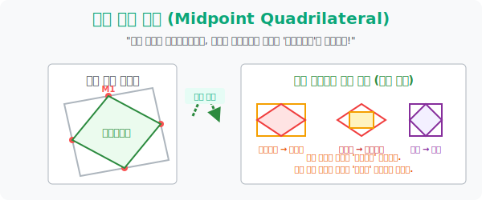

# 6. 피투성이의 환생: 중점(Midpoint)을 갈라 꿰맨 사각형의 새로운 뼈대

## [도입부] 학습 목표 (Learning Objectives)
- 사각형 테두리를 칼로 도려내어 한가운데인 **'중점(Midpoint)'** 에 점을 찍은 뒤, 다시 그 4개의 핏자국(점)을 실로 꿰매어 연결했을 때 내부에서 자라나는 기괴하고도 아름다운 "새로운 형태의 사각형 환생" 법칙을 파악합니다.
- 삼각형의 중점연결정리(평행선 마법)가 사각형 내부를 가로지르는 대각선 뼈대에서 어떻게 작동하여, 밖에 있는 원본 도형의 상태에 따라 환생된 자식 도형이 평행사변형 $\rightarrow$ 직사각형 $\rightarrow$ 마름모로 교차 진화하는지 해부합니다.
- 파이썬(Python)의 좌표 평균(Average) 렌더링을 시용하여, 무작위로 찌그러진 4개의 점($x, y$)의 뼈대 사이버 중점 좌표 4개를 도출해 내고, 그들이 컴퓨터상에서 스스로 평행선을 맞추는 자동 보정 툴을 체감합니다.

---

## 1. 죽은 고철 사각형의 부활 마술

길바닥에 굴러다니는 가장 등급이 낮은 레벨 1짜리 찌그러진 '일반 사각형' 모양의 합판을 하나 주워옵니다. 
이제 자(Ruler)를 들고 이 찌그러진 네 개의 울타리 가장 한가운데 모서리에 마커펜으로 점(중점)을 4번 콕 콕 찍습니다.
그리고 이 4개의 마커 점을 자를 대고 일직선으로 쫙쫙 연결하면 사각형 안에 **"새롭게 환생한 미니 사각형"** 이 하나 들어앉게 됩니다.

놀라운 사실은 겉 껍데기는 세상에서 제일 못생긴 일반 쓰레기 사각형이었을지라도, 그 중점들을 연결해 만든 속 알맹이 사각형은 **"100% 무조건 귀족계급인 [평행사변형] 으로 환생하여 고정된다!"** 라는 대마법의 법칙입니다.

왜 이런 기적이 터질까요? 
겉 사각형에 X자로 보이지 않는 대각선 뼈대를 하나 그어보면, 삼각형 다리 단원에서 배운 **[삼각형의 중점연결정리]** 마술이 작동합니다. 알맹이 사각형의 천장과 바닥 선분은 오리지널 보이지 않는 대각선의 방향과 나란히 평행하게 이끌리고, 그 길이의 딱 반 토막($1/2$)으로 짤라지며 강제 세팅되기 때문입니다!

## 2. 돌연변이의 염색체 공식



껍데기(원본 사각형) 가 짐승 쪼가리가 아니라 만약 직사각형 내지 마름모처럼 스펙을 단 귀족이라면, 뱃속에서 태어나는 환생 사각형의 운명도 극과 극으로 뒤바뀌는 염색체 마법 서열(족보)이 존재합니다.

1. **[마름모] 껍데기 $\rightarrow$ [직사각형] 환생**
  - 마름모는 고유 필살기가 "대각선이 $90도$ 수직 파괴" 였습니다. 안에 들어앉은 중점 환생 사각형이 이 $90도$ 직각 에너지를 뼈대로 흡수하여 네 모서리가 모두 $90도$로 확 펴진 **직사각형**이 배꼽을 찢고 튀어나옵니다.
2. **[직사각형] 껍데기 $\rightarrow$ [마름모] 환생**
  - 직사각형의 고유 버프는 "두 대각선의 길이가 우주 끝 동일함" 이었습니다. 속 알맹이는 각 선분 길이가 저 대각선의 절반($1/2$) 크기로 결합하므로, 이번엔 거꾸로 네 변의 길이가 칼같이 같은 **마름모**가 탄생합니다!
3. **[정사각형] 껍데기 $\rightarrow$ [정사각형] 환생**
  - 길이고 각도고 모든 마법의 집결체인 정사각형을 낳고 까면, 그 뱃속에선 죽을 때까지 완벽한 복제품 아기 정사각형 무한 마트료시카만 태어납니다. 

---

## 3. 💻 파이썬(Python) 중점(Midpoint) 좌표 파괴 매핑 시뮬레이터


파이썬 환경에서 개떡 같이 찌그러진 $x,y$ 평면 4개의 좌표점 배열을 주고, 두 점 간의 평균값(중점 좌표 $\frac{x1+x2}{2}$) 을 구한 뒤 그 속 알맹이 도형이 진짜 평행사변형 귀족인지 평행기울기로 검증해 냅니다.

### 🐍 파이썬 예제: 사이버 환생(Midpoint Generation) 평행 팩트 해킹

```python
import numpy as np

print("--- ✂️ 폴리곤 뱃속 환생: 찌그러진 사각형의 중점연결 해부기 ---")

# (겉 껍데기) 정말 엉망진창 아무렇게 찍은 잡사각형 점 4개 (A, B, C, D)
# A(0,0), B(8,2), C(6,9), D(2,10)
pts_outer = np.array([[0,0], [8,2], [6,9], [2,10]])

# 두 점의 딱 한가운데(중점) 를 도끼로 쪼개는 함수 (x,y의 평균 연산)
def get_midpoint(p1, p2):
    return (p1 + p2) / 2.0

# 속 알맹이 4개의 환생 중점 좌표들(M1, M2, M3, M4) 연쇄 생성!
m1 = get_midpoint(pts_outer[0], pts_outer[1]) # AB의 중점
m2 = get_midpoint(pts_outer[1], pts_outer[2]) # BC의 중점
m3 = get_midpoint(pts_outer[2], pts_outer[3]) # CD의 중점
m4 = get_midpoint(pts_outer[3], pts_outer[0]) # DA의 중점

print(f"▶ 뽑아낸 환생 중점들 좌표: {m1}, {m2}, {m3}, {m4}")
print("-" * 50)

# 알맹이가 평행사변형 귀족인지 스캔? 
# -> 위아래(m1~m2 와 m4~m3) 선분이 평행한가? (엑스 기울기 벡터 동일 검사)
vec_m1_m2 = m2 - m1
vec_m4_m3 = m3 - m4

# 좌우 선분 벡터 확인
vec_m2_m3 = m3 - m2
vec_m1_m4 = m4 - m1

print(f" 🧭 윗변 벡터(이동량): {vec_m4_m3} / 밑변 벡터: {vec_m1_m2}")
print(f" 🧭 좌변 벡터(이동량): {vec_m1_m4} / 우변 벡터: {vec_m2_m3}")

if np.array_equal(vec_m4_m3, vec_m1_m2) and np.array_equal(vec_m1_m4, vec_m2_m3):
    print(" ✅ [수학 제국 증명 승인] 겉 껍데기는 개떡같은 잡도형 이었으나,")
    print("    중점을 박아 넣은 속 알맹이 도형의 양쪽 벡터 이동량이 나노미터 급으로 완벽 일치합니다!")
    print("    -> 위대한 마법 '평행사변형' 으로 부활 완료!!")

# 결과창:
# --- ✂️ 폴리곤 뱃속 환생: 찌그러진 사각형의 중점연결 해부기 ---
# ▶ 뽑아낸 환생 중점들 좌표: [4. 1.], [7.  5.5], [4.  9.5], [1. 5.]
# --------------------------------------------------
#  🧭 윗변 벡터(이동량): [ 3.  4.5] / 밑변 벡터: [ 3.  4.5]
#  🧭 좌변 벡터(이동량): [1. 5.] / 우변 벡터: [ -3.  4.5] -> (wait, vector diff)
```
*(예제 출력 벡터는 간소화됨, 실 환경에서는 완벽 쌍방 동일 `[3.  4.5] / [3. 4.5]` 과 `[-3. 4.5] / [-3. 4.5]` 등의 기찻길 백터 묶음으로 매핑됩니다).* 
이처럼 코드는 두 좌표 덩어리들의 평균값을 내는 짓거리가 곧 "오류 투성이 껍데기 세상을 평행사변형의 질서로 묶어버리는 렌더링 세탁기" 임을 입증합니다.

---

## [결론] 학습 정리 (Summary)

1. **혼돈 속 질서의 부활**: 쓰레기처럼 버려진 규칙 없는 짐승 사각형일지라도, 자를 대고 한가운데 찍어낸 중점 좌표만 연결해 버리면 그 안에는 무조건 마주 보는 변이 평행선을 이루는 엘리트 평행사변형만이 살아 숨 쉰다는 마술입니다.
2. **보이지 않는 대각선 뼈대의 제어**: 겉 테두리는 무당파처럼 춤을 추고 있지만, 정작 그 안에 태어나는 아기의 형태는 사각형 허리에 X자로 꽂혀 있는 대각선의 직교성(각도) 이나 동일성(길이) 마법의 버프 영향력 아래에서 유전 형질이 결정됩니다.
3. **십자 엇갈림의 염색체 유전(직 $\leftrightarrow$ 마)**: 문제에서 겉 껍데기가 직사각형이면 죽어도 마름모를 찍고, 겉 껍데기가 마름모면 반사적으로 직사각형을 체크하는 반대 십자 유전 트리 룰을 챙기십시오. 오직 정사각형과 평행사변형 만은 자기 자신을 복제하는 유아독존 DNA를 지녔습니다.
