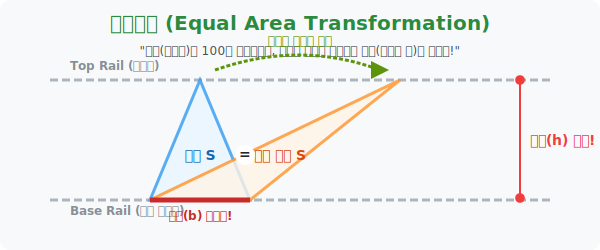

# 7. 등적변형 마술쇼: 미끄러지는 꼭짓점과 평행선의 넓이 사기단

## [도입부] 학습 목표 (Learning Objectives)
- 겉보기에 눈으로 확인한 도형의 생김새(각도나 선 굵기)에 속지 않고, 수학의 '수치적 스펙(밑변과 높이)' 에만 오로지 집착하여 형태를 마음대로 박살 내는 기하학의 마술, **'등적변형(等積變形)'** 의 개념을 체험합니다.
- 기찻길처럼 절대로 좁혀지지 않는 "두 평행선" 사이의 영역 안에서는 아무리 꼭짓점 하나를 잡고 좌우로 미친 듯이 드래그해 옮겨도, 바닥 면적이 똑같으면 **결국 페인트(넓이) 양은 절대 똑같다는 넓이 보존의 법칙**을 이해합니다.
- 파이썬(Python)의 다각형(Polygon) 넓이를 구하는 `Shoelace(신발끈) 공식`을 코딩하여, 꼭짓점 좌표 하나를 허공에서 마구 슬라이딩 시켜 비틀어놔도 연산된 넓이 값(면적)은 나노 단위로 똑같음을 증명하는 시스템을 구축합니다.

---

## 1. 모양에 속지 마라! 면적을 지키는 등적변형(等積變形)



삼각형의 넓이를 구하는 유일한 공식은 초등학생도 아는 **"$\frac{1}{2} \times \text{밑변} \times \text{높이}$"** 입니다.
이 짧은 수학 문장에는 어마어마한 잔혹함이 숨어 있습니다. "야, 난 너의 밑변 길이가 몇 인지, 높이가 정확히 치수로 깎여있는지만 본다! 네가 얼마나 뾰족한지, 각도가 어떻게 비틀어져서 못생겼는지 그딴 **'모양'** 따위는 내 알 바가 아니어!" 

그래서 통계/기하학자들은 무서운 치트키를 고안해 냅니다. 
"두 개의 기찻길(평행선) 을 그려보자. 아랫선분 바닥에 밑변 파이프를 고정 시켜! 자, 이제 윗 선분에 있는 꼭짓점 하나를 마우스로 잡고, 평행선 레일 선방향을 따라서 좌우로 마음대로 쫙쫙 미끄럼트려 보자!"

밑변은 못 박았으니 치수가 1도 안 변했고, 꼭짓점을 아무리 평행선 위에서 비비고 돌아다녀도 어차피 위아래 기찻길 간격(높이)은 항상 똑같습니다. 
생긴 건 괴물같이 옆으로 찢어진 흉측한 빗각 삼각형으로 돌연변이가 됐지만, **면적(넓이 값)은 최초의 정상인 삼각형과 완벽하게 $100\%$ 일치합니다!**
이렇게 "넓이(적, 積)를 평등하게(등, 等) 유지한 채, 모양만 갈아 마시는(형태 변, 變)" 위대한 기법을 바로 **[등적 변형]** 이라고 부릅니다. 


<br>

## 2. 평행사변형을 반갈죽하는 넓이의 신들

평행사변형 파트에서 이 마술이 왜 이렇게 중요할까요? 
평행사변형 대각선을 하나 쫙 그으면 두 개의 삼각형으로 찢어집니다. 이 두 삼각형의 넓이는 **똑같습니다.** 넓이만 똑같은 게 아니라 모양도 완벽한 쌍둥이 데칼코마니(합동) 인 게 당연하죠. 

하지만 평행사변형 안에서 "이상한 선분들을 십자로 교차해서 갈라놓은 4개의 찢어진 조각 삼각형들" 을 가만히 들여다보십시오. 
생긴 게 넷 다 저마다 각기 다릅니다. 어떤 건 예각, 어떤 건 둔각인 완전 쓰레기 잡동사니 조각들처럼 보이죠. 그러나 그 네 개의 끄나풀 뼈대 길이를 잡고 보면 수식과 등적변형 논리에 의해, **마주 보는 두 조각의 페인트 넓이 합이 귀신같이 거울 쌍**을 이루는 스펙트럼 마술이 마구 터져 나옵니다.
이처럼 모양에 속지 않고 뼈대와 높이 간격으로만 넓이를 통제하는 기술이 고급 수학 퀴즈의 백미입니다.

---

## 3. 💻 파이썬(Python) Shoelace(신발끈) 공식으로 면적 파괴 스캔하기


파이썬의 $X, Y$ 좌표계의 픽셀 세계에서 아무리 꼭짓점 $C$ 좌표를 x축으로 $10,000$칸 쯤 괴랄하게 밀어버린다 한들, 공식의 면적 결과물이 미동도 하지 않는 "절대 넓이 보존 시스템" 을 프로그래밍으로 펙트 체크합니다.

### 🐍 파이썬 예제: 좌표 꼭짓점 왜곡 이동과 내부 면적 넓이(신발끈 공식) 검열 시스템

```python
import numpy as np

print("--- 📐 등적 변형: 신발끈 공식 폴리곤 면적 스캐너 ---")

# 다각형(여기선 삼각형)을 그리는 순서대로 좌표(x, y) 나열!
# 신발끈 공식: 1/2 * abs((x1y2 + x2y3 + x3y1) - (y1x2 + y2x3 + y3x1))
def calculate_area_shoelace(pts):
    x = [p[0] for p in pts]
    y = [p[1] for p in pts]
    
    # 신발끈 수식 매트릭스 백터 꼬기 로직
    area = 0.5 * abs(x[0]*y[1] + x[1]*y[2] + x[2]*y[0] - (y[0]*x[1] + y[1]*x[2] + y[2]*x[0]))
    return area

# (정상 삼각형) 바닥 A(0,0), B(10,0) 길이가 고정됨. 꼭짓점은 C(5, 10).
A = (0, 0)
B = (10, 0)
normal_C = (5, 10)

area_normal = calculate_area_shoelace([A, B, normal_C])

print(f"▶ 1. 얌전한 스탠다드 삼각형의 넓이 페인트 량: {area_normal:.2f} 제곱 단위")
print("-" * 50)

# (마우스 드래그 변형기) = 윗 평행선(y=10 고정) 을 타고 x축을 +80칸 미친듯이 드래그해버림! (꼭짓점 파열)
skewed_C = (85, 10) # y좌표 10(높이)은 기찻길에 막혀 못뚫고 유지됨.

area_skewed = calculate_area_shoelace([A, B, skewed_C])

print(f"▶ 2. x축 방향으로 80칸 날려 찢어죽인 기괴한 돌연변이 삼각형 스캔 중...")
print(f" 💣 돌연변이의 산출 페인트 량: {area_skewed:.2f} 제곱 단위")

if area_normal == area_skewed:
    print("-" * 50)
    print(" ✅ [면적 불변의 법칙 승인] 겉 껍질의 왜곡(모양)은 허상에 불과합니다!")
    print("    -> 바닥(밑변 좌표)이 고정되고, 천장(y좌표 높이간격) 이 막혀있다면 형상의 왜곡은 무가치합니다.")

# 결과창:
# --- 📐 등적 변형: 신발끈 공식 폴리곤 면적 스캐너 ---
# ▶ 1. 얌전한 스탠다드 삼각형의 넓이 페인트 량: 50.00 제곱 단위
# --------------------------------------------------
# ▶ 2. x축 방향으로 80칸 날려 찢어죽인 기괴한 돌연변이 삼각형 스캔 중...
#  💣 돌연변이의 산출 페인트 량: 50.00 제곱 단위
# --------------------------------------------------
#  ✅ [면적 불변의 법칙 승인] 겉 껍질의 왜곡(모양)은 허상에 불과합니다!
#     -> 바닥(밑변 좌표)이 고정되고, 천장(y좌표 높이간격) 이 막혀있다면 형상의 왜곡은 무가치합니다.
```

코드가 입증했듯, 컴퓨터 그래픽 렌더링이 $x$축으로 $80$ 픽셀의 오프셋을 먹여서 물체를 끔찍하게 꼬리 빼듯 박살 냈지만, 신발끈 공식 연산망 내부의 $Y$축 지표 스펙(높이 고정)의 자물쇠가 풀리지 않아 면적량 $50.00$ 이 완벽 방어에 성공했습니다.

---

## [결론] 학습 정리 (Summary)

1. **시각적 착시(모양)의 거세**: "이 직사각형보다 저 마름모 조각이 더 길고 뾰족해 피자가 더 커 보이니까 저걸 집어야지" 식의 인간 뇌 스캔 지각 반응을 파괴하고, 오직 $x \times h$ 두 개의 숫자 지표로만 세상을 잘라 보는 수학적 냉혹함의 결정체입니다.
2. **평행 보존 빗장 뚫기**: 중학교 도형 증명 문제의 99% 킬러 문항들은 내 눈에 절반 크기 넓이처럼 생긴 삼각형들을 어떻게 "등적변형 기찻길 미끄럼" 으로 이리저리 이동시켜 퍼즐처럼 퓨전 짜 맞추는가의 눈싸움 게임입니다.
3. **가장 완벽한 공평함**: 좌표를 이리저리 찌그러 트려놔도 파이썬이 연산하는 컴퓨터 텍스쳐 내부에서는 페인트 픽셀 개수를 티끌 하나 더 쓰지 못한다는 이 원리가, 게임 엔진에서의 폴리곤 최적화 모델 구조 매핑 시스템과 직접적으로 맞물려 렌더링 됩니다.
