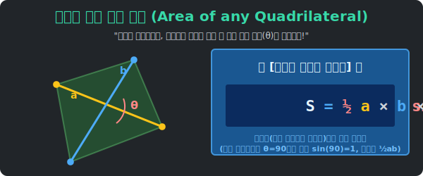

# 8. 이단아들(Outsiders)의 역습: 마법에 구속받지 않는 일반 사각형의 넓이 파괴 공식

## [도입부] 학습 목표 (Learning Objectives)
- 1수업부터 5수업까지 줄기차게 외워왔던 엘리트 족보(평행사변형, 사다리꼴, 직사각형) 따위의 소속감이 전혀 없는 야생의 **찌그러진 이단아 사각형들(Outsider Quadrilaterals)** 을 가만히 들여다보는 통찰을 얻습니다.
- 그 어떤 길이의 일치나 평행 조건의 버프 하나 없는 찌끄러기 도형 앞에서도 밑변과 높이 공식이 아닌, 삼각함수의 저주를 받은 궁극의 **[대각선 2개 + 크로스각(사인) 공식]** 하나로 모든 넓이 페인트 면적을 강제 도출시키는 스펙을 마스터합니다.
- 파이썬(Python)의 `math` 삼각함수 라이브러리를 통해 두 개의 대각선 길이 벡터와, 그들이 박치기하는 중심 교차 각도 $\theta$ 를 쏘아 넣어 0.1초 만에 폴리곤 렌더링 면적 데이터를 해킹하는 스크립트를 구현합니다.

---

## 1. 족보가 붕괴한 황무지: 이단아 사각형들의 등장

우리는 너무 오랜 시간 갇혀있었습니다.
"평행한가?", "90도 각도가 4개인가?", "길이가 4변 모두 같은가?"
수학자들은 딜레마에 빠졌습니다. **"아니, 세상의 도화지에 그려진 잡동사니 바위 사각형들이 저렇게 완벽한 직각이나 평행 기찻길을 이루고 있을 확률이 얼마나 되겠어? 세상은 수천만 개의 찌그러지고 등급 없는 돌연변이 폴리곤들뿐이야!"** (연(Kite) 모양부터 이상하게 파인 다각형까지).

평행사변형이 아니니 밑변 $\times$ 높이 공식을 못 씁니다. 직사각형도 아니니 가로 $\times$ 세로 팩트 공격도 튕겨 나옵니다. 
어디에도 소속되지 못해 모든 보너스 패시브 마법 카드가 차단된 최저 등급의 이단아 몬스터들, 이 잡동사니 사각형의 페인트 넓이(면적)는 도대체 인류가 어떻게 구해야 할까요?

수학은 위대합니다. "외곽(껍질 울타리) 이 개판이라면, 창을 찔러 내부의 장기(대각선 뼈대)를 뚫어버리면 된다!" 



<br>

## 2. 궁극의 무적 치트키: $\frac{1}{2} a b \sin(\theta)$


아무리 찌그러지고 흉측한 사각형이라도 무조건 몸통 안에는 $\mathsf{X}$ 자로 꼬인 두 개의 대각선 뼈대(길이 $a$, 길이 $b$) 가 들어있습니다. 그리고 사각형이 어떻게 생겨 먹었든 저 두 뼈대가 부딪치는 심장부 중심에는 필연적으로 교차 충돌 각도($\theta$, 세타) 가 발생합니다.

이 **[대각선 $a$, 대각선 $b$, 가운데 낀 각 $\theta$]** 이 3개의 데이터면 지상 최고의 사각형 해킹 공식이 뚫립니다.
**궁극 필살기 공식:  $$ \text{넓이} = \frac{1}{2} \times a \times b \times \sin(\theta) $$**

- 놀랍게도 이 공식은 삼각형의 두 변과 끼인각 넓이를 구하는 공식과 똑같이 생겼지만 본질이 다릅니다. 삼각형은 외곽선 테두리 변의 길이들을 넣었지만, 이 찌그러진 사각형 파괴 공식은 테두리가 개판이므로 내부 뼈대인 **'대각선'** 데이터를 칼로 잘라 집어넣은 사투의 수확입니다.
- 이 공식의 쾌감은 [정사각형이든 마름모든 일반 다각형이든] 묻지도 따지지도 않고 넓이값을 도출해 내는 "무적 폭격기" 라는 점에 있습니다. (마름모에 넣어보세요. 각도 $\theta$ 가 90도 수직 교차이니 $\sin(90^\circ) = 1$ 이 되어 $\frac{1}{2}ab$ 마름모 기본 넓이 공식과 완벽 동기화됩니다!) 

---

## 3. 💻 파이썬(Python) 삼각함수 모터(`math.sin`) 매트릭스 침투기


파이썬의 수학 모듈 `math` 를 불러와서 아무런 족보도 각도 룰도 없는 폴리곤 그래픽 데이터의 대각선 뼈대 스펙트럼 라인 2개와 각도 라디안(Radian) 만을 부어버려 1차원적으로 사각형 면적값을 사살 탈취하는 코드를 굴립니다.

### 🐍 파이썬 예제: 폴리곤 뼈대 스펙트럼(대각선/교각) 면적 산출기

```python
import math

print("--- ⚔️ 이단아 학살기: 삼각함수 대각선(Diagonal) 렌더링 무적 엔진 ---")

# (블라인드 타겟) 아무 이름도 붙일 수 없는 개떡같이 찌그러진 잡사각형!
# 해커가 내부를 스캔하여 뼈대 길이 정보만 몰래 훔쳐왔음
diag_a = 10.0      # 첫 번째 대각선 뼈대 길이
diag_b = 12.0      # 두 번째 십자 뼈대 길이
cross_angle = 60.0 # 두 뼈대가 박치기하며 튄 불꽃의 충돌 크로스 각도 (60도)

# 파이썬 math.sin() 함수는 바보같이 '라디안(Radian)' 숫자만 먹으므로 각도기 치수를 변환해준다!
theta_radian = math.radians(cross_angle)

print(f"▶ 타겟 스펙 데이터 감지 완료")
print(f"   - 뼈대 a길이: {diag_a} / 뼈대 b길이: {diag_b} / 심장부 충돌각: {cross_angle}도")
print("-" * 50)

# 전세계 통용되는 궁극체 무적 치트키 수식 발동: 1/2 * a * b * sin(theta)
outsider_area = 0.5 * diag_a * diag_b * math.sin(theta_radian)

print(f" 💣 [해킹 격파 완료] 찌끄러기 사각형 보호막 해제.")
print(f"    -> 숨겨진 본체 페인트 면적 넓이: {outsider_area:.2f} 제곱 픽셀!")
print(f"    (평행이나 90도 교차 같은 고정관념 규칙 따위는 쓸모없었습니다!)")

# 결과창:
# --- ⚔️ 이단아 학살기: 삼각함수 대각선(Diagonal) 렌더링 무적 엔진 ---
# ▶ 타겟 스펙 데이터 감지 완료
#    - 뼈대 a길이: 10.0 / 뼈대 b길이: 12.0 / 심장부 충돌각: 60.0도
# --------------------------------------------------
#  💣 [해킹 격파 완료] 찌끄러기 사각형 보호막 해제.
#     -> 숨겨진 본체 페인트 면적 넓이: 51.96 제곱 픽셀!
#     (평행이나 90도 교차 같은 고정관념 규칙 따위는 쓸모없었습니다!)
```

구질구질하게 사다리꼴 넓이 $\frac{1}{2}(\text{윗변}+\text{아랫변})h$ 이나 밑변$\times$높이 공식을 쓸데없는 외곽 선분을 들추며 고민할 일이 1도 없었습니다! 단지 대각선 스펙과 심장부 교차 각도를 삼각함수 `math.sin` 이라는 기하 렌더링 엔진에 던지는 행위만으로 우리는 세계관 내 어떤 다각형의 덩치(넓이)라도 박살 낼 자유를 영속하게 되었습니다.

---

## [결론] 학습 정리 (Summary)

1. **규칙의 바깥 세계**: 수학 교과서는 학생들에게 평행사변형이나 마름모처럼 아름답고 완벽한 "인공적 환상 도형(족보 상위권)" 들만 풀게 가스라이팅을 합니다. 하지만 진짜 자연과 빅데이터 공간 속의 좌표 도형들은 99% 이 이름 없는 찌그러진 아웃사이더 일반 사각형들임을 통찰해야 합니다.
2. **삼각함수($\sin \theta$)의 위력**: 초등학교의 높이($h$) 찾기 강박에서 벗어나십시오. 수직으로 꽂히는 높이가 없어도, 비스듬히 기울어진 타격 각도와 사인(sin) 파동 계수만 있다면 무리 없이 왜곡된 직각 빔(높이 치수)을 임의 추출해 낼 수 있는 위대한 수학의 변환 마법입니다.
3. **만능 치트키 공식**: $\frac{1}{2} a b \sin(\theta)$ 도끼자루는 묻지도 따지지도 않고 대각선 교차가 있는 어떤 육괴 몬스터를 만나더라도 단칼에 면적 정보를 벗겨내는 종결자입니다. 어떤 특수 조건 마법도 외울 필요가 없는 기막힌 가성비 무기를 챙기세요.
