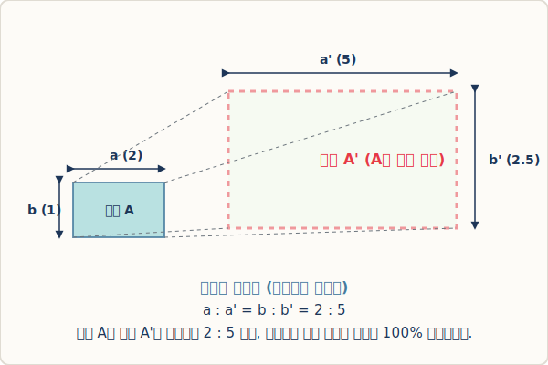

# 02. 닮은 도형의 성질과 닮음비

## 1. 학습 목표 (Learning Objectives)
* 두 도형이 서로 '닮음' 관계에 있을 때 나타나는 2가지 핵심 기하학적 성질을 이해합니다.
* 기호 체계($\sim$)와 **닮음비**의 정의를 명확히 살펴보고 비례식을 세우는 법을 연습합니다.

## 2. 확대와 축소, 기호로 나타내기
어떤 도형 $A$를 일정한 크기로 확대하거나 축소해서 나오는 도형 $A'$ 가 있을 때 두 도형은 무조건 하나로 포개어지며, 이를 **'도형 $A$와 $A'$는 닮음(Similar)이다'** 라고 부릅니다. 그림으로 보면 아래와 같습니다.

  

수학자들은 매번 그림을 그리기 귀찮으니 '닮았다'는 영단어인 Similar의 앞글자인 $S$를 살짝 비스듬히 눕혀서 다음과 같은 매력적인 기호를 만들었습니다.

> $\triangle ABC \sim \triangle A'B'C'$  (도형 ABC와 도형 A'B'C'는 서로 꼭 닮아있다)

합동 기호인 $\equiv$ (크기와 모양이 완전히 일치)와는 다르게 꼬불꼬불한 모양을 띠는 것은 크기가 자유자재로 고무줄처럼 축소되거나 팽창할 수 있다는 의미를 담고 있습니다.

## 3. 닮은 도형이 가지고 있는 2가지 절대 성질
어떤 도형을 확대나 축소해서 다른 도형을 만들면, 그들 사이에는 두 가지 불변의 규칙이 생겨납니다. 이것이 닮음 문제를 푸는 가장 강력한 무기입니다.

1. **대응변의 길이의 비는 모두 일정하다 (닮음비)**:
   - 작은 삼각형의 아랫변이 짧고, 큰 삼각형의 아랫변이 길다고 해서 제멋대로 길어진 것이 아닙니다.
   - 작은 삼각형의 왼쪽 빗변 길이가 큰 삼각형 기준 2배가 늘었다면, 반드시 아랫변도 2배, 오른쪽 빗변도 2배가 늘어납니다.
   - 이렇게 똑같이 확대/축소되는 비율($m : n$)을 우리는 **닮음비**라고 부릅니다.

2. **대응각의 크기는 모두 같다**:
   - 변의 길이는 달라도, 뾰족함의 정도(각도)는 절대 흔들리면 안 됩니다. 작은 원판 조각 피자의 끄트머리 각도와 가장 거대한 라지 사이즈 피자의 끄트머리 각도는 정확히 일치하여 둥글게 원을 이룰 수 있습니다. 
   - 각마저 늘어나거나 좁아져 버리면 그 순간 도형의 모양 자체가 깨지면서 더 이상 닮은 도형이라고 부를 수 없습니다.

## 4. 학습 정리 (Summary)
1. **닮음 기호 ($\sim$)**: 도형의 모양은 똑같으면서도 크기가 서로 확대, 축소의 비례 관계에 있을 때 사용하는 글로벌 수학 기호입니다.
2. **닮음비**: 두 닮은 평면도형이나 입체도형에서 1:1로 매칭되는(대응하는) 짝꿍 모서리들의 길이의 비율입니다.
3. 변의 길이는 커지거나 작아질 수 있지만, **두 도형의 내각(각도)은 예외 없이 100% 동일**해야만 모양을 유지할 수 있습니다.
