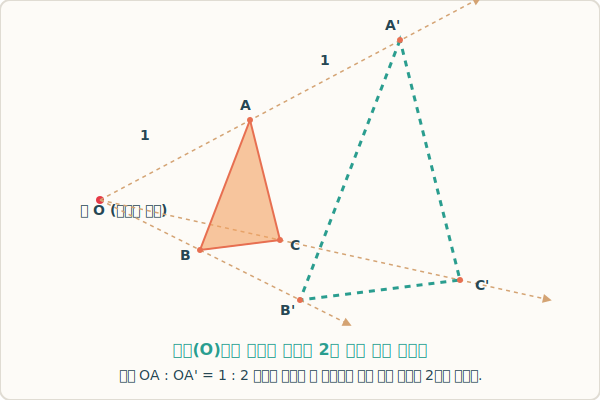

# 03. 닮은 도형 작도와 비례식 중심 연산

## 1. 학습 목표 (Learning Objectives)
* '닮음의 중심(Center of Similarity)'이 무엇인지 알아보고, 이를 기준으로 임의의 크기를 가진 닮은 도형을 직접 작도하는 기하학적 원리를 배웁니다.
* 스케일링 된 도형 위의 수많은 점들이 과연 제멋대로 흩어진 것인지, 보이지 않는 빛줄기(가상의 선) 위에 정렬된 것인지 구조를 살펴봅니다.

## 2. 극장에 빛을 쏘다, 닮음의 위치
도형의 닮은 관계를 다룰 때 우리는 단순히 책상 위에 도형 두 개를 멀찌감치 떼어놓고 "비율이 맞네~" 하고 감상하는 데서 끝나지 않습니다. 우리가 종이 위에 작은 삼각형 $\triangle ABC$를 하나 그렸다고 상상해볼까요?
이제 이 삼각형과 완벽하게 똑같이 생긴, 크기가 2배인 삼각형을 컴퍼스와 자만 가지고 백지 위에 그리려면 어떻게 해야 할까요?

마치 극장에서 작은 필름에 등불을 비춰서 거대한 빔 프로젝터 스크린에 화면을 투사(Projection)하듯이 그리는 방법이 있습니다.
종이 위 허공에 점 하나(이것을 점 $O$라고 부릅시다)를 콱 찍고, 그 점 $O$에서부터 작은 삼각형 $\triangle ABC$의 세 꼭짓점을 향해 눈부신 레이저 빛줄기 선을 쭉 그어 연장하는 것입니다.

그 다음, 점 $O$부터 작은 삼각형 첫 점 $A$까지 거리의 딱 2배가 되는 지점에 점 $A'$를 찍습니다.
나머지 $B$, $C$ 점을 통과하는 선 위에도 정확히 두 배 먼 곳에 점 $B'$와 $C'$를 찍은 뒤 그 세 점을 자로 이어줍시다.
기가 막히게도, 방금 그린 $\triangle A'B'C'$는 처음에 그린 작은 삼각형보다 사방의 모서리 길이가 완벽하게 2배 더 긴 **꼭 닮은 도형**이 됩니다.

## 3. 원점 방사형 작도 모형 다이어그램
위에서 설명한, 빛줄기 빔 프로젝터가 퍼져나가듯이 기점을 기준으로 크기를 키우고 줄이는 기법을 '닮음의 중심을 이용한 작도'라고 하며 이 그림들은 다음과 같은 특수 관계를 띱니다.

  

1. 이처럼 대응점($A$와 $A'$, $B$와 $B'$)들을 이은 모든 가상의 선들은 항상 하나의 교차점(**닮음의 중심**, Point $O$)에서 만나게 됩니다.
2. 서로가 이런 위치에 놓였을 때 수학에서는 두 닮은 도형이 **'닮음의 위치에 있다'**고 말합니다.
3. 컴퓨터 그래픽이 캐릭터를 키울 때, 픽셀 좌표계(x, y)에 상수 하나만 곱해주면 알아서 점들이 밀려나 커지는 원리도 이 일차원적 빛줄기 교차 모델을 기초로 합니다.

## 4. 학습 정리 (Summary)
1. **닮음의 중심 $O$**: 두 도형의 대응하는 각 꼭짓점들을 긴 선으로 연결했을 때 기적처럼 하나의 지점에서 모이는 중심 점입니다.
2. **비례적 거리 확장**: 닮음의 중심에서 작은 도형의 점 $A$까지의 거리와 확장된 도형의 점 $A'$까지의 거리를 비례식으로 세우면, 그것은 도형의 전체 **성장 비율(닮음비)**과 정확히 일치합니다 ($OA : OA' = m : n$).
3. **투시도법의 활용**: 이 레이저 확장 기법은 르네상스 화가들이 원근법과 착시를 다루어 종이에 입체 건물을 그릴 때 사용하던 가장 우아한 수학적 기하학 마술이었습니다.
