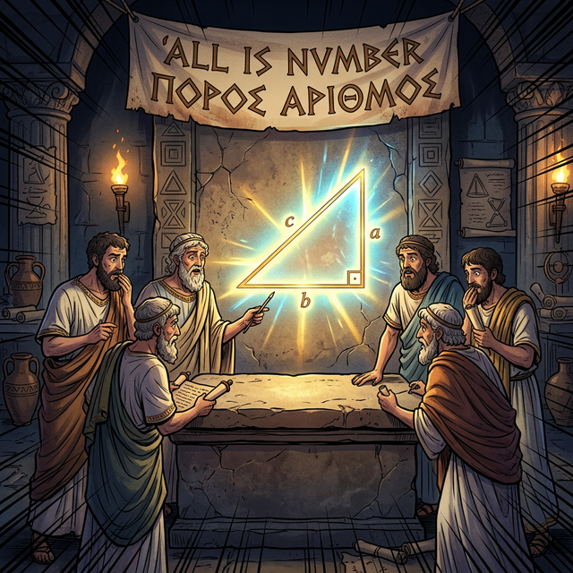

# 00. 인트로: 우주의 수, 피타고라스 학파

"만물은 수(Number)로 이루어져 있다."

고대 그리스 시대, 사람들은 세상의 모든 섭리를 신의 뜻이라고 믿었습니다. 하지만 피타고라스(Pythagoras)와 그의 추종자들로 이루어진 비밀 학파는 달랐습니다. 그들은 우주의 움직임부터 음악의 화음까지, 세상의 모든 것이 완벽한 유리수(정수와 그 비율)로 설계되어 있다고 굳게 믿었습니다.

  

## 가장 위대한 발견, 피타고라스의 정리

그들이 평생을 바쳐 연구한 기하학의 정점에 바로 **'직각삼각형의 비밀'**이 숨어 있었습니다.
가로와 세로가 수직을 이루는 직각삼각형이 있을 때, 가장 긴 변인 대각선(빗변)의 길이는 나머지 두 변의 길이와 무언가 우주적인 규칙으로 묶여 있다는 사실을 깨달은 것입니다.

이것이 인류 수학사에서 가장 유명한 공식이자, 2,500년이 지난 지금까지도 건축, 인공지능 공간 벡터, 컴퓨터 그래픽스(3D 모델링)에서 숨 쉬듯 쓰이고 있는 **피타고라스의 정리(Pythagorean Theorem)**입니다.

앞으로 펼쳐질 14번의 수업을 통해, 이 단순해 보이는 빗변 공식이 수많은 천재적인 수학자들의 서로 다른 기발한 아이디어로 어떻게 **증명(Proof)**되었는지, 
그리고 컴퓨터 알고리즘(Python)에서는 이 2,500년 전의 공식을 어떻게 1초 만에 계산해 내는지 깊숙이 다이빙해 보겠습니다.
