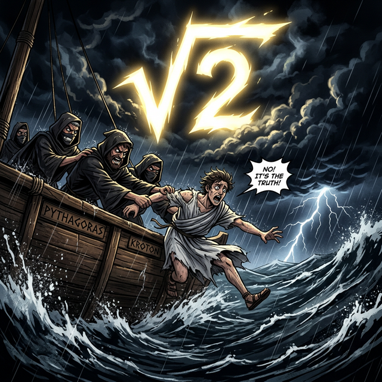

# 02. 두 번째 수업: 피타고라스 학파와 무리수의 공포

"우주 만물은 완벽한 정수(1, 2, 3...)와 그 정수들의 깔끔한 분수 비율(1/2, 3/4...)로만 이루어져 있다."
피타고라스 학파가 신봉하던 이 절대적인 믿음은, 아이러니하게도 자신들이 찾아낸 '피타고라스의 정리' 때문에 산산조각이 나고 맙니다.

---

## 학습 목표
* 밑변과 높이가 1인 직각삼각형에서 빗변의 길이가 유리수로 표현될 수 없음을 증명합니다.
* 무리수(Irrational Number)의 개념과 기호 루트($\sqrt{}$)의 탄생 배경을 배웁니다.
* 파이썬의 `math.sqrt()`를 이용해 영원히 끝나지 않는 무리수의 소수점(무한소수)을 직접 목격합니다.

## 1. 완벽한 세계의 붕괴: $\sqrt{2}$의 발견

어느 날, 피타고라스의 뛰어난 제자였던 히파소스(Hippasus)는 아주 단순한 직각삼각형 하나를 바닥에 그렸습니다.
밑변의 길이가 $1$이고, 높이도 $1$인 가장 작고 완벽한 직각이등변삼각형이었습니다.

그는 자랑스럽게 스승의 공식을 대입했습니다.
> $1^2 + 1^2 = c^2$
> $1 + 1 = 2 = c^2$

"음? 제곱해서 $2$가 되는 숫자 $c$가 무엇이지?"
히파소스는 계산을 거듭했지만, 어떤 정수나 분수를 가져와도 제곱해서 정확히 '2'가 떨어지는 숫자는 이 세상에 존재하지 않았습니다. (예: $1.4 \times 1.4 = 1.96$, $1.41 \times 1.41 = 1.9881...$)

이 숫자는 분수(비율, Rational)로 표현할 수 없었기에, 학파 사람들은 이 끔찍한 숫자를 '비율이 없는 미친 수', 즉 **무리수(Irrational Number)**라고 불렀습니다.

<div align="center">
  
</div>

자신들의 종교적 신념(우주는 완벽한 유리수다)이 틀렸다는 사실을 인정할 수 없었던 피타고라스 학파는 이 비밀을 발설한 히파소스를 지중해 바다에 던져 암살해 버리는 끔찍한 비극을 저지릅니다. 
수학의 역사상 가장 슬프고도 위대한 발견인 '무리수'는 이렇게 피를 머금고 탄생했습니다.

## 2. 루트($\sqrt{}$) 기호의 탄생과 파이썬

결국 인류는 제곱해서 2가 되는 이 기묘한 숫자를 표현하기 위해, 숫자 위에 지붕을 씌우는 새로운 수학 기호 **루트(Root, $\sqrt{}$)**를 발명해 냅니다.
제곱해서 2가 되는 빗변의 길이를, 우리는 이제 당당하게 **$\sqrt{2}$** 라고 씁니다.

컴퓨터 프로그래밍 세계에서도 이 무리수를 구하는 것은 엄청난 연산력을 요구하는 작업입니다. 파이썬으로 이 저주받은 숫자 $\sqrt{2}$의 끝자락을 한번 들여다볼까요?

```python
import math

# 히파소스를 죽음으로 몰아넣은 금지된 숫자, 루트 2 연산하기

base = 1
height = 1

# 빗변의 제곱(c^2)은 1+1 = 2
c_squared = (base**2) + (height**2)

# 파이썬의 math.sqrt() 함수로 루트(√) 씌우기
forbidden_number = math.sqrt(c_squared)

print("제곱해서 2가 되는 숫자는 과연 유리수(깔끔한 분수)일까?")
print(f"결과: {forbidden_number}")

# 출력: 1.4142135623730951...
# (파이썬 엔진도 영원히 계속되는 이 무한소수의 끝을 찾지 못하고 도중에 잘라버립니다!)
```

파이썬의 실행 결과에서 보듯, $\sqrt{2}$는 소수점 아래로 규칙 없이 영원히 뻗어나가는 '비순환 무한소수(무리수)'입니다.
인류는 피타고라스 정리를 통해 비로소 우리가 셀 수 있는 직관적인 숫자(유리수) 너머에, 무한하고 기하학적인 무리수의 세계가 끝없이 펼쳐져 있다는 것을 깨닫게 되었습니다.

## 학습 정리
1. **히파소스의 발견**: 밑변 $1$, 높이 $1$인 직각삼각형의 빗변($c^2 = 2$)은 기존의 유리수(분수)로는 절대 길이를 표현할 수 없는 미지의 숫자였다.
2. **무리수 (Irrational Number)**: 비율(Ratio)로 나타낼 수 없는 수. 소수점 아래로 특정한 규칙 없이 영원히 계속되는 무한소수를 뜻한다.
3. 파이썬의 `math.sqrt()` 함수는 루트($\sqrt{}$) 기호와 완벽히 동일하며, 무리수를 계산할 때 소수점 15자리 안팎에서 근사치로 잘라서(`1.414...`) 우리에게 보여준다.
