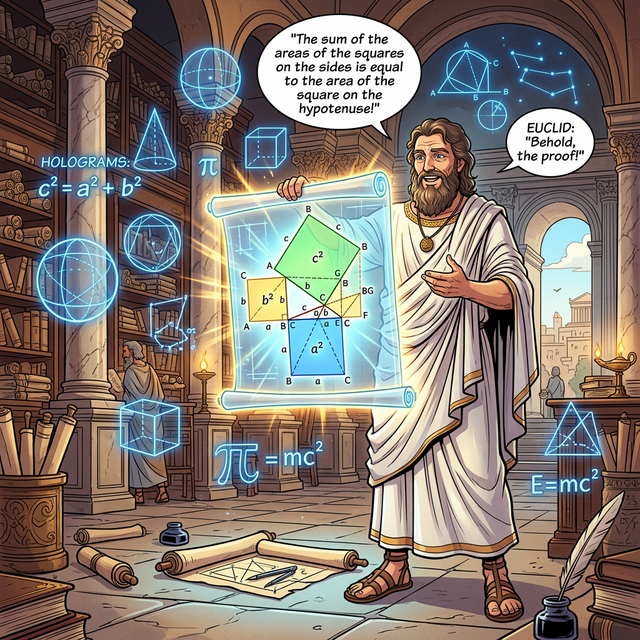
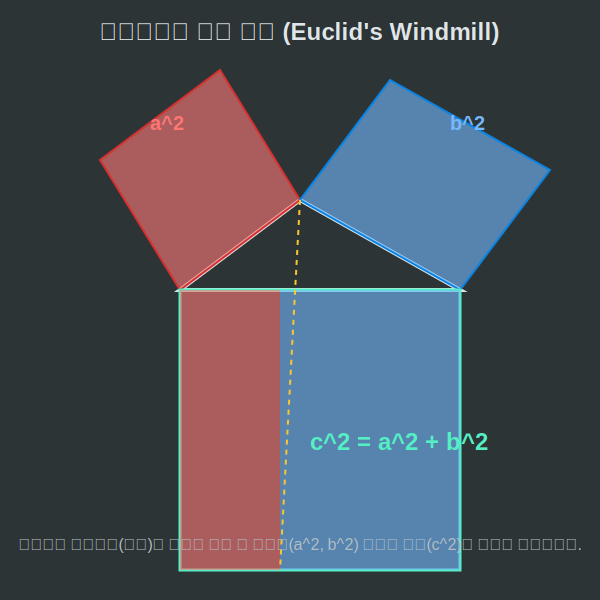

# 03. 세 번째 수업: 유클리드의 증명 (Euclid's Windmill)

세상에는 피타고라스의 정리를 "맞다"고 증명한 수학적 방법이 무려 **400가지**가 넘게 존재합니다. 인류 역사상 가장 많이 증명된 공식 1위의 영예를 가지고 있죠. 그 수많은 증명 중에서도 가장 우아하고, 기하학의 아버지라 불리는 사람이 남긴 최고의 걸작이 바로 **'유클리드의 풍차(Windmill) 증명'**입니다.

---

## 학습 목표
* 기하학의 원조 유클리드(Euclid)가 고안한 "풍차 모형"의 시각적 작동 원리를 이해합니다.
* 넓이가 같은 삼각형의 등적변형 원리를 배웁니다.
* 파이썬 코드로 기하학적 면적(Area) 보존의 법칙을 프로그래밍적으로 검증해 봅니다.

## 1. 기하학 여포 유클리드의 천재성

기원전 300년경, 유클리드는 자신의 그 유명한 기하학 교과서 『원론(Elements)』에서 피타고라스 정리를 증명하기 위해 거대한 그림 하나를 그렸습니다. 직각삼각형의 세 변에 각각 커다란 정사각형 세 개를 매달아 놓았는데, 그 모습이 마치 바람개비(풍차) 같다고 하여 '풍차 증명'이라는 귀여운 별명이 붙었습니다.

그의 아이디어는 직관적이고 완벽했습니다.
**"위에 매달린 작은 두 정사각형의 넓이를 모래처럼 부수어 아래쪽 가장 큰 정사각형 틀 안에 부으면, 남거나 모자람 없이 정확히 꽉 찰 것이다."**

<div align="center">
  
</div>

<div align="center">
  
</div>

위쪽 노란색 사각형($a^2$)과 파란색 사각형($b^2$) 안의 면적이, 보이지 않는 기하학의 레일을 타고 쭈르륵 아래로 미끄러져 내려와, 가장 큰 초록색 사각형($c^2$)을 반반씩 완벽하게 채우게 됩니다. 

이것은 밑변의 길이와 높이만 같다면 모양이 찌그러져도 넓이는 변하지 않는다는 **'등적변형'**이라는 수학적 스킬을 극의까지 끌어올린 증명 방식입니다.

## 2. 면적 보존의 법칙과 Python 검증 로직

유클리드가 모래를 부어 증명했다면, 21세기의 우리는 변수(Variables)를 할당하여 컴퓨터 메모리 위에서 넓이의 보존량을 검증할 수 있습니다. 위쪽 두 사각형 면적의 합계 메모리가 정확히 아래쪽 큰 사각형 면적 메모리와 바이트(Byte) 단위까지 일치하는지 파이썬으로 체크해 보겠습니다.

```python
# 유클리드의 풍차 증명 (면적 보존 법칙 파이썬으로 검증하기)

# 삼각형의 세 변 길이 세팅 (가장 완벽한 3:4:5 직각삼각형)
a = 3
b = 4
c = 5

# 1. 위쪽에 매달린 두 작은 정사각형의 넓이 (a^2, b^2)
area_A_square = a ** 2  # 3 * 3 = 9
area_B_square = b ** 2  # 4 * 4 = 16

# 두 넓이를 합친 총 모래의 양
total_top_sand = area_A_square + area_B_square
print(f"위쪽에서 쏟아부은 전체 넓이: {total_top_sand}")

# 2. 아래쪽에서 받아내는 가장 큰 정사각형의 넓이 (c^2)
area_C_square = c ** 2  # 5 * 5 = 25
print(f"아래쪽에서 받아낸 전체 넓이: {area_C_square}")

# 파이썬 CPU가 논리 연산자(==)를 통해 참/거짓을 심판!
if total_top_sand == area_C_square:
    print("증명 성공! 유클리드의 풍차 법칙은 컴퓨터 메모리상에서도 완벽합니다. (True)")
else:
    print("증명 실패. 2,500년 기하학이 붕괴되었습니다.")
```

파이썬 엔진은 단 $0.0001초$도 주저하지 않고 `True`를 외칩니다. 
우리는 유클리드의 천재적인 시각 증명을, 논리적인 코드로 한 치의 오차 없이 재현해 낸 것입니다.

## 학습 정리
1. **유클리드의 풍차 (Windmill) 증명**: 삼각형의 합동과 등적변형(밑변과 높이가 같으면 넓이가 보존됨)의 성질을 활용해 위쪽 두 정사각형의 넓이를 아래쪽 큰 정사각형에 분할하여 끼워 맞추는 역사상 가장 유명한 기하학 피타고라스 증명법.
2. 기하학적 넓이(Area)의 분할과 합산은, 컴퓨터 프로그래밍에서 메모리 블록(Memory Block)을 변수에 쪼개 저장하고 다시 합치는 논리 구조와 완전히 동일하다. 파이썬의 `==` 연산자는 유클리드의 천칭(저울) 역할을 한다.
