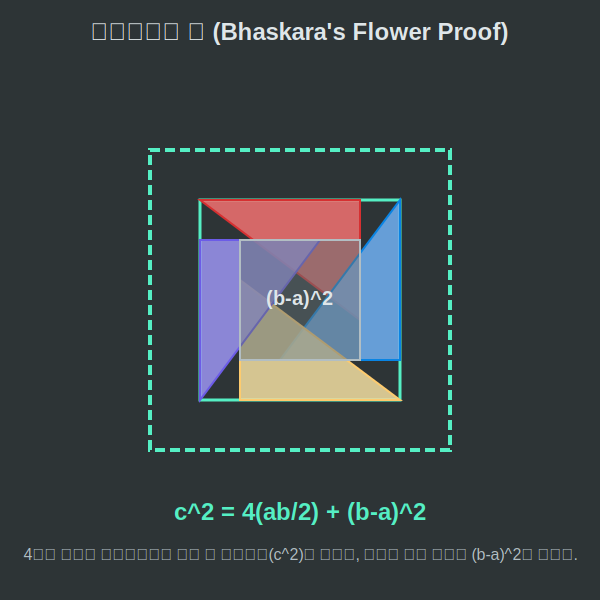

# 04. 네 번째 수업: 바스카라의 증명 (Bhaskara's Proof)

인도 수학자 우지인 바스카라(Bhaskara)는 책에 피타고라스 정리를 소개하면서 구구절절 긴 문장을 적지 않았습니다. 그는 그저 그림 하나를 툭 던져 놓고 단 한 마디만을 남겼습니다.

**"보라! (Behold!)"**

---

## 학습 목표
* 고대 인도의 천재 수학자 바스카라가 고안한 직관적인 꽃 모양 증명법을 이해합니다.
* 4개의 직각삼각형과 한가운데 작은 빈 공간의 넓이 합 연산을 배웁니다.
* 대수학 수식 전개식 $(b-a)^2$를 파이썬 코드로 해체하여 시뮬레이션합니다.

## 1. 퍼즐을 맞추며 외치는 "보라!"

유클리드가 복잡한 3개의 정사각형을 쪼개서 풍차 모양으로 증명했다면, 인도의 수학자 바스카라는 직각삼각형 $4$개를 바람개비 날개처럼 촘촘하게 맞물려 끼우는 아이디어를 냈습니다.

모양이 완전히 똑같은 직각삼각형 4개의 빗변($c$)을 바깥쪽으로 향하게 돌려 맞추면, 거대한 하나의 정사각형($c^2$)이 탄생합니다.
하지만 안타깝게도 가운데 부분은 닫히지 않고 작은 정사각형 모양의 구멍 하나가 뻥 뚫려 있습니다. (삼각형의 긴 변 $b$와 짧은 변 $a$가 엇갈리면서 그 틈새에 $(b-a)$ 길이의 빈틈이 생기기 때문입니다.)

<div align="center">
  
</div>

<div align="center">
  
</div>

결국 가장 바깥쪽에 생성된 거대한 테두리 정사각형 넓이($c^2$)는, 이 퍼즐 조각들을 몽땅 다 합친 넓이와 같습니다.
> 커다란 전체 넓이 $c^2$ = 4개의 삼각형 넓이 + 가운데 뚫린 사각형 모형의 넓이

## 2. $(b-a)^2$ 전개식과 Python 분해 시뮬레이션

바스카라의 이 시각적(비주얼) 기하학 퍼즐을 현대의 프로그래밍인 대수식(수식) 연산으로 치환해보면 무릎을 탁 치게 됩니다. 파이썬에서는 컴퓨터의 강력한 연산 장치(ALU)를 이용해 식의 좌우가 정확히 일치하는지 단 $0.1초$ 만에 대차대조표를 뽑아냅니다.

```python
# 바스카라의 "보라(Behold!)" 증명 - 파이썬 시뮬레이션

a = 3   # 짧은 밑변
b = 4   # 긴 높이
c = 5   # 가장 바깥을 향하고 있는 빗변

print(f"1. 가장 큰 바깥쪽 정사각형의 넓이 (c^2): {c**2}")

# 4개의 퍼즐 (삼각형 4개 + 가운데 빈칸 1개) 넓이를 구해서 합쳐봅시다.
triangle_4_pieces = 4 * ((a * b) / 2)       # 직각삼각형 4개
center_hole = (b - a) ** 2                  # 한가운데 뚫린 틈새의 정사각형

total_internal = triangle_4_pieces + center_hole
print(f"2. 삼각형 4조각 + 가운데 빈 공간 합친 넓이: {total_internal}")

if c**2 == total_internal:
    print("증명 완료: 바스카라의 그림(기하학)과 파이썬 수식(대수학)은 영원히 같습니다.")

# (대수식 보충 설명)
# c^2 = 4*(ab/2) + (b-a)^2
# c^2 = 2ab + (b^2 - 2ab + a^2)
# +2ab 와 -2ab가 마법처럼 만나서 폭파되어 사라집니다!
# 최종 남는 식: c^2 = b^2 + a^2 (아름다운 폼 완성)
```

중학교 때 우리를 끝없이 괴롭혔던 다항식의 전개 $(b-a)^2 = b^2 - 2ab + a^2$ 공식을 이렇게 그림 퍼즐의 넓이 계산 구멍으로 써먹는 것이 바로 인도 수학자들의 번뜩이는 천재성입니다.

## 학습 정리
1. **바스카라의 증명**: 4개의 똑같이 생긴 직각삼각형을 빗변이 바깥을 향하게 겹쳐 돌려 끼워서 거대한 정사각형($c^2$)을 만드는 방식.
2. 모양이 삐뚤어져 맞물리지 못하고 한가운데 생겨버린 구멍의 한 변의 길이는 $(b - a)$ 가 된다.
3. 이를 수식으로 전개하면 `2ab`가 서로 플러스 마이너스로 상쇄되어 날아가면서, 태초의 공식 $c^2 = a^2 + b^2$ 이라는 궁극의 예술적인 피타고라스 정리가 눈앞에 도출된다.
