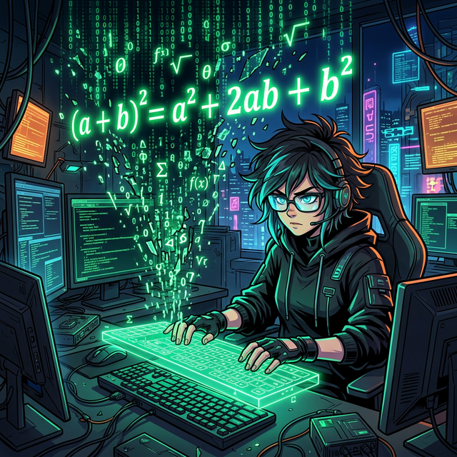

# 06. 여섯 번째 수업: 대수적 방법 및 파이썬 수식 전개 (Algebraic Proof)

앞서 배운 방법들은 종이에 펜으로 열심히 선을 긋고 도형을 굴리는 '아날로그식 기하학(Geometry)'이었습니다. 하지만 현대 수학자들과 컴퓨터 해커들은 선 그리기 장난을 멈추고 문자와 기호의 힘, 즉 **'대수학(Algebra)'**이라는 막강한 코드로 승부하기 시작했습니다.

---

## 학습 목표
* 기하학적인 그림을 배제하고 수식($x, y$)의 논리 전개만으로 $(a+b)^2$ 다항식을 정리하는 대수적 증명을 이해합니다.
* 파이썬의 대수학 라이브러리인 **`sympy`** 모듈을 사용하여 컴퓨터가 문자를 어떻게 쪼개고 합치는지(expand & simplify) 목격합니다.

## 1. 기하학을 지배하는 기호의 마법: 대수학(Algebra)

커다란 정사각형 한 변의 길이를 무작정 $(a+b)$라고 세팅해 보겠습니다.
그렇다면 그 큰 정사각형의 전체 넓이는 자연히 **$(a+b)^2$** 가 됩니다.

우리는 중학교 과정에서 이 식이 어떻게 폭발(전개)하는지 달달 외우고 있습니다.
> $(a+b)^2 = a^2 + 2ab + b^2$

<div align="center">
  
</div>

그런데 이 거대한 $(a+b)$ 크기의 상자 속에는 **[가운데 작은 기울어진 $c^2$ 사각형 한 개]**와 **[모서리를 감싸는 직각삼각형 4개]**를 딱 맞게 우겨 넣을 수 있습니다.
- 모서리를 채운 직각삼각형 4개 넓이 합 = $4 \times (\frac{1}{2}ab) = 2ab$
- 가운데 들어간 정사각형의 넓이 = $c^2$
- **내용물 총합 = $c^2 + 2ab$**

결국 껍데기 상자의 넓이식($(a+b)^2$)과 안쪽 내용물을 다 세어놓은 식이 무조건 같아야 합니다.
> $a^2 + 2ab + b^2$ (가죽) = $c^2 + 2ab$ (알맹이)

양쪽에 지저분하게 끼어 있는 $+2ab$를 가차 없이 지워버립시다.
**아!**
> $a^2 + b^2 = c^2$

피타고라스의 정리가 무섭도록 완벽한 기호들의 파괴와 재조립 끝에 증명되었습니다.

## 2. Python `SymPy`: 수식을 다루는 AI의 두뇌

다항식의 전개와 상쇄(Cancellation), 여러분은 종이에 부호 연필 자국을 지워가며 계산하지만, 인공지능과 파이썬 프로그램은 인간 대신 미적분과 다항식 전개를 $0.001초$도 안 걸려서 수행해 주는 `sympy` (Symbolic Python) 확장 기능을 갖고 있습니다.

```python
import sympy

# 파이썬으로 경험하는 마법의 대수학(Algebraik) 세계
# 일반적인 숫자 변수가 아닌 '기호(Symbol)' 변수로 선언합니다.
a, b, c = sympy.symbols('a b c')

# 1. 왼쪽 거대 껍데기 박스의 식 정의 (a+b)^2
left_equation = (a + b)**2

# 2.sympy.expand() 함수를 쓰면 (a+b)^2 이 폭발하여 전개됩니다!
expanded_left = sympy.expand(left_equation)
print(f"껍데기 전개식: {expanded_left}") 
# 결과: a**2 + 2*a*b + b**2

# 3. 내부 알맹이들의 식
right_equation = c**2 + 2*a*b

# 4. 왼쪽 껍데기와 오른쪽 알맹이가 같다고 두고 양쪽에서 같은 녀석을 뺍시다.
# 방정식: (a**2 + 2*a*b + b**2) - 2ab = (c**2 + 2*a*b) - 2ab 
final_left = expanded_left - 2*a*b
final_right = right_equation - 2*a*b

print(f"\n최종 남은 좌변: {final_left}")
print(f"최종 남은 우변: {final_right}")
# 결과: a**2 + b**2 
# 결과: c**2
```

숫자를 대입하지 않고 오직 논리적인 기호의 조립만으로 진리를 도출해 내는 능력, 이것이 바로 '대수학'이 시도미술(기하학)을 집어삼키고 현대 수학과 컴퓨터 양자역학을 지배하게 된 이유입니다.

## 학습 정리
1. **대수적 증명 (Algebraic Proof)**: 그림 조각의 넓이를 비교하는 대신, 다항식의 전개 $(a+b)^2 = a^2+2ab+b^2$ 와 논리적인 수식 상쇄 연산을 통해 결론을 증명하는 현대적이고 무자비한 논리 체계.
2. 파이썬의 **`sympy` 라이브러리** 등은 이미 인간을 초월하여 수백 차수의 다항식을 빛의 속도로 쪼개거나 인수분해할 수 있는 능력을 갖추고 있다. 프로그래머는 이 대수학 모듈을 통해 무수히 많은 미적분 모델을 구현한다.
