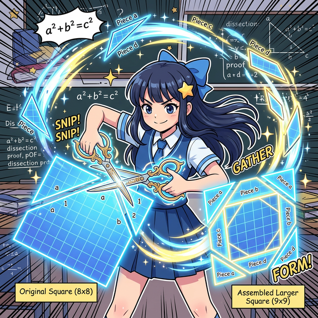
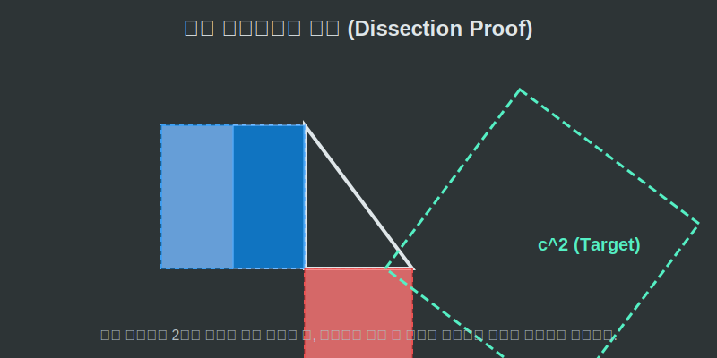

# 07. 일곱 번째 수업: 오려붙이기에 의한 증명 (Dissection Proof)

유년 시절 색종이와 가위를 들고 놀아본 경험이 있나요? 
영리한 수학자들은 유클리드의 골치 아픈 평행선 보조선이나, 복잡한 대수학 기호를 집어 던지고 **오직 '가위' 하나로만** 피타고라스의 정리를 퍼즐 맞추듯 증명해 냈습니다.

---

## 학습 목표
* 가위로 자르고 이어 붙이는 도형의 분할(Dissection) 기법이 어떻게 넓이 보존의 법칙을 만족시키는지 원리를 체득합니다.
* 앙리 페리갈(Henry Perigal)의 모눈종이 절단 증명법을 애니메이션으로 관찰합니다.
* 파이썬 배열 슬라이싱(Slicing)을 통해 선분(Data)이 분할되고 하나로 재결합하는 코딩 원리를 융합합니다.

## 1. 싹둑 잘라서 퍼즐 맞추기

작은 두 개의 정사각형($a^2$와 $b^2$)이 있습니다.
수학자들은 중심을 통과하는 수직 수평 보조선을 그은 뒤 가위로 이 두 사각형의 배를 십자(+) 모양으로 사정없이 갈라 버렸습니다.

총 4개의 사각형 쪼가리와 1개의 온전한 작은 사각형이 만들어지게 됩니다. 놀랍게도 이 5개의 조각들을 들고 와서 빗변에 매달린 거대한 정사각형($c^2$)의 텅 빈 틀 안에 이리저리 테트리스(Tetris)처럼 욱여넣었더니, 조금의 틈도 없이 완벽하게 하나의 그림으로 꽉 차 들어맞았습니다.

<div align="center">
  
</div>

<div align="center">
  
</div>

이 방식을 **'오려붙이기 증명(Dissection Proof)'**이라고 부릅니다. 영국의 아마추어 수학자였던 페리갈(Perigal)이 고안해 낸 이 방식은, 각도기나 자가 없어도 초등학생조차 색종이와 가위만 있으면 피타고라스 정리를 손으로 직접 만져보며 깨달을 수 있게 만들었습니다.

## 2. Python의 조각 모음: 슬라이싱(Slicing)과 리스트 병합

컴퓨터 메모리에서도 이 '오려붙이기'는 매초 hàng 억 번씩 발생합니다. 거대한 데이터를 네트워크로 보낼 때, 그대로 보내면 너무 뚱뚱해서 전송되지 않습니다. 컴퓨터가 가위를 들고 데이터를 4조각으로 잘라버린 뒤(Slicing), 목적지에 도착하면 뿔뿔이 날아온 조각 데이터를 다시 하나로 합칩니다(Concatenation).

기하학의 종이 자르기와, 파이썬 데이터 자르기가 어떻게 똑같은 원리로 합쳐지는지 볼까요?

```python
# 파이썬으로 경험하는 오려붙이기(Dissection)와 리스트(List) 결합

# 1. 작은 사각형 2개의 데이터 배열
# [a^2 사각형 조각] = 데이터 길이 5
# [b^2 사각형 조각] = 데이터 길이 12
square_a_data = [1, 2, 3, 4, 5]
square_b_data = [6, 7, 8, 9, 10, 11, 12, 13, 14, 15, 16, 17]

print(f"오려낸 가죽 조각의 총개수: {len(square_a_data) + len(square_b_data)}개")

# 2. 강력한 배열 조립 연산자 (+) 를 이용한 데이터 합체 (Concatenation)
# 각각 떨어져 있던 원소들을 커다란 변수(c^2) 틀 안에 차곡차곡 끼워 맞춥니다.
massive_c_square_data = square_a_data + square_b_data

print(f"퍼즐이 완성된 가장 큰 C 박스의 데이터 크기: {len(massive_c_square_data)}개")
# 출력: 오려낸 가죽 17조각, 퍼즐 완성본 17조각으로 완벽히 동일 (넓이 보존 달성)

# 내부의 데이터 구조도 순서대로 차곡차곡 예쁘게 복원되었습니다.
print(massive_c_square_data)
```

어떤 형태의 조각(List, 문자열, 파동)이든 잘게 쪼개져 날아가도, 조각들을 다 합친 총량(Total Length/Area)은 쪼개기 전의 원본 양($c^2$)과 무조건 일치합니다. 우리는 조각 모음에 깃든 피타고라스의 정신을 언제나 컴퓨터 위에서 체험하고 있는 것입니다.

## 학습 정리
1. **분할(Dissection) 및 재조립 증명**: 페리갈과 헨리 듀드니 등에 의해 유명해진 방식으로, $a^2$ 와 $b^2$ 사각형을 가위로 오려낸 다음, 테트리스처럼 $c^2$ 프레임 안에 물리적으로 맞춰 넣어 평면 기하학의 면적 보존성을 증명하는 기법이다.
2. 잘게 쪼개진 정보 조각을 다시 하나의 거대한 틀에 담아내는 행위는 현대 컴퓨터 공학의 **데이터 패킷 캡슐화** 및 **배열(Array) 병합**의 코어 로직과 흐름을 같이 한다.
