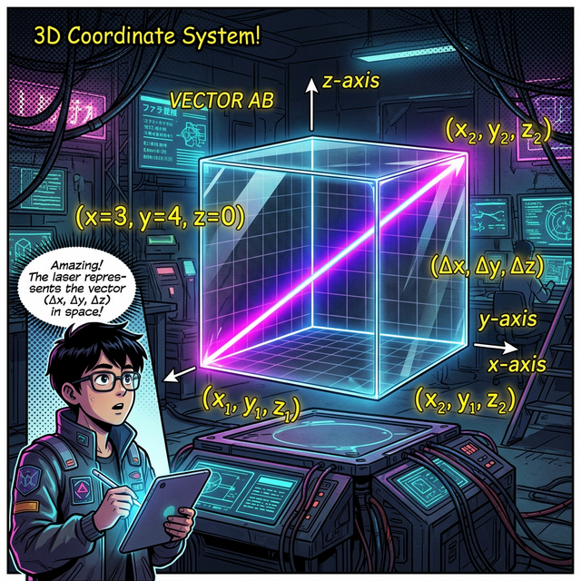




# 12. 열두 번째 수업: 입체도형에의 활용 (3D Applications)

지금까지 종이(2D) 위에서 놀았다면, 이제는 현실의 공간(3D)으로 뛰쳐나갈 차례입니다.
내 방 한가운데에 가장 긴 장대를 대각선으로 놓고 싶을 때, 장대의 최대 길이는 얼마나 될까요?
우리는 줄자 없이 오직 가로, 세로, 높이 치수만으로 이를 완벽히 알아낼 수 있습니다. 피타고라스 정리가 $x$, $y$, $z$ $3$차원 우주에서도 똑같이 작동하기 때문입니다.

---

## 학습 목표
* 3차원 직육면체 룸(Room)을 가로지르는 허공의 가장 긴 대각선 공식($l = \sqrt{a^2+b^2+c^2}$)을 이해합니다.
* 2D 평면 대각선 식의 확장이 3차원에 어떻게 누적되어 적용되는지 논리를 추적합니다.
* 파이썬 정육면체 좌표계($x, y, z$) 벡터 연산을 활용해 3D 게임 속 거리(Distance) 판독기를 만듭니다.

## 1. 허공을 가르는 레이저: 직육면체의 대각선

나의 직사각형 방바닥을 생각해 볼까요. 
방바닥의 모서리 끝($A$)에서 반대편 끝($B$) 쥐구멍까지 바닥으로 직선을 그으면, 그것은 2D 사각형의 대각선입니다. ($A$에서 $B$까지의 길이 = $\sqrt{a^2+b^2}$)

그런데 우리는 3D 공간인 천장 꼭대기 전등($C$)에서부터 아래쪽 쥐구멍($B$)까지 허공을 대각선으로 가로지르는 가장 긴 레이저를 쏘고 싶습니다.
놀랍게도 아까 그어놓은 '방바닥 대각선'을 다시 직각삼각형의 '밑변'으로 사용하고, 방의 '기둥 높이'를 높이로 사용해서 한 번 더 피타고라스를 적용하면 됩니다!

> $\text{바닥 대각선}^2 + \text{기둥 높이}^2 = \text{허공 대각선}^2$
> $(\sqrt{a^2+b^2})^2 + c^2 = \text{허공 대각선}^2$
> $\mathbf{l} = \mathbf{\sqrt{a^2 + b^2 + c^2}}$

이 미친 듯이 단순하고 아름다운 공식은 다음과 같이 선언합니다.
> "가로, 세로, 높이를 각각 제곱해서 몽땅 더한 뒤 루트($\sqrt{}$)를 씌우면 그 공간을 가로지르는 가장 거대한 길이가 나온다."

<div align="center">
  
</div>

## 2. Python 3차원 유니버스: $x, y, z$ 좌표계 통신

여러분이 오버워치나 배틀그라운드 같은 3D 게임을 할 때, 상대방 저격수가 건물 옥상(높이 $Z$)에 있고 나는 바닥(깊이 $X$, $Y$)에 있을 때 게임 엔진은 어떻게 여러분 사이의 거리를 계산해서 저격 대미지(Damage)를 깎을까요? 

정확히 바로 이 피타고라스의 $3$차원 대각선 거리 측정 공식을 초당 몇백만 번씩 돌리고 있습니다!
파이썬 `math.dist` 함수는 이 피타고라스 공식을 3차원 $x,y,z$ 튜플 좌표계로 완벽하게 내장하고 있습니다.

```python
import math

# 파이썬으로 경험하는 3D 사이버 공간의 피타고라스 저격수 (Sniper)

# 1. 내 캐릭터의 위치 좌표 (X축, Y축, Z축:바닥)
my_position = (0, 0, 0)

# 2. 적군 빌런의 위치 좌표 (가로 30m, 세로 40m, 빌딩 높이 50m 허공)
enemy_position = (30, 40, 50)

# 파이썬에 내장된 '유클리디언 피타고라스 직각 거리 측정' 마법 함수 
# (수학 공식: 루트( x^2 + y^2 + z^2 )) 을 내부적으로 실행시킵니다.
distance = math.dist(my_position, enemy_position)

print("💥 3차원 맵의 적군과의 허공 대각선 거리를 측정합니다...")
print(f"-> 삐빅! 타겟까지의 절대 다이렉트(대각선) 거리: {distance:.2f} M")

# 만약 수동으로 3D 피타고라스 식을 조립한다면?
manual_distance = math.sqrt( (30**2) + (40**2) + (50**2) )

if math.isclose(distance, manual_distance):
    print("-> 시스템 검증 완료: 파이썬의 dist 모델은 2,500년 전 3D 피타고라스 루트 방정식과 완전히 일치합니다.")

# 출력: 
# 💥 3차원 맵의 적군과의 허공 대각선 거리를 측정합니다...
# -> 삐빅! 타겟까지의 절대 다이렉트(대각선) 거리: 70.71 M
```

피타고라스 정리가 없었다면, 우리는 3차원 우주로 나아가는 인공위성 발사 궤적도, 게임 속 화려한 3D 그래픽 총알 발사도 절대 구현할 수 없었을 것입니다. 이것이 위대한 수(Number)의 예술입니다.

## 학습 정리
1. **3차원 허공의 대각선 ($l = \sqrt{a^2+b^2+c^2}$)**: 가로, 세로, 높이를 각각 제곱해서 더한 값의 제곱근(루트)이 방을 가로지르는 허공 대각선의 길이가 된다.
2. 2D 직각삼각형 피타고라스 공식($\sqrt{a^2+b^2}$)이 바닥 면적에서 한 번 쓰이고, 높이 기둥($c^2$)까지 추가되며 자연스럽게 수퍼사이즈 모델로 확장 진화(Evolution)한 결과물이다.
3. 현대 게임 그래픽스와 3D 데이터 프로그래밍 환경에서 Python **`math.dist(point1, point2)`** 함수는 피타고라스 방정식을 3차원 공간($x, y, z$) 좌표계에 결합한 절대적인 표준 거리 센서로 활용된다.

