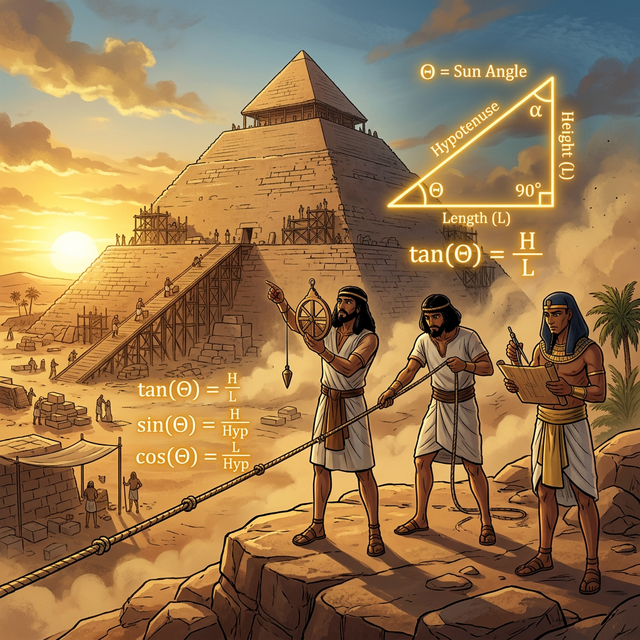

# 00. 인트로: 닿을 수 없는 곳을 측량하다 (Intro)

수천 년 전 고대 우주관에서는 땅은 평평하고 하늘은 둥근 돔형 천장이었습니다. 
하지만 별자리들의 궤도를 꼼꼼히 관측하던 고대 그리스와 이집트의 괴짜 수학자들은 하늘의 거대한 별들이 도는 '각도'와 땅 위 그림자의 '길이' 사이에 아주 정밀하면서도 숨겨진 비율의 법칙이 있다는 걸 직감했습니다.

---

## 1. 어떻게 자(Ruler) 없이 피라미드 꼭대기를 잴까?

여러분 앞에 구름 위로 솟은 거대한 기자의 대피라미드가 있다고 칩시다. 
이 피라미드의 정확한 수직 높이를 재려면 어떻게 해야 할까요? 
헬기를 타고 꼭대기에서 줄자를 떨어뜨리거나, 사다리를 타고 올라가는 것은 당시 기술로는 불가능하거나 너무 위험한 일입니다.

  

이때 하늘을 향해 시선을 돌린 천재 탈레스(Thales) 같은 수학자의 뇌리에 미친 아이디어가 스칩니다.
**"피라미드가 만드는 그림자의 제일 끝점과 모래사장에 꽂은 내 1미터짜리 작은 지팡이의 그림자 끝점을 동시에 관찰하면 어떨까?"**

이 단순한 호기심 하나가 인류 측량술을 영원히 바꿔놓았습니다.

## 2. 확대/축소의 마법: 닮음(Similarity)

작은 지팡이와 긴 그림자가 만드는 삼각형, 거대한 피라미드와 어마어마하게 긴 그림자가 만드는 삼각형.
햇빛은 아주 멀리서 수평으로 나란히 쏟아지기 때문에, 이 두 삼각형은 그림자를 만드는 **햇빛의 꺾인 각도**가 완벽하게 일치합니다!

이렇게 크기만 다를 뿐, 내각(안쪽 3개의 직각 포함 각도)이 하나도 빠짐없이 모두 똑같은 두 쌍둥이 삼각형을 우리는 **'닮은 삼각형(Similar Triangles)'**이라고 부릅니다. 
자동차 설계 도면(미니어처)과 실물 크기 자동차(거대로봇)의 관계를 생각해 보세요. 도면에서 바퀴 반지름과 문짝 높이의 **비율(Rate)**이 가령 1:5 였다면, 100배로 뻥튀기시켜 만든 진짜 현실 자동차에서도 그 두 길이의 1:5 비율만큼은 절대 틀어지지 않고 똑같이 유지되어야 정상입니다. 바로 이 '절대 무너지지 않는 비율 스폰지 법칙'이 '삼각비(Trigonometric Ratios)'의 유일한 뿌리입니다. 

## 3. 세상을 해킹하는 치트키 삼각형

이제 거대한 피라미드의 진짜 수직 높이(도달 불가능 영역)는 더 이상 난제가 아닙니다.
내가 꽂은 지팡이(도달 가능 영역)의 작은 직각 삼각형 빗변, 밑변, 높이 비율만 줄자로 재어 파악해 두면, 피라미드의 어마어마한 긴 밑변 그림자 길이에 방금 구해둔 '비율' 숫자만 곱해주면 그만입니다! 

직접 꼭대기에 올라가지 않아도 땅 위에서 펜과 종이만으로 허공의 꼭대기 좌표를 때려 맞출 수 있게 된 것입니다.
이처럼 어떤 각도 $\theta$(세타) 하나만 정해지면 영원불멸 변하지 않는 신성한 우주의 비율값들! 우리는 그것을 **사인(Sine), 코사인(Cosine), 탄젠트(Tangent)** 라는 이름으로 부르게 됩니다. 다음 장에서 자세히 뜯어봅시다.
