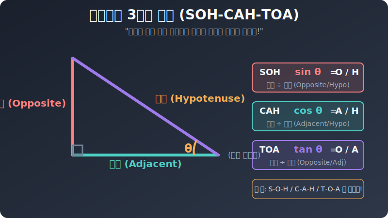

# 02. 두 번째 수업: 사인, 코사인, 탄젠트의 탄생 (SOH CAH TOA)

오직 직각 삼각형 안에서만 쓸모 있는, 3개의 특별한 분수 나눗셈(비율)에 대해 배워봅시다.
외국 학생들은 보통 이 세 가지 헷갈리는 삼각비의 앞글자를 따서 마법의 주문처럼 **"SOH-CAH-TOA (소-카-토아)"** 라고 죽어라 암기합니다. 대체 이 주술은 무슨 뜻일까요?

---

## 1. 관찰자의 시선: 기준각 (Theta $\theta$)

어떤 비율을 구하기 전에, 내가 "어떤 관점(어느 모서리 시점 각도)"에서 삼각형을 쳐다보느냐가 가장 중요합니다. 이 눈알을 굴리는 중심 기준각을 수학 기호로 보통 **$\theta$(세타)** 라고 씁니다.

  

내가 $\theta$ 자리에 딱 쪼그리고 서서 바라본다고 상상해 보세요.
1. **빗변 (Hypotenuse, $H$):** 가장 멀고 길쭉하게 뻗은 대각선 지붕 미끄럼틀입니다.
2. **높이 (Opposite, $O$):** 내가 보고 있는 시선 바로 맞은편 앞쪽에 적벽처럼 우뚝 서 있는 반대편(Opposite) 절벽 선형태 변입니다.
3. **밑변 (Adjacent, $A$):** 내가 밟고 서 있는 바닥, 나와 인접하게(Adjacent) 찰싹 붙어 있는 변입니다. 

자, 이제 이 세 가지 변의 이름을 조합해서 SOH-CAH-TOA 주문을 하나씩 분해 해석해 보겠습니다.

## 2. SOH: 사인 (Sine) = Opposite / Hypotenuse

내가 서 있는 각도 $\theta$ 의 앞면이 얼마나 가파르게 끊어질 듯 치솟고 있는지를 나타내는 아찔한 절벽력 비율입니다.
* **$S = O / H$** (Sine = Opposite 나누기 Hypotenuse)
* 한국말 변형: $\text{사인}(\sin) = \frac{\text{높이}}{\text{빗변}}$
* 사인 값이 크다($1.0$에 가깝다)는 건? 대각선 끝까지 올랐을 때, 실제로 위에서 찍혀 눌러본 떨어지는 높이 낭떠러지가 어마어마하게 폭발적이라는 뜻입니다! 

## 3. CAH: 코사인 (Cosine) = Adjacent / Hypotenuse

이건 반대로 얼마나 내가 바닥에 안전하게 붙어 깔려 있느냐를 재는 스텔스 바닥 밀착형 비율입니다.
* **$C = A / H$** (Cosine = Adjacent 나누기 Hypotenuse)
* 한국말 변형: $\text{코사인}(\cos) = \frac{\text{밑변}}{\text{빗변}}$
* 코사인 값이 크다($1.0$에 가깝다)는 건? 대각선을 타고 올라가 봤자 하늘 위 높이는 개뿔도 안 높아지고 그저 내내 지루하게 우측 수평 평지 길 지평선만 길쭉하게 바닥에 뻗어 있었다는 안도감(또는 무력감)을 줍니다. 

## 4. TOA: 탄젠트 (Tangent) = Opposite / Adjacent

내가 앞으로 전진하는 거리($x$축) 대비, 하늘로 치솟는 수직 미사일 높이($y$축) 솟구침을 묻는, 기울기 폭주 척도입니다. 가장 폭발적인 수치 상승을 보여줍니다.
* **$T = O / A$** (Tangent = Opposite 나누기 Adjacent)
* 한국말 변형: $\text{탄젠트}(\tan) = \frac{\text{높이}}{\text{밑변}}$
* 자동차 엑셀의 가속 페달 같은 놈입니다. 바닥(밑변)을 아주 쥐꼬리만큼 전진했는데, 탄젠트 수치가 극악으로 높다면 위로 미친 듯이 수직 상승하는 엘리베이터 공포 절벽의 기울기를 가진 길이라는 뜻입니다. ($90$도가 다 와가면 탄젠트 값은 미친 듯이 폭주하여 무한대 $\infty$ 로 에러 빔을 뿜으며 날아갑니다!)

## 5. 결론: 결국 치트키일 뿐이다

SOH CAH TOA, 사인, 코사인, 탄젠트. 
어렵고 복잡해 보여도, 쫄 것 하나 없습니다. **그저 삼각형의 "변의 길이 숫자 두 개" 를 위아래 분수 막대기에 올려두고 계산기 버튼으로 엔터를 쳐 나눗셈 한 번 딸깍 소수점 결과 숫자 하나를 뽑아본 것에 불과하다!** 이것이 삼각비의 궁극적인 정체이고 전부입니다.

이제 다음 시간엔, 사람들이 각도기 없이도 뻔질나게 써먹는 아주 흔하고 신성한 '특수 각도 3총사($30^\circ$, $45^\circ$, $60^\circ$)' 의 비밀스러운 소수점 비율값들을 암기 보드판에 적격시켜 볼 차례입니다.
