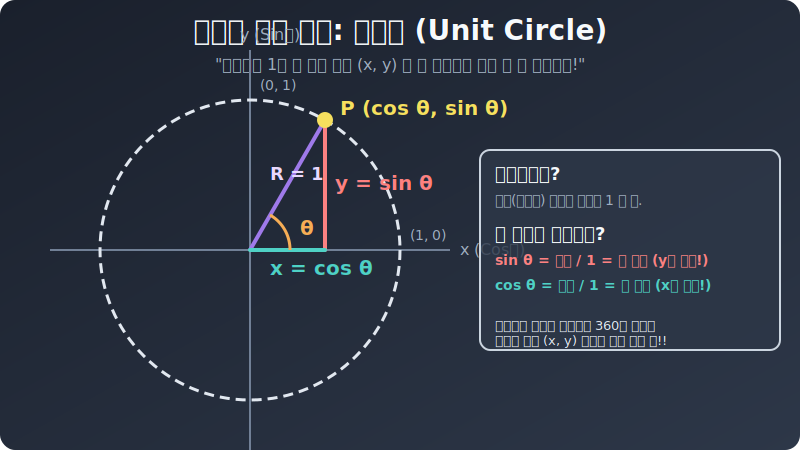

# 02. 두 번째 수업: 모든 것을 품은 마법의 링, 단위원 (Unit Circle)

자, 이제 직각 삼각형의 감옥을 부술 시간입니다. 이 해킹 탈옥 기법의 핵심은 피타고라스 좌표계 정중앙, 십자가 정가운데 $(0, 0)$ 원점에 쾅 하고 **"반지름 길이가 정확히 $1$ 인 동그란 서클(원)"** 을 그려 넣는 것입니다! 우리는 이 원을 **단위원(Unit Circle)** 이라고 부릅니다. 

---

## 1. 분수(Ratio)를 소거해 버리는 숫자 $1$의 마법

이 반지름 $1$짜리 원이 왜 그렇게 파괴력 넘치는 마법의 치트키일까요?
원점을 밟고 서서, 원의 테두리 위 빙글빙글 달리는 자동차를 점 $P$ 라고 해봅시다. 우리가 원점부터 이 점 $P$ 를 바라볼 때 자연스럽게 가상의 빗변이 생기고, $X$축 바닥으로 수직으로 선(눈금)을 내리면 직각 삼각형이 짜잔 하고 생깁니다.

  

자, 삼각비 비율 공식을 소환해 볼까요. SOH-CAH!
* 파란색 빗변(Hypotenuse)의 뼈대 길이는 항상 원의 반지름입니다. 그런데 반지름을 애초에 치트키 숫자 **'$1$'** 로 고정해 놨죠!
* $\sin(\theta) = \frac{\text{높이}}{\text{빗변}(1)} = \mathbf{\text{그냥 높이! (y 픽셀 좌표값 !)}}$
* $\cos(\theta) = \frac{\text{밑변}}{\text{빗변}(1)} = \mathbf{\text{그냥 밑변! (x 픽셀 좌표값 !)}}$

이럴 수가. 밑변 나누기 빗변, 높이 나누기 빗변 하면서 귀찮게 나눗셈 비율 분수 짓거리를 할 필요가 모조리 증발해 버렸습니다! 분모가 1로 고정되면서 **"점 $P$가 위치한 레이더상 진짜 물리적 좌표값 $(X, Y)$ 가, 곧 코사인 값과 사인 값 그 자체 덩어리"** 가 되는 미친 기적의 매핑(Mapping) 연결 고리가 태어난 것입니다!

## 2. 좌표계를 질주하는 무한한 각도 추적

이 단위원 스캐너의 규칙 덕분에 이제 삼각형이 $90^\circ$ 도를 넘어가 등딱지가 바닥에 처박히는 한이 있어도 아무 문제가 없습니다! 각도가 둔각 $150^\circ$ 로 좌측 바닥으로 고꾸라졌다고요?
괜찮습니다. 단위원 상의 왼쪽($X$가 마이너스인 구역) 둥근 테두리 위로 자동차 점 $P$ 가 굴러갔을 뿐이니까요. 

점 $P$의 레이더 좌표를 스캔해 보니 가령 $(-0.866, \dots)$ 으로 잡힙니다.
그 말은 즉? $150^\circ$ 의 밑변(X) 좌표가 음수 영역에 세워져 그려졌으니, **"아~ $150^\circ$의 코사인($\cos$) 값은 마이너스($-0.866$ 음수) 가 튀어나오겠구나!!"** 

$200^\circ$ 도? 점 자가용이 바닥 3사분면 축 밑바닥으로 완전히 떨어지니까, 밑변($X$)도 음수 코사인값, 높이($Y$)도 지하실로 파였으니 사인값도 음수($-$)! 
$400^\circ$ 도? 자동차가 원을 한 바퀴 빙글 돌고 좀 더 가서 멈춘 스캐너 좌표니까 결국 $40^\circ$ 스캔 지점 좌표랑 물리적으로 완벽 동일한 사인/코사인 값이 튀어나오겠구나! 

이처럼 삼각형의 변은 절대로 '길이' 가 마이너스(음수) 란 게 존재할 수 없다는 금기(Taboo)마저도 단위원(Unit Circle) 좌표계의 축으로 이식하면서, 삼각함수는 $-1.0$ 에서 $+1.0$ 을 오가며 음수 값마저 펑펑 자유자재로 뱉어내는 완벽한 **진폭 함수**로 봉인이 풀려버린 것입니다.
이 봉인이 해제된 마이너스-플러스 데이터들이 시간의 흐름을 타고 꼬리에 꼬리를 물면 어떻게 될까요?
다음 장에서 소름 돋게 춤추는 파동(Wave) 그래프가 모니터에 요동치기 시작합니다.
