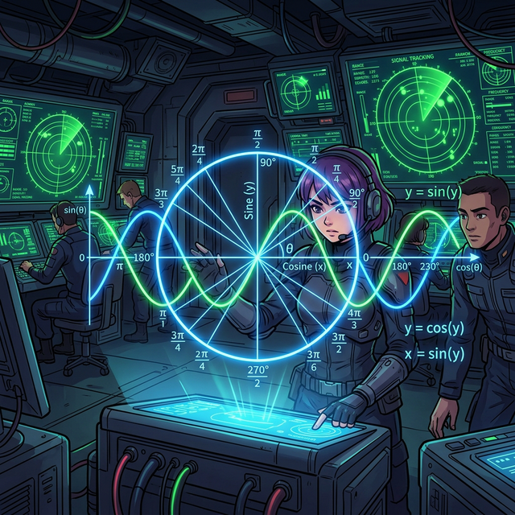

# 수학이야기 87.삼각비2 (Trigonometry 2)

  

---
이전 모듈(삼각비 1)에서 우리는 $90^\circ$ 직각으로 완전히 막혀버린 '닫힌 삼각형' 안에서 꼼지락거리며, 건물 높이나 대포알의 궤도 각도를 구하는 기초 비율(SOH-CAH-TOA)을 배웠습니다. 
하지만 삼각형 안쪽의 뾰족한 예각은 기껏해야 $0^\circ$ 에서 $90^\circ$ 사이를 맴돌 뿐입니다.

> "만약 각도가 $90^\circ$ 를 넘어가서 $150^\circ$, 아니 $360^\circ$ 나 $1000^\circ$ 처럼 빙글빙글 계속 회전하는 놈이라면 대체 어떻게 계산해야 하지?"

이 질문의 해답은 바로, 모서리를 부수고 나와 완벽하게 둥근 궤도를 도는 **'단위원(Unit Circle)'** 공간으로 퀀텀 점프(Quantum Jump) 하는 것입니다.
직선과 모서리의 학문이었던 삼각비가, 우주 행성의 영원한 공전 궤도, 라디오 전파, 인공지능 통신 파동(Wave)의 주기적 진동을 지배하는 **'삼각 함수(Trigonometric Functions)'** 로 폭발적으로 진화하는 경이로운 순간을 구경해 봅시다.

---

## 목차

- [00. 인트로: 모서리를 부수고 나온 비율 (Intro)](00_intro)
- [01. 첫 번째 수업: 디그리(도)의 종말과 라디안의 탄생 (Radians)](01_radian_measure)
- [02. 두 번째 수업: 모든 것을 품은 마법의 링, 단위원 (Unit Circle)](02_unit_circle_trigonometry)
- [03. 세 번째 수업: 영원히 물결치는 사인과 코사인의 심장 박동 (Sine & Cosine Graphs)](03_graphs_of_sine_cosine)
- [04. 네 번째 수업: 무한대를 향해 폭주하는 탄젠트 절벽 (Tangent Graph)](04_graph_of_tangent)
- [05. 다섯 번째 수업: 영원히 깨지지 않는 피타고라스의 삼각 호흡 (Trig Identities)](05_trig_identities)
- [06. 여섯 번째 수업: 파이썬 코드로 두 파동을 합치다 (Harmonics & Signals)](06_harmonics_and_sound)
