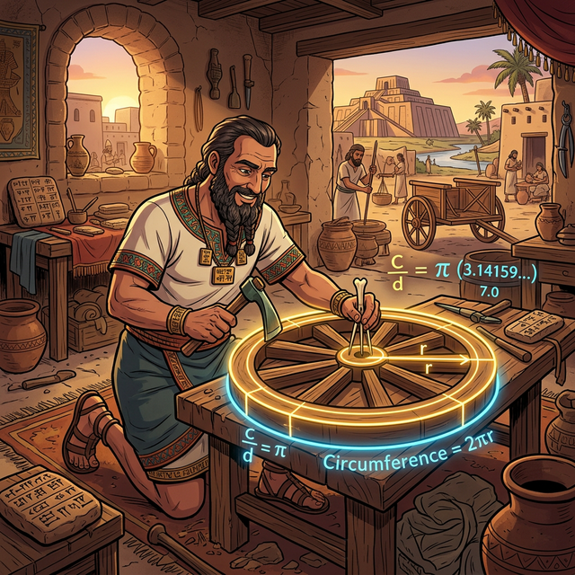

# 00. 인트로: 인류 최고의 발명품, 수레바퀴 (Intro)

우리가 매일 타고 다니는 자동차의 타이어, 컴퓨터 안에 들어있는 도는 하드디스크 모터, 심지어 우주로 날아가는 로켓의 엔진 터빈까지. 이 모든 회전하는 역학 에너지의 중심에는 인류 최고의 발명품이자 가장 단순한 기하학 도형인 **"원(Circle)"** 이 존재합니다.

기원전 약 3500년 전, 수메르인 중 누군가가 무거운 돌덩이를 옮기기 위해 통나무를 잘랐을 때 그들은 우주가 숨겨놓은 가장 위대한 물리 엔진 치트키, 원주율($\pi$)의 문을 열어젖혔습니다.

  

## 1. 지치지 않는 운동의 비밀

정사각형 바퀴를 단 자전거를 상상해 보십시오. 
한 번 굴러갈 때마다 모서리가 땅에 쿵쾅거리며 박히고 충격으로 모든 추진 에너지가 땅바닥으로 새어 나갈 것입니다. 

하지만 어떤 천재가 모서리들을 전부 다 깎고 깎아내서 "가운데 중심 축(Axle) 으로부터 땅바닥에 닿는 테두리까지의 모든 폭(반지름)이 완벽하게 $1:1$ 로 일치하는" 원형 톱니바퀴를 만들었습니다. 
이 원형 바퀴는 땅을 구를 때 자동차의 높박낮임(위아래 출렁거림) 을 완벽한 $0$ 으로 렌더링 하며, 엔진의 모든 힘을 $100\%$ 앞으로 밀고 나가는 전진 에너지로 전환시킵니다. 

마찰과 중력을 가장 이기기 쉬운 기하학적 최소 스크립트, 그것이 바로 원입니다.

## 2. 해킹 불가능한 무한의 비밀번호, 파이 $\pi$ 

이렇게 위대하고 매끄러운 원이지만, 고대 이집트인들과 그리스의 천재 수학자, 프로그래머들까지 $5000$년이 넘도록 풀지 못한 역겨운 수학적 버그 코드가 하나 이 원 안에 숨어 있었습니다.

> **"저 원의 가장 먼 가로지름 뼈대(지름) 의 길이를 $1$미터라고 쳤을 때, 도대체 저 둥근 테두리 껍질(원주) 의 실제 길이는 줄자로 재면 정확히 몇 미터로 떨어질까?"**

그 누구도 이 테두리 길이를 소수점 끝자리까지 정확한 유리수 분수로 표현하지 못했습니다. "$3$배보다는 조금 긴데? $3.1$배쯤 되나? 아니 $3.14$정도... 아니 $3.141592...$" 
영원히 $0$ 으로 나누어 떨어지지 않는 미친 무한루프 소수! 
인류는 이 기묘한 비율의 족쇄에 **파이($\pi$)** 라는 알파벳 하나를 스티커처럼 붙이고 통째로 외워버리는 항복 선언을 했습니다. 

이 단원에서는 이 거대한 무한 스크립트 파이의 정체가 어떻게 $\pi r^2$(넓이), $2\pi r$(둘레) 로 팽창해 가는지를 코드 단위로 조목조목 뜯어보겠습니다. 제일 먼저, 원을 이루는 기초 부품 명칭부터 세팅합시다!
