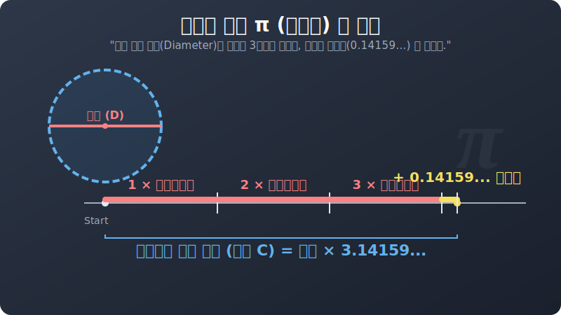

# 03. 세 번째 수업: 무한의 암호, $\pi$ (원주율) 의 정체 (The Secret of Pi)

고대 신전 건축가들은 둥근 기둥을 세우기 위해, 자신들이 갖고 있는 일자 자막대기(지름) 만으로 바깥쪽 둥근 기둥의 둘레(원주) 길이가 도대체 얼마나 될지 미리 계산해야만 했습니다.
그들은 크기가 제각각인 수백 개의 수레바퀴와 둥근 그릇들을 모아놓고, **"테두리 둘레(원주) $\div$ 한가운데 지름선"** 의 비율을 미친 듯이 나눠보기 시작합니다.

그리고 소름 돋는 우주의 절대 규칙 하나를 마주합니다.

---

## 1. 3.14159... 영원히 끝나지 않는 요술 지팡이

놀랍게도 바퀴가 손가락만 한 동전이든, 거대한 신전의 돌기둥이든.
테두리 껍데기 줄자를 쫙 펴서, 그 원이 가진 일자 지름 자막대기로 재어보면?
> 무조건 **줄자는 항상 자신의 지름 지팡이보다 딱 "3배 하고도 아주 조금 쪼가리(약 0.14) 가 남는" 길이**를 가졌습니다. 

이 우주가 세팅해 놓은 영원불변의 고정 렌더링 비율, 이 $3.141592...$ 로 끝없이 흘러가는 무리수(순환하지 않는 무한소수) 비율 값을 인류는 **원주율 (Ratio of Circumference to its Diameter)** 이라고 불렀습니다.
और 그리이스어 알파벳인 **$\pi$(파이, Pi)** 라는 마법의 기호 하나를 덧씌워 숫자 대신 코드로 쓰기 시작합니다!

 
(2강에서 선보였던 지름 3바퀴 반의 굴리기 SVG 마법을 눈으로 다시 확인하세요!)

## 2. 계산기가 없던 시대의 노가다 머신, '다각형 쪼개기'

아르키메데스(Archimedes) 같은 미친 수학적 해커들은, 이 $\pi$ 의 진짜 소수점 아래 암호를 캐내기 위해 소름 돋는 무식한 물리 연산을 감행합니다.
그는 둥근 원을 그대로 잴 수가 없으니, 그 원과 가장 비슷하게 생긴 **정 다각형**을 억지로 그려 넣어 각을 쪼개면 원의 테두리에 근접할 것이라 생각했습니다.

1. 원의 바깥쪽에 딱 맞게 닿는 커다란 육각형을 그리고 둘레를 잰다.
2. 원의 안쪽에 딱 맞게 닫는 조금 작은 육각형을 그리고 둘레를 잰다.
3. 그러면? **진짜 둥근 원의 둘레 길이는 무조건 [안쪽 육각형]과 [바깥쪽 육각형] 사이의 어떤 값 어딘가에 갇혀(Lock) 있게 됩니다!**
4. 이 육각형을 12각형, 24각형, 48각형... 무려 **"정 96각형"** 까지 자신의 손과 연필만으로 모래판 위에서 곱하고 루트를 씌워 쪼개서 노가다 계산을 돌렸습니다.

그 결과 아르키메데스는 $\pi$ 가 $3.1408$ 보다는 크고 $3.1428$ 보다는 작다는 엄청나게 디테일한 근삿값 범위를 인류 역사상 가장 기계적으로 렌더링 해내는 데 성공합니다. 

이 무식하지만 완벽한 로직(양쪽 한계를 조여 들어가는 샌드위치 압축법) 은 현대 컴퓨터 그래픽(GPU) 이 복잡한 3D 면의 넓이를 버텍스(Vertex, 꼭짓점 폴리곤) 를 쪼개서 잘게 다져 계산해 내는 렌더링 방식과 정확하게 똑같은 컴퓨터 알고리즘 그 자체였습니다. 

## 3. 원의 공식을 폭발시키는 방아쇠, $\pi$ 

이 위대한 암호 문자 $\pi$ 하나만 등 뒤에 달아주면, 더 이상 빙빙 둘러재는 줄자는 필요 없습니다. 
원의 뱃속 정보인 반지름($r$) 값 하나만 대입해도 파이썬 함수 엔진처럼 툭 하고 둘레(원주율 껍데기 총길이) 가 터져 나옵니다. 

다음 장에서는 이 파이($\pi$)의 권력을 이용해, 인류가 가장 지겨워하면서도 가장 많이 쓰는 기본 공식 2개인 **둘레($2\pi r$)** 와 **넓이($\pi r^2$)** 스크립트가 도대체 왜 그런 모양을 띠게 뛰었는지 속 시원하게 분해해 보겠습니다.
