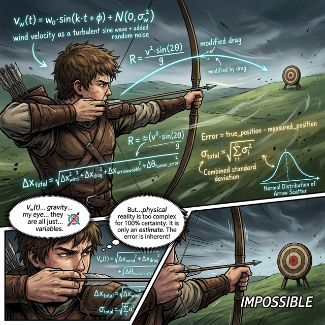

# 00. 인트로: 완벽한 측정은 우주에 존재하지 않는다 (Intro)

여러분이 궁수라고 상상해 봅시다. 표적의 정중앙인 텐텐(10점) 구역을 향해 아주 정교하게 화살을 날려 꽂았습니다. 누가 보아도 완벽한 10점이었습니다.
하지만 눈에 보이지 않는 공기의 저항, 습기, 나뭇잎의 진동, 그리고 궁수의 심장 박동 때문에 사실 화살촉은 정중앙의 원자핵에서 $0.000001\text{mm}$ 비켜나 있었습니다.

---

## 1. 물리적 세계의 한계

수학 교과서에 그려진 "길이가 $5\text{cm}$인 선분"은 개념적으로 완벽한 $5\text{cm}$입니다. 
하지만 여러분의 필통에 있는 플라스틱 자로 실제 종이 위에 $5\text{cm}$ 선을 그린다고 생각해 보세요.

* 연필심 두께 때문에 발생하는 $+$ 오차
* 플라스틱 자의 눈금이 미세하게 팽창해서 발생한 오차
* 그리는 사람의 미세한 수전증

우주에서 그 어떤 초정밀 레이저 자를 들이대더라도, 소수점 수억 번째 자리까지 들어가게 원자 단위의 양자 요동 때문에 **"완벽하게 자로 잰 측정값"** 이라는 것은 존재할 수 없습니다.

  

## 2. 참값(True Value)과 근삿값(Approximate Value)

오직 신(God)이나 대자연만이 알고 있는 어떤 사물의 완벽하고 절대적인 진짜 수치를 **참값(True Value)**이라고 부릅니다.
그리고 인간이 자를 대고 눈금으로 눈대중해서 읽어낸 한계가 있는 수치를 **근삿값(Approximate Value) 혹은 측정값(Measured Value)**이라고 합니다.

* 여러분의 진짜 키: $175.1239848249... \text{cm}$ (영원히 알 수 없는 참값)
* 건강검진에서 잰 키: $175.1 \text{cm}$ (기계가 소수점 첫째 자리에서 자른 근삿값)

## 3. 오차를 다스리는 자가 세상을 다스린다

인간의 과학 기술은 "오차를 완전히 없애는 법"이 아니라, **"오차를 얼마만큼 허용해 주면 우리가 로켓을 우주로 날리는 데 문제가 없을까?"**를 고민하며 발전해 왔습니다. 
이 틈바구니($\text{측정값} - \text{참값}$)를 수학적으로 정의하고 컨트롤할 수 있게 된 순간, 인류는 무너지는 다리와 터지는 보일러의 비극을 막고 현대 과학 혁명을 이룩할 수 있었습니다. 

자, 그럼 우리가 일상에서 흔히 쓰는 근삿값과 눈금의 세계로 깊이 들어가 볼까요?
