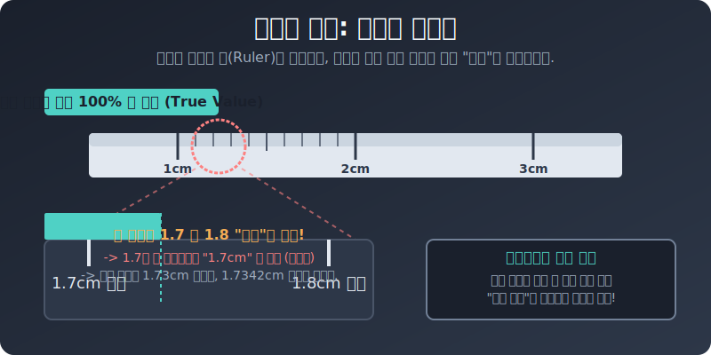

# 01. 첫 번째 수업: 참값과 측정값의 차이 (True vs Approximate)

일상생활에서 우리가 너무나 당연하게 사용하고 있는 소수점 숫자들 중 상당수가 사실은 '진짜 얼굴'이 아니라 적당히 화장하고 타협한 모습이라는 것을 알고 계셨나요? 

---

## 1. 근삿값이 발생할 수밖에 없는 이유

우리 주변에서 흔히 쓰이는 숫자들은 크게 두 가지로 나뉩니다.

1. **정확한 값 (개수)**: 교실에 있는 학생 수 $35$명, 책상 위의 연필 $3$자루. 사람이 하나둘 셀 수 있는 것들은 $35.1$명 같이 애매한 오차가 발생하지 않는 완벽한 '참값'입니다.
2. **어쩔 수 없는 근삿값 (측정)**: 하지만 키, 몸무게, 시간, 온도 같은 연속적인 물리량을 '기계(자, 저울)'로 재는 순간, 눈금의 한계 때문에 무조건 마지막 자리를 어림잡게 됩니다. 따라서 체중계의 $60.5\text{kg}$은 진짜 내 몸무게가 아니라 기계가 보여줄 수 있는 한계점인 '근삿값'입니다. 

또한 원주율 $\pi (3.1415...)$ 나 $\sqrt{2} (1.414...)$ 처럼 수식 자체는 완벽한 참값이지만, 컴퓨터나 계산기가 메모리 한계 혹은 계산 편의를 위해 $3.14$ 라고 잘라서 써버리면 그 순간 참값은 '근삿값'으로 전락하게 됩니다.

## 2. 눈금의 한계: 최소 눈금 단위

여러분이 만약 가장 작은 눈금이 $0.1\text{cm}(1\text{mm})$로 파여 있는 일반적인 자를 가지고 있다고 가정해 봅시다.
어떤 연필의 끝이 $1.7\text{cm}$ 눈금과 $1.8\text{cm}$ 눈금 사이에 떨어졌다면, 우리는 어떻게 적어야 할까요?

<div align="center">
  
</div>

시력이 아프리카 마사이족 급이라도, 우리는 이 자를 가지고 공식적인 기록에 $1.73\text{cm}$ 라고 적으면 안 됩니다! (기계가 $0.01\text{cm}$ 단위를 보장하지 않기 때문입니다.) 
규칙상 $1.7$ 쪽에 훨씬 더 가까워 보이므로, 눈대중으로 반올림하여 **"약 $1.7\text{cm}$ 지점"** 이라고 측정값을 적는 것이 과학적 측정의 한계입니다.

결국, 모든 측정 도구는 가장 미세한 눈금, 이른바 **"최소 눈금" 단위를 넘어서는 진짜 참값을 영원히 알 수 없습니다.**

## 3. 파이썬과 측정값의 디지털 한계

우리의 컴퓨터 역시 현실의 '자(Ruler)'나 다름없습니다. 64비트 메모리를 가진 컴퓨터의 최소 눈금은 $10^{-16}$(소수점 아래 $16$번째 자리) 정도입니다. 
따라서 파이썬 또한 이 최소 눈금을 넘어가는 숫자가 들어오면, 측정 도구(메모리)의 한계로 인해 눈대중으로 잘라버립니다!

```python
# [Python] 컴퓨터(RAM) 라는 측정 도구의 '최소 눈금' 한계 들여다보기
import math

# 파이(Pi)는 원래 무한한 소수점 길이를 가진 참값(True Value)입니다.
print("[컴퓨터의 눈금 한계 테스트 시작]\n")

# 하지만 파이썬이 float 타입으로 파이를 저장하는 순간, 자(Ruler)가 잘라버립니다.
computer_pi = math.pi

# 1. 일반적인 출력 (눈금이 허용하는 만큼만 보여줌)
print(f"파이썬이 주장하는 Pi (측정값): {computer_pi}")

# 2. 아주아주 긴 50자리 숫자처럼 보여달라고 강제로 윽박질러보겠습니다.
# (최소 눈금 바깥의 미지의 영역을 보여달라고 하는 행위)
print(f"강제로 소수점 50자리 확대: {computer_pi:.50f}")

print("\n-> 소수점 15자리 (141592653589793...) 이후부터 나타나는 숫자들(115... 등)은")
print("-> 실제 참값 파이와 아예 다른 쓰레기 값(노이즈)입니다.")
print("-> 파이썬 메모리의 '최소 눈금'인 64비트를 벗어났기 때문입니다!")
```

**[실행 결과]**
```text
[컴퓨터의 눈금 한계 테스트 시작]

파이썬이 주장하는 Pi (측정값): 3.141592653589793
강제로 소수점 50자리 확대: 3.14159265358979311599796346854418516159057617187500

-> 소수점 15자리 (141592653589793...) 이후부터 나타나는 숫자들(115... 등)은
-> 실제 참값 파이와 아예 다른 쓰레기 값(노이즈)입니다.
-> 파이썬 메모리의 '최소 눈금'인 64비트를 벗어났기 때문입니다!
```

이 결과를 통해 알 수 있듯, $1\text{mm}$ 자를 가지고 맨눈으로 "음, $1.73489\text{cm}$ 같아"라고 우기는 것은, 컴퓨터에게 소수점 $50$자리를 출력하라고 명령하여 나오는 쓰레기 값을 믿는 것과 완전히 똑같이 바보 같은 짓입니다. 

도구(자석, 저울, 램메모리)의 최소 눈금 한계! 이 선을 넘어서는 순간 물리적인 오차가 폭발하게 됩니다. 다음 시간에는 이 '오차'를 수학적으로 컨트롤하는 개념에 대해 알아보겠습니다.
