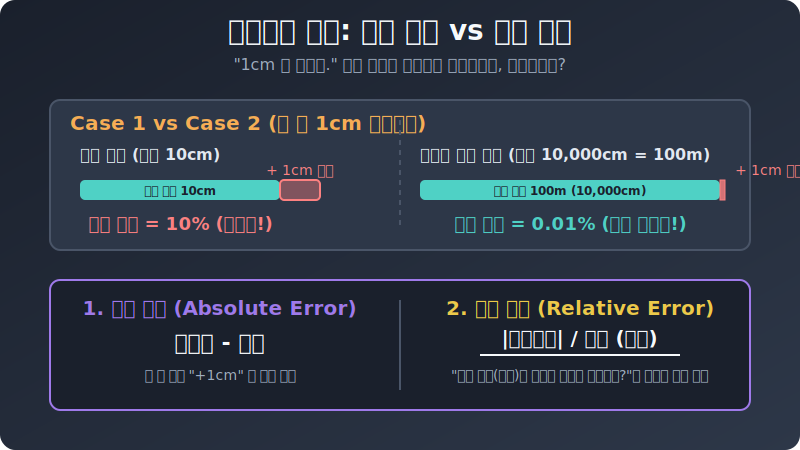

# 02. 두 번째 수업: 오차와 정확도 (Error and Accuracy)

자, 측정값이 무조건 부정확하다는 현실을 인정했습니다. 그렇다면 남은 임무는 단 하나입니다. 
**"내가 틀리긴 틀렸는데, 도대체 얼만큼 틀렸는가?"** 를 아주 건방지고 당당하게 수학적으로 평가하는 것입니다.

---

## 1. 절대 오차 (Absolute Error) : 팩트 폭격

가장 단순하고 무식하게 오차를 계산하는 방법입니다. 내가 읽은 근삿값에서 불변의 참값을 그냥 빼버립니다.

$$ \textbf{오차} = \textbf{측정값} - \textbf{참값} $$

* 내 몸무게가 진짜로는 $60\text{kg}$ 인데, 체중계가 $61\text{kg}$ 이라고 나왔다면?
  * 오차 = $61 - 60 = +1\text{kg}$
* 내 몸무게가 진짜 60\text{kg} 인데, 체중계가 $58\text{kg}$ 이라고 고장 났다면?
  * 오차 = $58 - 60 = -2\text{kg}$

오차가 양수($+$)면 내가 실제보다 '오버(Over)'해서 쟀다는 뜻이고, 음수($-$)면 실제보다 '덜 쟀다(Under)'는 뜻입니다.

## 2. 1cm 오차의 억울함 (상대 오차)

"야! 너 $1\text{cm}$ 나 오차를 냈어!"
과연 이 비난은 정당할까요? 상황에 따라 완전히 다릅니다.

<div align="center">
  
</div>

* **상황 1:** 친구 코 길이를 쟀는데 $1\text{cm}$ 를 틀렸습니다. 코 크기에 1cm가 틀리면 거의 성형 수술 대참사입니다!
* **상황 2:** 서울에서 부산까지 가는 고속도로 길이를 쟀는데 $1\text{cm}$ 를 틀렸습니다. 400km 스케일에서 1cm 나부랭이 오차는 신(God)의 경지입니다.

절대 오차(단순히 $1\text{cm}$)만 보면 두 상황 똑같이 $1\text{cm}$ 를 틀렸습니다. 
하지만 "얼마나 큰 대상을 쟀는가?" 라는 전체 규모를 고려하면 오차의 치명도가 완전히 다릅니다. 이를 평가하는 잣대가 바로 **상대 오차(Relative Error)**입니다.

## 3. 상대 오차 공식 (비율)

"내가 재려고 했던 전체 크기(참값) 중에서, 오차가 차지하는 비율이 얼마나 되는가?"

$$ \textbf{상대 오차} = \frac{\;|\text{오차 (절댓값)}|\;}{\text{참값}} $$

* 코 길이(참값 $5\text{cm}$)의 상대 오차: $\frac{1}{5} = \textbf{0.2 (20\%)}$ -> 완전 망함!
* 고속도로(참값 $40,000,000\text{cm}$)의 상대 오차: $\frac{1}{40,000,000} = \textbf{0.0000025\%}$ -> 역대급 초정밀 성공!

## 4. 파이썬 무기: math.isclose() 의 원리

여러분이 첫 단원 실수 파트에서 소수점 오차를 잡기 위해 썼던 `math.isclose()` 함수는 내부적으로 바로 이 **"상대 오차"** 개념을 사용하여 두 숫자가 같은지 다른지 판별합니다.

```python
# [Python] 파이썬이 소수점을 안전하게 비교하는 비법 (상대 오차 허용!)
import math

perfect_real = 0.3
hacked_float = 0.1 + 0.2  # 0.30000000000000004 (오차 발생)

# 1. 절대 오차를 그냥 빼서 확인해 봅니다
absolute_error = abs(hacked_float - perfect_real)
print(f"컴퓨터 덧셈이 만들어낸 절대 오차: {absolute_error}")

# 2. 파이썬의 math.isclose() 는 "상대 오차 (rel_tol)" 한계치를 부여하는 함수!
# rel_tol=1e-09 의 뜻: "참값 대비 상대 오차가 0.0000001% 이하로 나면 같은 숫자로 인정해 줄게!"
if math.isclose(hacked_float, perfect_real, rel_tol=1e-09):
    print("-> 팩트: 둘의 상대 오차가 내가 허용한 '허가선' 보다 훨씬 작기 때문에 안전하게 같다고 쳐줍니다!")
else:
    print("-> 팩트: 오차가 너무 커서 다른 숫자로 판정!")
```

**[실행 결과]**
```text
컴퓨터 덧셈이 만들어낸 절대 오차: 5.551115123125783e-17
-> 팩트: 둘의 상대 오차가 내가 허용한 '허가선' 보다 훨씬 작기 때문에 안전하게 같다고 쳐줍니다!
```

이처럼 프로그래밍과 공학에서 "정확하다"는 것은 $0\%$ 의 오차를 뜻하지 않습니다. **"우리가 합의한 상대 오차선 아래로 들어왔다!"** 라는 뜻입니다. 수학은 이미 틀릴 것을 알고 있고, 틀린 양을 허용범위 내로 찍어 누르는 위대한 타협의 기술입니다.
