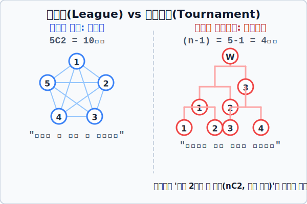



# 06. 이긴 자만 살아남는다: 리그전과 토너먼트

## 1. 학습 목표 (Learning Objectives)
* 스포츠 대회(월드컵, 롤드컵 등)의 양대 산맥인 **'리그전(League)'**과 **'토너먼트(Tournament)'**의 구조를 수학적 '경우의 수'로 명확하게 파헤칩니다.
* 모든 참가자가 한 번씩 맞붙는 평등한 조합 계산과, 단 한 명의 생존자만 남기고 죽음을 강요하는 잔혹한 뺄셈 수학의 시각적 아키텍처를 이해합니다.

## 2. 평등의 결투장, 리그전 (League)
프로야구(KBO) 정규 시즌이나 축구 프리미어리그(EPL) 방식입니다. 리그전의 룰은 아주 우아하고 수학적으로 완벽하게 평등합니다.
> **리그전의 철학**: "누가 제일 대장인지 알기 위해선, **조합 가능한 '모든 쌍(Pair)'이 한 번씩 빠짐없이 전부 다 맞붙게 만들어라!**"

즉, 참가 팀이 5팀이라면 어떻게 될까요? 5개의 팀이라는 바구니에서, 순서와 서열 상관 없이 맞붙을 '2명'을 뽑아오는 **조합(Combination, $\mathbf{_5C_2}$)** 의 수학 그 자체입니다! 반장이 B팀이고 부반장이 A팀이든 반장이 A고 부반장이 B든 두 팀이 서로 치고 박고 축구공을 차는 **'한 경기'** 라는 사건 자체는 똑같으니까요!

* 5팀이 리그전을 치를 때 총 경기 수 = 무작위 두 명 뽑기 ($_5C_2$) = $\frac{5 \times 4}{2 \times 1} = \mathbf{10\text{경기}}$
* (이는 방안에 있는 5명이 빠짐없이 서로 '한 번씩 악수하는 횟수'를 구하는 문제와 100% 동일한 로직입니다.)

## 3. 잔혹한 서바이벌, 토너먼트 (Tournament)
반면 조별리그를 뚫고 올라간 월드컵 본선 결승 스테이지나 스타크래프트 예선전은 피바람이 붑니다.
> **토너먼트의 철학**: "경기를 했다? 진 놈은 즉시 목을 치고 집으로 보낸다. **패배자는 단 한 번의 경기만으로 사라지고 오직 단 한 명의 우승자(Champion)만 살아남는다!**"

참가 팀이 1,000팀이건 10,000팀이건 수학자들에게 전체 경기 수를 묻는다면 0.1초 만에 뺄셈만으로 정답을 낼 수 있습니다. 이들의 논리는 서늘합니다.

"어차피 매 경기가 끝날 때마다 무조건 **'패배자(탈락자)가 1팀씩'** 발생한다. 우승자 1명을 빼고 나머지 모조리(9,999팀)를 죽여서 탈락시켜야 대회가 끝나지 않는가? 따라서 9,999번의 경기를 치러야만 이 살육전이 마무리될 것이다!"

* $N$ 팀이 참가한 토너먼트의 총 경기 수 = 무조건 $\mathbf{N - 1\text{경기}}$ 

  

## 4. 학습 정리 (Summary)
1. **리그전 (조합론 $\mathbf{_nC_2}$)**: 모든 참여자가 단 한 명의 예외도 없이 순서와 무관하게 1대1 쌍(Pair) 매칭을 이루는 구조로, 악수하기나 리그 스포츠 경기 수가 모두 동일한 수학적 무작위 조합($C$) 카운팅 논리로 구동됩니다.
2. **토너먼트 ($\mathbf{n-1}$의 뺄셈)**: 매 경기마다 반드시 승자와 '단 1명의 탈락자'가 필연적으로 발생한다는 점을 역이용한 사고방식으로, 최종 1명의 챔피언을 가리기 위해선 (총원 - 1명) 의 탈락자를 학살해야 하므로 전체 경기 수는 언제나 $n-1$회로 수렴합니다.

