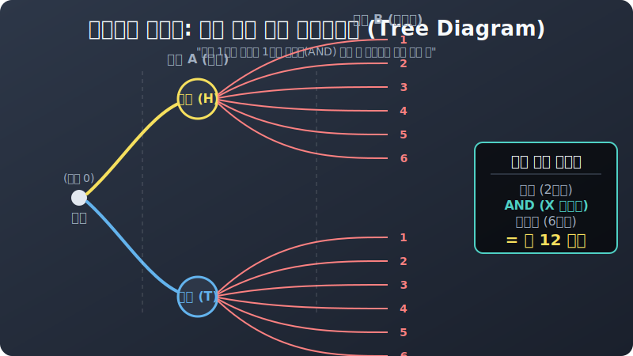

# 03. 세 번째 수업: 동전과 주사위 분기점 트리 그리기 (Tree Diagrams)

머릿속 알고리즘으로 곱하고 더하기만 하다 보면, 어느 순간 "어? 내가 방금 셌던 $5$번째 우주가 햄버거 + 콜라 였나? 아니 햄버거 + 사이다 방이었나?" 하고 변수 메모리 누수(Memory Leak) 가 오면서 뇌 버퍼오버플로우가 걸려서 터져버립니다.
이럴 때 해커들은 머리로 무식하게 세지 않고, 백지에다 나뭇가지(Tree) 를 그려 결괏값을 구조적으로 메모리에 매핑(Mapping) 합니다.

이것이 확률 계산의 시각적 깡패 스킬, **"수형도 (Tree Diagram 나뭇가지 그림)"** 입니다.

---

## 1. 수형도 (Tree Diagram) 의 렌더링 방식

사건이 두 개 이상 겹겹이(AND 중첩) 터져 나갈 때 엄청난 위력을 발휘합니다.
질문: 
> "동전 한 개와 주사위 한 개를 동시에 공중으로 던졌다! 터져 나올 수 있는 총경우의 수는?"
(2강에서 배운 대로 동전 $2$가지 $\times$ 주사위 $6$가지 = 총 $12$가지의 미래 분기점 곱의 법칙입니다.)

이걸 종이 위에 $12$갈래 잔가지로 그대로 그려봅니다.
1. 처음 뿌리(Root) 꼭짓점에서 거대한 두 갈래 가지가 뻗어 나옵니다. 
   - 윗가지는 동전의 **[앞면 H]** 세계관
   - 아랫가지는 동전의 **[뒷면 T]** 세계관입니다.
2. 이제 [앞면] 세계관 끝에 매달려 볼까요? 이 세계관 안에서도 주사위가 $1$부터 $6$까지 여섯 갈래 잔가지로 뻗어 나갑니다! $(H-1, H-2, H-3 \dots H-6)$
3. 당연히 밑의 [뒷면] 세계관에서도 똑같은 $6$갈래 잔가지가 터져 열립니다! $(T-1, T-2 \dots T-6)$

  

가장 오른쪽 끝에 맺힌 나뭇잎 풀때기(Leaf Node) 의 개수를 눈깔로 세어보십시오. 정확히 $12$개($2 \times 6$) 의 최종 평행우주 엔딩이 프린트되어 있을 것입니다.

## 2. 수형도 파싱의 최강점 (안 헷갈린다!)

사실 $2 \times 6 = 12$ 암산 따위 초등학생도 합니다. 그런데 왜 굳이 이 귀찮은 트리를 배울까요?
서바이벌 문제에서 이렇게 묻기 때문입니다.

> "동전은 무조건 [앞면] 이 나오면서, 주사위는 [짝수]가 터지는 세계관 시나리오만 뽑아봐!"

트리를 그려놨다면 뇌를 쓸 필요도 없습니다. 
위쪽 거대한 [앞면] 윗가지들 라인만 쭉 쳐다본 다음, 그 윗가지에 매달린 $6$개의 잎사귀 중에서 $2, 4, 6$ 번 잔가지에만 형광펜 색칠을 쓱쓱 하면 됩니다. 
트리를 그리면 인간의 뇌 연산 부하가 "조건문 판별" 에서 "그림 동그라미 치기" 로 다운그레이드되기 때문에 $100\%$ 실수 없는 완벽한 필터링 코드 해킹이 가능해집니다.

트리로 모든 경우의 수 우주의 개수(분모) 를 셌다면? 
다음 장에서는 이제 그 분모값을 깔고 앉아 드디어 진짜 확률(**퍼센트 %**) 을 계산하는 로직 공식 $P$ 스크립트로 들어가 보겠습니다.
