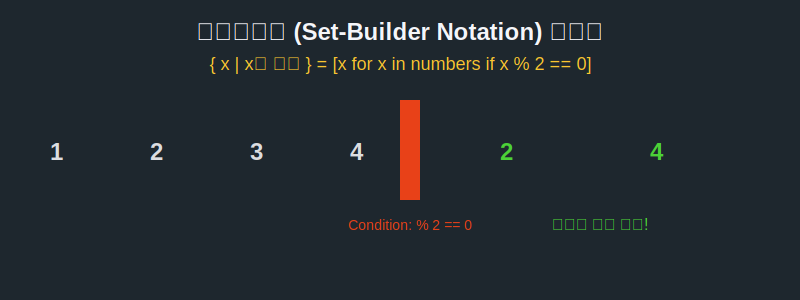

# 02. 두 번째 수업: 집합을 다양하게 표현해 봐요

수학자들이 집합 바구니 안에 들어있는 데이터를 종이 위에 적어 상대방에게 전달할 때는, 중괄호 `{ }` 라는 튼튼한 포장지를 사용합니다. 
문제는, 이 포장지 안에 물건들을 담는 방식이 대상의 크기나 특징에 따라 크게 두 가지의 완벽히 다른 스타일로 나뉜다는 점입니다.

---

## 학습 목표
* 집합의 기본 표현법인 **원소나열법(Roster Method)**과 **조건제시법(Set-Builder Notation)**의 차이를 이해합니다.
* 무한한 데이터를 다룰 때 왜 무식한 원소나열법 대신 세련된 조건제시법이 필수적인지 파악합니다.
* 파이썬의 **List Comprehension(리스트 컴프리헨션)** 코드가 조건제시법의 철학을 어떻게 물려받았는지 확인합니다.

## 1. 하나하나 예쁘게 늘어놓기: 원소나열법

데이터가 몇 개 없을 때는 굳이 머리를 쓸 필요 없이 바구니 안의 내용물을 투명하게 다 늘어놓으면 됩니다.
이를 **원소나열법**이라고 부릅니다. 아주 직관적입니다.

* $A = \{1, 2, 3, 4, 5\}$
* $B = \{봄, 여름, 가을, 겨울\}$

하지만 이 방법은 모임의 크기가 커지면 재앙이 됩니다. 
"1부터 1만까지의 짝수 집합"을 원소나열법으로 칠판에 적으려면, $C = \{2, 4, 6, 8, ... , 10000\}$ 처럼 중간을 점(`...`)으로 얼버무리거나 밤새도록 숫자를 적어야 합니다.

## 2. 규칙만 세련되게 알려주기: 조건제시법

수학은 게으른 천재들의 학문입니다. 그들은 모든 숫자를 다 적지 않고, **입장 규칙만 적어두는 VIP 명부**를 창안했습니다. 
이것이 바로 **조건제시법**입니다.

가운데에 튼튼한 장벽(`|`, 바)을 하나 세웁니다.
> $D = \{ x \mid x\text{는 } 1부터\ 1만\ 사이의\ 짝수 \}$
1. 장벽의 왼쪽($x$): "앞으로 우리 바구니에 담길 녀석들을 일단 X라고 부를 거야."
2. 장벽의 오른쪽: "근데 그 X 녀석들이 바구니를 통과하려면 이런 조건을 만족해야만 해."

<div align="center">
  
</div>

데이터베이스의 `SQL` 조회문(`SELECT * FROM users WHERE height > 160`)과 완전히 똑같은 철학입니다. 

## 3. 파이썬으로 맛보는 조건제시법 (Comprehension)

파이썬(Python)은 이 조건제시법의 수학적 우아함을 코드 세계에 가장 잘 훔쳐 온 언어입니다. 
파이썬 프로그래머들은 $1$부터 $10$까지의 짝수 집합을 만들 때, `[2, 4, 6, 8, 10]` 이라 치면서 원소나열법을 낭비하지 않습니다. 

<div align="center">
  
</div>

```python
# 원소나열법: 인간이 일일이 다 쳐야 한다.
roster_method = [2, 4, 6, 8, 10]

# 조건제시법 (Python List Comprehension): 규칙만 던져준다.
# "1부터 10까지 돌아가면서(for) 꺼내보고, 짝수(if x % 2 == 0)라면 x를 담아라!"
set_builder = [x for x in range(1, 11) if x % 2 == 0]

print(f"원소나열법 노가다: {roster_method}")
print(f"조건제시법 코딩: {set_builder}")

# 출력 결과는 완전히 똑같다.
# 원소나열법 노가다: [2, 4, 6, 8, 10]
# 조건제시법 코딩: [2, 4, 6, 8, 10]
```

원소가 단 5개일 때는 별 차이가 없어 보이지만, $1$억 개의 소수(Prime) 집합을 만들어야 한다고 상상해 보십시오. 원소나열법으로는 절대 우주를 담을 수 없지만, 조건제시법 코딩은 단 한 줄로 $1$억 개의 우주를 가뿐히 담아냅니다.

## 학습 정리
1. **원소나열법 (Roster Method)**: 집합 안의 모든 원소를 `{}` 안에 하나씩 직접 콤마(`,`)로 나열하여 보여주는 직관적인 방식이다.
2. **조건제시법 (Set-Builder Notation)**: 원소들의 공통된 규칙이나 속성만을 `|` 오른쪽에 제시하여 수천만 개의 데이터를 단 한 줄로 요약하는 고급 표현법이다.
3. 데이터의 양이 기하급수적으로 폭발하는 현대 컴퓨팅 환경에서는 이 조건제시법 사고방식(Python Comprehension)이 프로그래밍의 핵심 소양이다.
