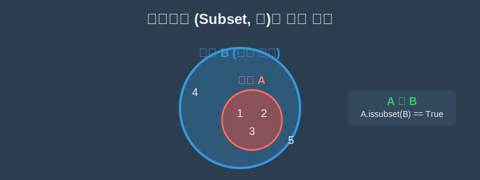

# 04. 네 번째 수업: 부분집합 (Subsets)

우리가 속한 대한민국 국가 국가대표 축구팀은, 더 거대한 '전 세계 축구 선수들의 모임(전체집합)'에 소속되어 있는 하나의 작은 그룹입니다. 이처럼 어떤 커다란 집합 안에 완벽하게 포함되어 있는 더 작은 집합을 수학에서는 **부분집합(Subset)**이라고 부릅니다.

---

## 학습 목표
* 부분집합(Subset) $\subset$ 기호와 원소 $\in$ 기호의 쓰임새 차이를 엄격하게 구분합니다.
* 텅 비어 있는 진정한 허무의 공간, **공집합(Empty Set, $\emptyset$)**의 위대함을 배웁니다.
* 파이썬(Python)의 내장 함수 `issubset()`을 이용하여 부분집합 여부를 True/False로 자동 판별합니다.

## 1. 내 안에 너 있다: $\subset$ 기호

집합 $A = \{1, 2, 3\}$ 이고, 집합 $B = \{1, 2, 3, 4, 5\}$ 라고 해봅시다. 
$A$가 가진 모든 식구($1, 2, 3$)들이 하나도 빠짐없이 모두 더 거대한 $B$ 가문의 호적에 등록되어 있습니다. 이때 우리는 "$A$는 $B$의 부분집합이다" 라고 말하며, U자 자석을 눕혀놓은 것 같은 포함 기호($\subset$)를 씁니다.

> $A \subset B \quad$ (큰 쪽($B$)으로 입을 벌립니다)

<div align="center">
  
</div>

지난 시간에 배운 원소 기호($\in$)와 헷갈리면 절대 안 됩니다!
- **$1 \in A$**: 숫자 $1$(개인)은 집합 $A$(단체)의 원소이다.
- **$A \subset B$**: 집합 $A$(작은 단체)는 통째로 집합 $B$(거대 단체)에 포함되는 부분집합이다. 

## 2. 모든 집합의 뼈대: 공집합 ($\emptyset$)

만약 어떤 집합 바구니를 열어보았는데 내용물이 단 하나도 없다면 어떻게 될까요?
조건을 이렇게 걸어버린 겁니다. $E = \{ x \mid x\text{는 100살 넘은 현역 프로게이머} \}$
이 바구니는 텅 비어있게 됩니다. 원소가 $0$개인 이 투명한 바구니를 **공집합(Empty Set)**이라 부르고 동그라미에 작대기를 그은 기호($\emptyset$)를 사용합니다.

<div align="center">
  
</div>

수학의 황금 룰 중 하나는 바로 **"공집합($\emptyset$)은 이 세상 모든 집합의 부분집합이다"**라는 것입니다. 
아무것도 없는 빈 공간은, 우주의 어떤 거대하고 복잡한 집합 안에도 '당연히' 무조건 들어갈 수 있기 때문입니다. 집합을 건축물이라 치면, 공집합은 건물을 짓기 전의 허허벌판(기초공사)과 같습니다.

## 3. 파이썬과 `issubset` 논리 검사

빅데이터 시스템에서 회원 가입 약관을 점검할 때, 유저가 체크한 필수 항목(A)들이 회사 규정의 전체 필수 항목(B)에 완벽하게 100% 부분집합으로 다 들어가 있는지(누락된 체크는 없는지) 1초 만에 검사해야 합니다. 
파이썬(Python)은 프로그래머들이 직접 교집합을 구하며 고생하지 않도록 `issubset()`이라는 직관적인 영단어 판별기를 제공합니다.

```python
# 파이썬으로 경험하는 부분집합(Subset) 판별기

# 1. 깐깐한 수학의 집합(set) 바구니 생성
small_a = {1, 2, 3}
big_b = {1, 2, 3, 4, 5}
weird_c = {2, 3, 6} # 6이라는 엉뚱한 스파이가 포함됨!

# 2. issubset() 함수로 '부분집합' 관계 논리 참/거짓 판단
print("A는 B의 완벽한 부분집합인가?")
print(small_a.issubset(big_b))
# 수학 기호로는 A ⊂ B 이며, 결과는 True!

print("C는 B의 완벽한 부분집합인가?")
print(weird_c.issubset(big_b))
# 수학 기호로는 C ⊄ B 이며, 결과는 False! (6 때문에 탈락)
```

이 코드는 수천만 건의 엑셀 데이터 테이블 2개를 비교할 때, A테이블의 내용이 B테이블 안에 완전히 속해있는지 검증하는(데이터 유실 체크) 궁극의 실무 스킬로 활용됩니다.

## 학습 정리
1. **부분집합 ($A \subset B$)**: 작은 집합 $A$의 모든 원소가 거대한 집합 $B$의 원소로 100% 소속되어 있을 때의 포함 관계.
2. **원소($\in$) vs 집합($\subset$) 기호 구분**: 개인이 단체에 들어갈 때는 삼지창($E$) 모양, 단체 통째로 더 큰 단체에 들어갈 때는 자석 모양을 쓴다.
3. **공집합 ($\emptyset$)**: 규칙을 만족하는 데이터가 아예 없는 빈 껍데기 바구니이며, 모든 집합의 베이스캠프(부분집합) 역할을 한다. 프로그래밍 초깃값 리스트 `[]`나 빈 배열 `Set()`과 동일한 개념이다.
