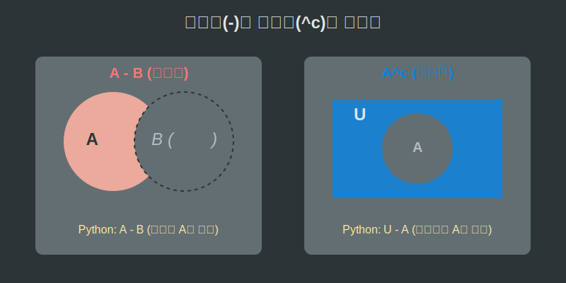

# 06. 여섯 번째 수업: 집합의 연산 ②차집합과 여집합 (Difference & Complement)

합집합과 교집합이 두 개의 데이터를 긍정적으로 섞어내는 연산이었다면, 이번 시간에 배울 **차집합**과 **여집합**은 무언가를 무자비하게 쓸어버리고 도려내는 아주 차갑고 날카로운 필터링(Filtering) 연산입니다.

---

## 학습 목표
* 기준 집합에서 남의 영역을 파내어버리는 차집합($A - B$)의 개념을 일상생활의 '제외 검색'과 비교하여 직관적으로 깨닫습니다.
* 영토 내에서 나 자신만을 완전히 거꾸로 뒤집는 반전 매력, 여집합($A^c$)의 개념을 익힙니다.
* 파이썬의 마이너스 연산자(`-`)가 데이터를 어떻게 순식간에 삭제해 내는지 그 위력을 경험합니다.

## 1. 너한테만 있는 거 다 내놔: 차집합 (Difference, $-$)

$A$에서 $B$를 뺀다는 뜻의 **차집합($A - B$)**은 일반 숫자의 뺄셈($5 - 3 = 2$)과는 느낌이 완전히 다릅니다.
기준이 되는 집합 $A$가 가지고 있는 멤버들 중에서, 괘씸하게도 $B$에도 양다리를 걸치고 있는 박쥐 같은 녀석들(교집합)만 쏙쏙 골라내어 발로 뻥 차버려 도려내는 행위입니다.

> $A - B = \{x \mid x \in A$ **그리고** $x \notin B\}$

정확히 **$A$만의 순수한 혈통(Only A)**만 남기는 강력한 필터링입니다. 벤다이어그램으로 그려보면 동그라미 전체 영역에서 옆의 친구 동그라미 모양대로 사과를 한 입 베어 문 것 같은 예쁜 초승달 모양이 남게 됩니다.

<div align="center">
  
</div>

## 2. 내 것 빼고 전부 다: 여집합 (Complement, $A^c$)

여집합에서 '여' 자는 한자로 남을 여(餘), 즉 '나머지 잉여'를 뜻합니다.
우리가 인터넷 쇼핑몰에서 옷을 검색할 때 "여성용만 보여줘!"라고 필터링을 걸면, 전체 옷(전체집합 $U$)에서 남성용 옷을 제외한 '나머지' 옷들이 다 튀어나옵니다.

어떤 집합 $A$가 아닌 그 바깥의 모든 것들을 완전히 반전시켜 가리키는 수학 기호가 바로 여집합 기호, **$A^c$** (A의 Complement, A 여집합) 입니다. 

> $A^c = \{x \mid x \in U$ **그리고** $x \notin A\}$

벤다이어그램으로 치면 $A$ 동그라미 안쪽만 쏙 빼놓고, 전체 박스($U$)의 넓은 바탕 그라운드를 시커멓게 칠해버리는 것입니다. 사진 앱의 '색상 반전(Invert)' 버튼이나 다크모드의 흑백 반전 기술과 본질적으로 완벽히 똑같은 논리입니다.

<div align="center">
  
</div>

## 3. 파이썬의 `마이너스(-)`와 집합 필터링

우리는 파이썬(Python)에서도 숫자끼리 빼는 마이너스 기호(`-`)를 그대로 사용하여 차집합을 1초 만에 실행할 수 있습니다. 여집합은 파이썬 집합명령어로 직접 구현되어 있진 않지만, 전체집합 원본 데이터를 만들어두고 거기서 쿨하게 마이너스로 빼버리면 그게 곧 여집합 코딩이 됩니다.

```python
# 파이썬으로 경험하는 날카로운 데이터 도려내기 필터 (차집합 -)

marvel_fans = {"아이언맨", "어벤져스", "스파이더맨"}    # A 집합
dc_fans = {"배트맨", "슈퍼맨", "아이언맨"}              # B 집합

# 차집합 (- : 마이너스 기호 사용) -> 순수한 마블의 골수팬만 남기기!
pure_marvel = marvel_fans - dc_fans

print(f"차집합 (A - B): {pure_marvel}")
# 출력: {'어벤져스', '스파이더맨'} 
# (DC 영화도 좋아해서 양다리를 친 '아이언맨'은 가차 없이 쫓겨남)
```

인터넷 포털의 스팸 메일 필터 시스템은 본질적으로 이런 마이너스 차집합 연산기입니다. "내 전체 수신 메일 리스트($A$) 마이너스(`-`) 스팸 등록 키워드가 포함된 메일 리스트($B$)." 
마법의 차집합 연산 덕분에 우리는 깨끗하고 순수한 진짜 이메일 혈통망을 매일 아침 열어볼 수 있습니다.

## 학습 정리
1. **차집합($-$) 원리**: 자기 영역($A$) 중에서 남의 그룹($B$)과 겹치는 배신자 멤버들만 정밀 타격하여 도려내는 연산 방식. 벤다이어그램에선 초승달(사과 한 입 앙!) 모양.
2. **여집합($^c$) 반전**: 전체 테두리 우주($U$) 안에서 온전히 **'나를 뺀 전체 나머지'**를 긁어모으는 음각/양각 반전 메커니즘. 
3. 이 두 연산은 컴퓨터 프로그램 서버에서 악성 유저 차단 필터나 특정 검색어 제외(-키워드) 인공지능을 구축할 때 근간이 되는 가장 무자비하고 정확한 삭제 필터 기술이다.
